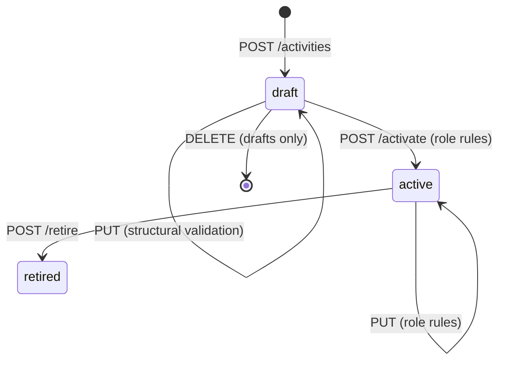

# RoPA API Design (v0.5)

> The HTTP API of the RoPA service. It is built on `ropa-data-model.md` (referred to as **DM §n**) and checked against `ropa-story.md` (Hireloop). The OpenAPI document is generated from Zod schemas (Zod-first), so this document describes intent and shapes, not the final schema text.

## 1. Conventions

### 1.1 Basics

| Topic | Convention |
|---|---|
| Base path | `/v1` |
| Format | JSON (`application/json`). Report exports can also be Markdown or CSV (§5.1) |
| Field names | camelCase in JSON; the database's snake_case columns are mapped (`client_coverage` → `clientCoverage`) |
| Resource names | Plural, kebab-case: `/activities`, `/agreement-terms`, `/review-items` |
| Dates | `YYYY-MM-DD` for dates, RFC 3339 for timestamps, ISO 8601 durations for periods (`P7Y`) |
| Countries | ISO 3166-1 alpha-2 (`DE`, `US`, `IN`) |
| Docs | `GET /openapi.json` (spec) and `GET /api-docs` (Swagger UI). `GET /healthz` for Render's health check |
| Auth | Deferred (program decision). §1.6 covers who made a change until auth exists |

### 1.2 Identifiers (DM §3.0, Q6)

- **Path parameters accept any identifier.** `{ref}` can be the UUID `id`, or the `code` (activities, review items) or `slug` (everything else). `/v1/activities/P3` and `/v1/activities/3f9c…` return the same record. Agreements have only an `id`.
- **Request bodies reference other records by any identifier, as a string:** `"party": "mailcrest"`.
- **Responses always return all identifiers.** Every record includes `id`, its `code` or `slug`, and `name`. Every reference to another record is a small **Ref** object:

```json
{ "id": "5d0a…", "slug": "mailcrest", "name": "Mailcrest Inc." }
```

- `id`, `code`, `version`, `status`, `createdAt` and `updatedAt` are **read-only**. They're ignored if sent. A `slug` can be set on create (otherwise it's derived from the name) and can't be changed through the API in v1.

### 1.3 Lists

- Response: `{ "data": [ … ], "nextCursor": "…" | null }`.
- Paging: `?limit=` (default 50, max 200) and `?cursor=`.
- Filters are query parameters named after the field. Filters that take a record accept any identifier (`?party=mailcrest`).

### 1.4 Saving versioned records

Activities, parties, agreement terms, agreements, offerings, systems and taxonomy entries are **versioned aggregates** (DM §4, §6).

- **Every successful create or update writes a revision** (a full JSON snapshot) in the same transaction and emits a `record.changed` event (§6).
- **Updates replace the whole aggregate** (`PUT`). There's no `PATCH` in v1: a full document keeps each revision a clean snapshot. The one exception is the engagement sub-resource on activities (§3.5), a convenience that still saves and versions the whole activity.
- **Nested rows keep their identity.** In a `PUT`, a nested row (engagement, transfer, retention rule, client scope entry at activity or engagement level) sent **with** its `id` is updated. One sent **without** an `id` is created. An existing one that's **left out** is deleted.
- **Optimistic concurrency.** See §1.8.

### 1.5 Validation levels

| Level | What it checks | When | On failure |
|---|---|---|---|
| **Structural** | Types, enums, required base fields, references exist, identifiers well-formed | Every write | `400` / `422` |
| **Role rules** | DM §5: fields required or forbidden by role, allowed engagement roles, cross-entity rules | On `activate`, and on every save of an `active` activity | `422` |
| **Advisory** | Coverage checks: missing transfers, region violations, unmapped systems, external SaaS mismatches | Never blocks | Reported by `GET /coverage` (§5.5) |

Drafts can therefore be saved while incomplete. An activity can only become `active` once it passes the role rules. `joint_controller` fails structural validation with `422 not_yet_supported` (DM §10, Q5).

### 1.6 Who changed what

Each revision records **who** made a change and **why** (DM §3.12). The two come from different places:

| | Who: actor | Why: change note |
|---|---|---|
| Sent as | `X-Actor` header, e.g. `priya.raman` | `changeNote` field in the request body, e.g. `"Added Scribe AI for CV parsing"` |
| Required? | Yes, on every write | No (optional for now; see DM §11, F4) |
| Lifespan | **Temporary.** Stands in for auth. Once auth exists, the actor comes from the authenticated user and `X-Actor` is dropped | **Permanent.** Not related to auth |
| Stored in | `revision.actor` | `revision.change_note` |

**`changeNote` details**
- A top-level field in the body of every create, `PUT`, `activate` and `retire` request. `DELETE` takes no note: it's only allowed for drafts that were never active.
- **Write-only.** It belongs to the change, not to the record: it's stored on the revision, so `GET` never returns it and a later `PUT` can't resend an old note by accident. Revision lists, `/changes` and `record.changed` events do return it. In Zod it's part of the input schemas only, and OpenAPI marks it `writeOnly`.
- It's a body field rather than a header because it's free text: headers don't reliably carry non-ASCII characters ("Aurelia DPA §7", "Tomás"), have size limits and are often logged by proxies.

### 1.7 Errors

[RFC 9457](https://www.rfc-editor.org/rfc/rfc9457) problem details (`application/problem+json`), with a list of field errors for validation failures:

```json
{
  "type": "https://ropa.example/problems/validation",
  "title": "Activity does not satisfy role rules",
  "status": 422,
  "errors": [
    { "path": "/purposes", "code": "forbidden_for_role", "message": "Processor activities cannot have purposes (Art. 30(2))" },
    { "path": "/engagements/1/role", "code": "role_not_allowed", "message": "Processor activities only allow subprocessor engagements" }
  ]
}
```

| Status | Meaning |
|---|---|
| 400 | Malformed request |
| 404 | Unknown `{ref}` |
| 409 | Conflict: slug already taken, record still referenced (delete), invalid state transition |
| 412 / 428 | Version mismatch / missing `If-Match` (§1.8) |
| 422 | Validation failed (structural or role rules), or `not_yet_supported` |

### 1.8 Concurrency

Two people (or a person and a service) can act on the same record at the same time. The rules below make sure nobody silently overwrites someone else's change, and that **you approve exactly the version you reviewed**.

| Operation | Protection | On conflict |
|---|---|---|
| `PUT` / `DELETE` on a versioned record (§1.4), including the engagement sub-resource (§3.5, which uses the activity's version) | `If-Match: "<version>"` required | `428` if missing, `412` if out of date |
| `POST /activities/{ref}/activate` and `/retire` | `If-Match: "<version>"` required | `428` if missing, `412` if out of date |
| `POST /review-items/{ref}/resolve` and `/dismiss` | Status check: only an `open` item can be closed | `409` invalid state transition |
| `POST` (create) | None needed: there's nothing to overwrite | `409` if a slug is already taken |
| Views, revisions, `/changes` | None: read-only | — |

- **Versions and ETags.** Every response for a versioned record carries `ETag: "<version>"`, and the body includes `version`. Clients send it back in `If-Match`.
- **Why lifecycle actions need it.** Priya reviews P3 at version 3 and activates it, while Tomás has just saved version 4 with a new US vendor. With `If-Match: "3"` she gets `412` and must look at version 4 first, instead of activating something she never saw. Retiring works the same way.
- **Why review items don't.** They aren't versioned, and their only changes are one-way status transitions, so the status check is enough. If review items later get editable fields (assignee, due date), they get a `version` and `If-Match` too.
- **Services follow the same rule.** The Snapshot updating a system or the Monitor adding a transfer reads the record, then writes with the version it read. On `412` it reads again and retries.
- **Implementation.** The version check happens in the database, in the same transaction as the write (`UPDATE … WHERE id = $1 AND version = $2`), never as a separate read beforehand. The status check for review items is done the same way (`… WHERE status = 'open'`).

## 2. Endpoint map

**Records** (versioned aggregates, DM §4)

| Resource | Endpoints | Filters |
|---|---|---|
| Activities | `GET/POST /activities` · `GET/PUT/DELETE /activities/{ref}` · `POST /activities/{ref}/activate` · `POST /activities/{ref}/retire` · `GET/POST /activities/{ref}/engagements` · `GET/PUT/DELETE /activities/{ref}/engagements/{id}` (§3.5, built later) | `role`, `status`, `offering`, `subjectCategory`, `dataCategory`, `party`, `system`, `country`, `special=true` |
| Parties | `GET/POST /parties` · `GET/PUT/DELETE /parties/{ref}` | `kind`, `country` |
| Agreement terms | `GET/POST /agreement-terms` · `GET/PUT/DELETE /agreement-terms/{ref}` | `direction`, `authorizationType` |
| Agreements | `GET/POST /agreements` · `GET/PUT/DELETE /agreements/{id}` | `party`, `terms`, `offering`, `active=true` |
| Offerings | `GET/POST /offerings` · `GET/PUT/DELETE /offerings/{ref}` | — |
| Systems | `GET/POST /systems` · `GET/PUT/DELETE /systems/{ref}` | `kind`, `renderResourceId`, `hostingParty` |
| Taxonomies | `GET/POST /taxonomy/{type}` · `GET/PUT/DELETE /taxonomy/{type}/{ref}`, where `{type}` is `subject-categories`, `data-categories` or `security-measures` | `special` (data categories) |

**History** (DM §3.12, §6)

| Endpoint | Returns |
|---|---|
| `GET /{resource}/{ref}/revisions` | Revision list for one record: version, validFrom, actor, changeNote |
| `GET /{resource}/{ref}/revisions/{version}` | The full snapshot for that version |
| `GET /changes?from=&to=&entityType=` | All revisions in a time range across the record: the "what changed since March" list (Ch8) |

**Workflow**

| Endpoint | Purpose |
|---|---|
| `GET/POST /review-items` · `GET /review-items/{ref}` | Open and read review items (filters: `status`, `source`, `reason`, `target`, `dueBefore`) |
| `POST /review-items/{ref}/resolve` · `POST /review-items/{ref}/dismiss` | Close with a required `resolutionNote`. Only `open` items can be closed (`409` otherwise, §1.8) |

**Views** (read models, DM §7)

| Endpoint | Purpose | Story |
|---|---|---|
| `GET /report` | The Art. 30 record: controller, processor or both; scoped; as of a date; JSON/Markdown/CSV | Ch4, Ch8 |
| `GET /subprocessors` | Subprocessor list for an offering (standard terms) or a client (signed terms) | Ch4 |
| `GET /parties/{ref}/impact` | What depends on this vendor, and who must be told | Ch6 |
| `GET /data-map` | Where a subject category's data lives, and whether Hireloop acts or forwards | Ch7 |
| `GET /coverage` | Gaps between the record and the architecture | Ch5 |

**Service**: `GET /healthz`, `GET /openapi.json`, `GET /api-docs`.

## 3. Activities

### 3.1 Shape

In Zod, the activity is a **discriminated union on `role`** (DM §5), which becomes `oneOf` with a discriminator in OpenAPI. There are separate input and output schemas: `ActivityInput` takes references as strings, and `Activity` returns Ref objects plus the read-only fields.

| Group | Fields | Roles |
|---|---|---|
| Identity & lifecycle | `id`, `code`, `name`, `description`, `role`, `roleRationale`, `status`, `owner`, `supersedes`, `startedAt`, `endedAt`, `reviewDueAt`, `version`, `createdAt`, `updatedAt` | all |
| Scope | `subjectCategories`, `dataCategories`, `systems`, `securityMeasures` | all |
| Controller (Art. 30(1)) | `purposes`, `lawfulBases`, `specialConditions`, `retentionRules`, `dpiaRequired`, `dpiaRef` | controller |
| Processor (Art. 30(2)) | `offering`, `clientCoverage`, `processingCategories`, `clientScope`, `dpiaSupportRef` | processor |
| Third parties | `engagements[]`, each with `transfers[]` and (processor only) `clientScope`. Several engagements may name the same party, e.g. one per region (DM §3.2) | all |

### 3.2 Example: create a processor activity (P1, Ch3)

```http
POST /v1/activities
X-Actor: priya.raman
```

```json
{
  "changeNote": "Initial processor record for the ATS",
  "role": "processor",
  "name": "Candidate application management",
  "owner": "Priya Raman",
  "offering": "ats",
  "clientCoverage": "all_enrolled",
  "processingCategories": ["hosting", "storage", "workflow", "candidate notifications", "retention-deletion"],
  "subjectCategories": ["candidates"],
  "dataCategories": ["identity", "cv", "assessment"],
  "systems": ["hireloop-app", "hireloop-api", "hireloop-db", "retention-sweep"],
  "securityMeasures": ["encryption-at-rest", "tenant-isolation", "rbac", "audit-logging"],
  "engagements": [
    { "party": "render", "role": "subprocessor", "serviceDescription": "Hosting",
      "processingCountries": ["DE"], "dataCategories": ["identity", "cv", "assessment"] },
    { "party": "mailcrest", "role": "subprocessor", "serviceDescription": "Candidate notifications",
      "processingCountries": ["US"], "dataCategories": ["identity"],
      "transfers": [{ "destinationCountry": "US", "mechanism": "dpf" }] },
    { "party": "glitchlog", "role": "subprocessor", "serviceDescription": "Error tracking",
      "processingCountries": ["US"], "dataCategories": ["identity"],
      "transfers": [{ "destinationCountry": "US", "mechanism": "sccs" }] }
  ]
}
```

Response: `201 Created`, `Location: /v1/activities/P1`, `ETag: "1"`, and the full activity with `code: "P1"`, `status: "draft"`.

**Client scope** (DM §3.8) is either `null` (the engagement applies to every client the activity covers) or an object with one `mode` and a list of clients:

```json
"clientScope": {
  "mode": "exclude",
  "clients": [{ "client": "aurelia", "reason": "EU-only processing (Aurelia DPA)", "agreement": "9c41…" }]
}
```

The **activity** has a `clientScope` of the same shape (DM §3.8). Its `mode` must match `clientCoverage`: `include` for an `opt_in` activity (opt-ins), `exclude` for an `all_enrolled` one (opt-outs). Activity-level entries also carry `startedAt` and optionally `endedAt`:

```jsonc
// P2 (clientCoverage: opt_in): Aurelia opted in
"clientScope": { "mode": "include",
                 "clients": [{ "client": "aurelia", "reason": "Client enabled the module", "startedAt": "2026-03-16" }] }

// P3 (clientCoverage: all_enrolled): Aurelia opted out
"clientScope": { "mode": "exclude",
                 "clients": [{ "client": "aurelia", "reason": "Client objected (Aurelia DPA, specific authorization)", "startedAt": "2026-04-14" }] }
```

Use the activity scope when a client doesn't get the processing at all, and the engagement scope when the client gets it through a different vendor or region.

In Ch4, after Aurelia signs, Priya `PUT`s P1 keeping every nested `id`, with three changes:
- the Mailcrest engagement is renamed "Candidate notifications (US region)" and gets `clientScope` `exclude: aurelia`;
- the Glitchlog engagement gets `clientScope` `exclude: aurelia`;
- a **new** Mailcrest engagement (no `id`) is added for the EU region:

```json
{ "party": "mailcrest", "role": "subprocessor", "serviceDescription": "Candidate notifications (EU region)",
  "processingCountries": ["IE"], "dataCategories": ["identity"], "transfers": [],
  "clientScope": { "mode": "include",
                   "clients": [{ "client": "aurelia", "reason": "EU data region (Aurelia DPA)", "agreement": "9c41…" }] } }
```

### 3.3 Example: read a controller activity (C2, Ch2)

```json
{
  "id": "7b1e…", "code": "C2", "name": "Customer accounts & billing",
  "role": "controller", "status": "active", "version": 3,
  "owner": "Priya Raman", "roleRationale": null, "supersedes": null,
  "purposes": ["Provide contracted service accounts", "Invoice and collect payment"],
  "lawfulBases": ["6(1)(b)", "6(1)(c)"], "specialConditions": [],
  "dpiaRequired": false, "dpiaRef": null,
  "subjectCategories": [{ "id": "…", "slug": "client-users", "name": "Client users" }],
  "dataCategories": [
    { "id": "…", "slug": "identity", "name": "Identity & contact" },
    { "id": "…", "slug": "account", "name": "Account data" },
    { "id": "…", "slug": "billing", "name": "Billing data" }
  ],
  "systems": [{ "id": "…", "slug": "hireloop-app", "name": "Recruiter app" }, "…"],
  "securityMeasures": ["…"],
  "retentionRules": [
    { "id": "…", "dataCategory": { "id": "…", "slug": "account", "name": "Account data" },
      "period": "P90D", "trigger": "after contract end", "legalRef": null },
    { "id": "…", "dataCategory": { "id": "…", "slug": "billing", "name": "Billing data" },
      "period": "P7Y", "trigger": "after invoice date", "legalRef": "Dutch tax law" }
  ],
  "engagements": [
    { "id": "…", "party": { "id": "…", "slug": "ledgerpay", "name": "Ledgerpay Ltd" },
      "role": "recipient", "serviceDescription": "Payment processing (independent controller)",
      "processingCountries": ["IE"], "dataCategories": ["…billing"], "transfers": [] }
  ],
  "reviewDueAt": "2027-02-10", "startedAt": "2026-02-10", "endedAt": null,
  "createdAt": "2026-02-10T09:12:00Z", "updatedAt": "2026-06-20T14:03:00Z"
}
```

(Some arrays are shortened with `"…"` for readability.)

### 3.4 Lifecycle



- `POST /activities/{ref}/activate` (requires `If-Match`, §1.8; optional body `{ "changeNote": "…" }`): runs the role rules, sets `status: active` and `startedAt` (if not set). `422` if the rules fail.
- `POST /activities/{ref}/retire` (requires `If-Match`, §1.8): body `{ "endedAt": "2026-09-30", "changeNote": "…" }`. Sets `status: retired`. A retired activity can't be edited or reactivated, and its code is never reused (DM §3.0).
- `DELETE`: only for activities that have never been active (`409` otherwise). Everything else is retired, so history stays intact.
- **Role change** (DM §3.0): retire the old activity, then `POST` a new one with `"supersedes": "C4"`. The new activity gets a new code (`P4`).

### 3.5 Engagement sub-resource (convenience, built later)

Editing one vendor on an activity shouldn't require sending the whole activity. That's common for the Monitor (adding the onward transfer in Ch6) and the Snapshot. So engagements also have their own endpoints:

| Endpoint | Purpose |
|---|---|
| `GET /activities/{ref}/engagements` | List the activity's engagements |
| `POST /activities/{ref}/engagements` | Add an engagement |
| `GET /activities/{ref}/engagements/{id}` | Read one engagement |
| `PUT /activities/{ref}/engagements/{id}` | Replace one engagement, including its `transfers` and `clientScope` |
| `DELETE /activities/{ref}/engagements/{id}` | Remove one engagement |

**It's still one aggregate** (DM §4). These endpoints are shortcuts, not a separate record:
- **Concurrency uses the activity's version.** `If-Match` carries the *activity's* version, and the response's `ETag` is the activity's new version. A change to one engagement and a change to another field of the same activity therefore can't overwrite each other silently.
- **Every write is an activity revision.** It writes a full snapshot of the activity and emits `record.changed` for the activity, exactly like a `PUT /activities/{ref}`.
- **Same validation.** The activity is validated as a whole after the change: structural checks always, and role rules if the activity is `active`.
- **Same conventions.** `changeNote` goes in the body, and `X-Actor` is required. Engagements are identified by `id` only (they have no code or slug, DM §3.0).
- Nested transfers and client scope entries are replaced as part of the engagement. They don't get endpoints of their own.

## 4. Other records

All follow §1.4 (full `PUT`, `If-Match`, revisions). Notes that go beyond the data model:

| Resource | Notes |
|---|---|
| Parties | `name` in responses mirrors `legalName`. `DELETE` → `409` while any engagement, agreement, system or client scope references the party. The `self` party can't be deleted |
| Agreement terms | `DELETE` → `409` while agreements or offerings use them |
| Agreements | Identified by `id` only. Ending an agreement is a `PUT` with `endedAt`. `offering` is required for outbound terms. Creating Aurelia's agreement is the "signing" in Ch4 |
| Offerings | `defaultTerms` must reference outbound terms |
| Systems | Filter `?renderResourceId=srv-…` lets the Architecture Snapshot find a system by its Render ID. A bulk sync endpoint is left for when the Snapshot exists |
| Taxonomies | `DELETE` → `409` while any activity references the entry |

## 5. Views

All views are read-only, computed from current state or, with `asOf`, from revisions (DM §6). Every view response includes `generatedAt` and, where supported, `asOf`.

### 5.1 `GET /report`

| Parameter | Values | Notes |
|---|---|---|
| `view` | `controller` \| `processor` \| `all` | Default `all` |
| `offering` | ref | Processor view scoped to an offering's standard terms (pre-contract, Ch4) |
| `client` | ref | Processor view scoped to one client's actual terms (post-contract, Ch4). Mutually exclusive with `offering` |
| `asOf` | date | The record as it stood on that date (Ch8) |
| `format` | `json` \| `markdown` \| `csv` | Default `json`. CSV flattens to one row per activity × engagement |

**JSON structure:**
- `organisation`: the `self` party, including DPO contact (Art. 30(1)(a)).
- `controllerActivities[]`: purposes, lawful bases, subject and data categories, recipients (engagements), transfers, retention, security measures.
- `processorActivities[]`: the controllers served (e.g. "all clients on Standard DPA v3" plus bespoke clients, or just the scoped client), processing categories, subprocessors, transfers, security measures.

**Markdown structure** (`format=markdown`, `Content-Type: text/markdown`). This is the export that feeds the architecture document, so it's built early (§8, step 2):
- A header with the organisation, DPO contact, `generatedAt`, `asOf` and the scope (offering or client).
- **Controller activities** and **Processor activities** sections, with one heading per activity in the form `### P3 · CV parsing`.
- Each activity heading is preceded by a **stable anchor** built from its code (`<a id="p3"></a>`). Names can change, but codes never do (DM §3.0), so the architecture document can link a system box straight to `…#p3` and the link keeps working after renames.
- Per activity: purposes and lawful bases (controller), or controllers served and processing categories (processor); subject and data categories, with special categories marked; a **third parties** table (party, role, service, countries, transfer mechanism); retention (controller); security measures.
- A closing **subprocessor list** for the scope, identical to `GET /subprocessors`.

CSV (one row per activity × engagement) stays in the last build step.

### 5.2 `GET /subprocessors`

Exactly one of `offering` or `client` is required. `asOf` is optional.

Example: `GET /v1/subprocessors?client=aurelia&asOf=2026-05-01` (after P3 CV parsing was added and switched off for Aurelia):

```json
{
  "generatedAt": "2026-09-19T10:00:00Z",
  "asOf": "2026-05-01",
  "scope": {
    "client": { "id": "…", "slug": "aurelia", "name": "Aurelia Bank S.A." },
    "offering": { "id": "…", "slug": "ats", "name": "Hireloop ATS" },
    "terms": { "id": "…", "slug": "aurelia-dpa", "name": "Aurelia Bank DPA",
               "authorizationType": "specific", "noticeDays": 60 }
  },
  "subprocessors": [
    { "party": { "id": "…", "slug": "render", "name": "Render Services, Inc." },
      "services": ["Hosting"], "processingCountries": ["DE"], "transfers": [],
      "activities": [{ "id": "…", "code": "P1", "name": "Candidate application management" },
                     { "id": "…", "code": "P2", "name": "Diversity & accommodations module" }] },
    { "party": { "id": "…", "slug": "mailcrest", "name": "Mailcrest Inc." },
      "services": ["Candidate notifications (EU region)"], "processingCountries": ["IE"],
      "transfers": [],
      "activities": [{ "id": "…", "code": "P1", "name": "Candidate application management" }] }
  ]
}
```

The list is built from the client's **effective engagements** (DM §3.8) and grouped by party: Aurelia sees Mailcrest in Ireland with no transfer, while `?client=northwind` shows Mailcrest in the US (DPF) plus Glitchlog.

With `?offering=ats` instead, the list shows the standard terms: engagements with an `include` scope are left out (they're client-specific), so Mailcrest appears with its US region, and Glitchlog and Scribe AI are included. Opt-in activities such as P2 appear under a separate `optionalModules` array with their own subprocessors.

### 5.3 `GET /parties/{ref}/impact`

What depends on a vendor, for the Monitor (Ch6). Clients are **grouped by agreement terms**, because 399 clients share the standard DPA. Add `?expandClients=true` to list every client.

Example: `GET /v1/parties/mailcrest/impact` when Mailcrest announces Helpdesk Partners (30 days' notice):

```json
{
  "generatedAt": "2026-06-03T08:00:00Z",
  "party": { "id": "…", "slug": "mailcrest", "name": "Mailcrest Inc." },
  "vendorTerms": { "id": "…", "slug": "mailcrest-dpa-2025", "name": "Mailcrest DPA 2025",
                   "authorizationType": "general", "noticeDays": 30 },
  "engagements": [
    { "activity": { "id": "…", "code": "C2", "name": "Customer accounts & billing" },
      "activityRole": "controller", "engagementRole": "processor",
      "subjectCategories": ["…client-users"], "dataCategories": ["…identity"],
      "specialCategories": false, "processingCountries": ["US"], "clientGroups": [] },
    { "activity": { "id": "…", "code": "C3", "name": "Hireloop sales & marketing" },
      "activityRole": "controller", "engagementRole": "processor",
      "subjectCategories": ["…leads"], "dataCategories": ["…identity"],
      "specialCategories": false, "processingCountries": ["US"], "clientGroups": [] },
    { "activity": { "id": "…", "code": "P1", "name": "Candidate application management" },
      "engagement": { "id": "…", "serviceDescription": "Candidate notifications (US region)" },
      "activityRole": "processor", "engagementRole": "subprocessor",
      "subjectCategories": ["…candidates"], "dataCategories": ["…identity"],
      "specialCategories": false, "processingCountries": ["US"],
      "clientGroups": [
        { "terms": { "id": "…", "slug": "standard-dpa-v3", "name": "Standard DPA v3" },
          "authorizationType": "general", "noticeDays": 30, "clientCount": 399,
          "requiresApproval": false, "noticeConflict": false }
      ] },
    { "activity": { "id": "…", "code": "P1", "name": "Candidate application management" },
      "engagement": { "id": "…", "serviceDescription": "Candidate notifications (EU region)" },
      "activityRole": "processor", "engagementRole": "subprocessor",
      "subjectCategories": ["…candidates"], "dataCategories": ["…identity"],
      "specialCategories": false, "processingCountries": ["IE"],
      "clientGroups": [
        { "terms": { "id": "…", "slug": "aurelia-dpa", "name": "Aurelia Bank DPA" },
          "authorizationType": "specific", "noticeDays": 60, "allowedRegions": ["EEA"],
          "clientCount": 1, "clients": [{ "id": "…", "slug": "aurelia", "name": "Aurelia Bank S.A." }],
          "requiresApproval": true, "noticeConflict": true }
      ] }
  ],
  "summary": { "engagements": 4, "activities": 3, "processorActivities": 1, "affectedClients": 400,
               "clientsRequiringApproval": 1, "noticeConflicts": 1 }
}
```

- `requiresApproval`: the client's terms need **specific** authorization (Art. 28(2)), so a notice isn't enough.
- `noticeConflict`: the vendor's notice (30 days) is shorter than the notice owed to the client (60 days).
- There is **one entry per engagement**, not per activity, so P1 appears twice: its US-region and EU-region Mailcrest engagements reach different clients.
- Client groups contain only the clients for whom that engagement is **effective** (DM §3.8): opted-out and scoped-out clients aren't counted, and opt-in activities only count clients who opted in.
- `allowedRegions` is included when the client's terms restrict regions, so the Monitor can see that an onward transfer to India (Helpdesk Partners) would break Aurelia's EU-only clause, even though Mailcrest stores Aurelia's data in Ireland.
- Small groups (`clientCount` ≤ 10) list their clients by default.

### 5.4 `GET /data-map`

| Parameter | Notes |
|---|---|
| `subjectCategory` | Required |
| `client` | Optional. Scopes **processor** activities to that client's effective engagements (DM §3.8: coverage and client scopes). Controller activities that concern the category are always included |

Example: `GET /v1/data-map?subjectCategory=candidates&client=northwind` (Lena's erasure request, Ch7):

```json
{
  "subjectCategory": { "id": "…", "slug": "candidates", "name": "Candidates" },
  "client": { "id": "…", "slug": "northwind", "name": "Northwind Logistics B.V." },
  "entries": [
    { "activity": { "code": "P1", "…": "…" }, "role": "processor", "action": "forward",
      "systems": ["…hireloop-db", "…hireloop-app", "…hireloop-api"],
      "vendors": [{ "party": "…mailcrest", "dataCategories": ["…identity"] }],
      "retention": null },
    { "activity": { "code": "P3", "…": "…" }, "role": "processor", "action": "forward",
      "systems": ["…cv-parser"],
      "vendors": [{ "party": "…scribe-ai", "dataCategories": ["…cv", "…identity"] }],
      "retention": null },
    { "activity": { "code": "C4", "…": "…" }, "role": "controller", "action": "act",
      "systems": ["…hireloop-app", "…hireloop-api"],
      "vendors": [{ "party": "…glitchlog", "dataCategories": ["…identity"] }],
      "retention": [{ "dataCategory": null, "period": "P90D", "trigger": "after event", "legalRef": null }] }
  ]
}
```

- `action: forward`: Hireloop is the processor. It passes the request to the client (the controller) and assists.
- `action: act`: Hireloop is the controller and decides, using the retention rules (for example, whether a legal obligation overrides erasure).
- `retention` is `null` for processor activities, because retention is the client's decision.

### 5.5 `GET /coverage`

Advisory findings, never blocking (§1.5):

| Finding type | Meaning |
|---|---|
| `unmapped_system` | A Render system no active activity uses (Ch5: `cv-parser`) |
| `transfer_missing` | An engagement processes data outside the EEA with no matching transfer |
| `external_saas_mismatch` | An `external_saas` system without a matching engagement with its host, or the reverse (DM §5) |
| `region_violation` | An engagement effective for a client whose terms have `allowedRegions` processes or transfers data outside them (Ch6: Helpdesk Partners in India reaching Mailcrest's EU region for Aurelia) |
| `review_overdue` | `reviewDueAt` has passed |

Response: `{ "generatedAt", "findings": [ { "type", "severity", "target": Ref, "details" } ] }`. Coverage doesn't open review items itself. A scheduled job (a natural fit for a **Render cron job**) or the Snapshot calls it and opens review items for new findings.

## 6. Events

RoPA **pushes** events to its consumers (Q3). Delivery is HTTP `POST` to configured URLs over Render's private network. Service-to-service auth is deferred along with auth.

| Event | When | Payload | Consumer |
|---|---|---|---|
| `record.changed` | Any revision | `entityType`, `entity` (Ref), `version`, `changeType` (`created` \| `updated` \| `activated` \| `retired` \| `deleted`), `actor`, `changeNote`, `validFrom` | Audit log (#1) |
| `subprocessors.changed` | A save changes the derived subprocessor list of an offering or a client | `offering` or `client` (Ref), `added[]`, `removed[]` (party Refs) | Monitor (#5): outbound notices (Ch5) |

**Envelope.** Every event has the same wrapper:

```json
{ "id": "e7c2…", "type": "record.changed", "source": "ropa", "occurredAt": "2026-04-14T10:02:11Z",
  "data": { "entityType": "activity", "entity": { "id": "…", "code": "P3", "name": "CV parsing" },
            "version": 1, "changeType": "created", "actor": "priya.raman",
            "changeNote": "Added Scribe AI for CV parsing", "validFrom": "2026-04-14T10:02:11Z" } }
```

**Delivery guarantees.** The audit log is the permanent history, so an event must never be lost because a consumer was briefly down:
- **Transactional outbox.** The event is written to an outbox table (DM §3.13) **in the same transaction** as the revision. If the save commits, the event exists. If it rolls back, it doesn't.
- **At-least-once delivery.** A dispatcher sends pending events and marks them delivered on a `2xx` response. Failures are retried with increasing delays (e.g. 1 min, 5 min, 30 min, then hourly), and each attempt's error is kept.
- **Idempotent consumers.** A retry can deliver the same event twice, so consumers ignore an `id` they've already processed.
- **Ordering.** Events for one record are sent in version order. Across records there's no ordering guarantee; consumers use `version` and `occurredAt`.
- **Reconciliation.** `GET /changes` stays available, so the audit log can backfill anything it missed, e.g. after being restored from a backup.
- **On Render.** The dispatcher can run inside the web service for the demo. A **background worker** is the production shape and another Render feature to showcase (it needs a paid instance).

## 7. Story walkthrough

| Chapter | Calls |
|---|---|
| Ch2 controller records | `POST /taxonomy/*`, `POST /parties` (self, vendors), `POST /activities` (C1–C4, role controller), `POST /activities/{ref}/activate` |
| Ch3 processor records | `POST /agreement-terms` (standard-dpa-v3), `POST /offerings` (ats), `POST /agreements` ×N, `POST /activities` (P1) |
| Ch4 questionnaire | `GET /subprocessors?offering=ats`, `GET /report?view=processor&offering=ats` |
| Ch4 signing | `POST /parties` (aurelia), `POST /agreement-terms` (aurelia-dpa), `POST /agreements`, `PUT /activities/P1` (Mailcrest EU-region engagement, client scopes), `POST /activities` (P2, `opt_in` with Aurelia included), `GET /subprocessors?client=aurelia` |
| Ch5 AI parsing | Snapshot finds `cv-parser` → `POST /systems` → `GET /coverage` → `POST /review-items` · `POST /activities` (P3) → `subprocessors.changed` → Monitor notifies clients · `PUT /activities/P3` (activity client scope: exclude Aurelia) |
| Ch6 vendor change | Monitor → `GET /parties/mailcrest/impact` → `POST /review-items` ×3 (with deadlines) → later `PUT /activities/{C2,C3,P1}` or, once built, `PUT /activities/{ref}/engagements/{id}` (onward transfer) → `POST /review-items/{ref}/resolve` |
| Ch7 DSARs | `GET /data-map?subjectCategory=candidates&client=northwind` · `GET /data-map?subjectCategory=employees` |
| Ch8 regulator | `GET /report?asOf=2026-03-01`, `GET /report`, `GET /changes?from=2026-03-01` |
| Ch9 architecture doc | `GET /systems`, `GET /activities?system=…` (joined by the Snapshot using `renderResourceId`) |

## 8. Build order

1. **Foundation:** conventions (§1), taxonomies, parties, agreement terms, agreements, offerings, systems. Revisions are **written** from day one, because they can't be recreated later.
2. **Activities:** CRUD, role rules, activate/retire. `GET /subprocessors` and `GET /report` in **JSON and Markdown** (current state). Markdown comes this early because it feeds the architecture document (Q5). This is enough for Ch2–Ch4.
3. **Governance views:** `/parties/{ref}/impact`, `/data-map`, `/coverage`, review items. Enough for Ch5–Ch7 and the Monitor/DSAR integrations.
4. **History:** `asOf`, `/revisions`, `/changes`, event outbox and push delivery. Enough for Ch8 and the audit log.
5. **Conveniences:** CSV report format; engagement sub-resource (§3.5).

## 9. Open questions

1. ~~**Concurrency**~~ **Resolved (2026-09-19):** `If-Match` required on `PUT`, `DELETE`, `activate` and `retire`. Review-item transitions are protected by a status check. See §1.8.
2. ~~**Actor and change note**~~ **Resolved (2026-09-19):** `X-Actor` header until auth exists. The change note is a permanent, optional, write-only `changeNote` body field. See §1.6.
3. ~~**Events vs polling**~~ **Resolved (2026-09-19):** push, using a transactional outbox with at-least-once delivery; `/changes` stays available for reconciliation. See §6.
4. ~~**Nested sub-resources**~~ **Resolved (2026-09-19):** yes, `/activities/{ref}/engagements` as a convenience that still versions the whole activity. Designed now, built later (§8, step 5). See §3.5.
5. ~~**Report formats**~~ **Resolved (2026-09-19):** Markdown moves forward to step 2 because it feeds the architecture document; CSV stays in step 5. See §5.1 and §8.
