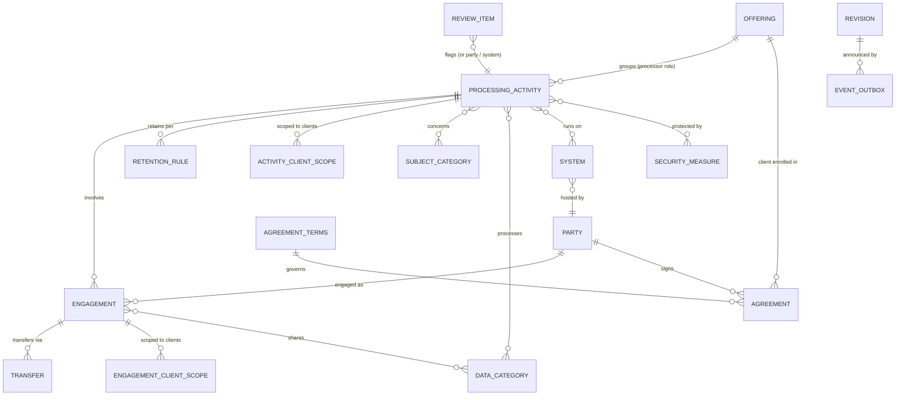

# RoPA Data Model (v0.9)

> Entities, relationships and rules for the RoPA service's Postgres store. It builds on `ropa-design.md` (strawman) and is checked against `ropa-story.md` (Hireloop). It replaces §6 of the strawman, and it is the input for the API shapes.

## 1. Design decisions this model assumes

These settle strawman decisions 1–5, based on what the story showed. **Confirmed 2026-09-19.**

| # | Decision | Answer | Story evidence |
|---|---|---|---|
| 1 | Role modeling | One `processing_activity` table with a `role` field; required fields vary by role (§5) | Ch2, Ch3 |
| 2 | Processor granularity | Processor activities belong to an **offering**. Clients are covered through their **agreement** for that offering. Each processor activity has a **default coverage** (`all_enrolled` or `opt_in`) with per-client exceptions (opt-outs and opt-ins). Per-client vendor differences use **client-scoped engagements** (include or exclude clients) | Ch3, Ch4 |
| 3 | Party model | One `party` table (`self` / `client` / `vendor` / `other`) plus a role-bearing `engagement` link from activity to party | Ch2 (Ledgerpay as recipient), Ch4 |
| 4 | Ownership | RoPA owns parties, agreements, activities and review items. The Monitor owns vendor-list snapshots and outbound client notices. The Snapshot owns systems (RoPA keeps a reference) | Ch5, Ch6 |
| 5 | Versioning | Yes: an append-only `revision` table holding a full snapshot of each aggregate (§6) | Ch8 |

**What RoPA deliberately does not store:** data about individual people. It records *categories* of people and data, not records of them. The only personal data it holds is business contacts (owners, DPO, vendor contacts). Following Render's HIPAA guidance, table and column names never contain personal data either.

## 2. Entity overview

Groups:
- **Record core:** `processing_activity`, `engagement`, `transfer`, `retention_rule`
- **Who:** `party`, `agreement_terms`, `agreement`, `offering`
- **Client scoping:** `activity_client_scope`, `engagement_client_scope`
- **Where:** `system`
- **Shared vocabulary:** `subject_category`, `data_category`, `security_measure`
- **Workflow and history:** `review_item`, `revision`, `event_outbox`

## 3. Entities

**Conventions**
- Every table has `id uuid` (primary key) and `created_at timestamptz`. Tables whose rows can be edited also have `updated_at timestamptz`. These columns aren't repeated below.
- One row per column. **Required** means `NOT NULL` (and non-empty for arrays):
  - **yes / no**: always or never required;
  - **by role**: depends on the activity's role, see §5;
  - **if …**: required under the stated condition.
- `FK → table` is a foreign key to that table's `id`.
- Link tables (pure many-to-many) are named `a_b`, have two required FK columns and use both as a composite primary key.

### 3.0 Identifiers

Each record can have up to three identifiers, each with a different job:

| Identifier | Example | Used by | Shown to people? | Can it change? | Tables |
|---|---|---|---|---|---|
| `id` | `3f9c…` (UUID) | Databases, foreign keys, other services | Never | Never | All |
| `code` | `P3`, `RI-42` | People: diagram labels, cross-references, report headings, DPA annexes, DPIA packs | Yes, **next to** the name ("P3 · CV parsing") | **Never**, and never reused | `processing_activity`, `review_item` |
| `slug` | `mailcrest`, `health` | People and machines: URLs, seed files, config | Rarely as a label | Rarely; avoid after publishing | `party`, `agreement_terms`, `offering`, `system`, taxonomies |
| `name` | "CV parsing" | People: the main label | Yes | Freely (e.g. the C1 rename kept `C1`) | `processing_activity` and every table with a `slug` |

Rows that only exist inside another record (`engagement`, `transfer`, `retention_rule`, `agreement`, client scopes, revisions) have only an `id`. They're identified by the record they belong to.

**Code rules**
- **Assigned by the system, never typed by hand.** Activities get a sequence per role prefix: `C1…Cn` for controller, `P1…Pn` for processor, `J1…Jn` for joint controller (deferred). Review items get `RI-1…RI-n`.
- **Never changed or reused.** Once `P3` has appeared in a report or a contract annex, it must mean the same thing forever. A retired activity keeps its code, and the code is never assigned again.
- **A role change means a new activity.** The prefix encodes the role, and moving an entry from controller to processor changes which Art. 30 record it belongs to. So Priya retires C4 and creates P4 with `supersedes_id → C4`. The trail stays visible, and old documents that mention C4 still resolve.

**Slug rules**
- Lowercase, hyphenated, unique **within its table** (no type prefix: `health`, not `dc-health`).
- Derived from the name at creation. Changing one after it has been shared breaks URLs and seeds, so avoid it.
- The story's prefixed identifiers (`act-c2`, `off-ats`, `sc-candidates`, `dc-identity`) are illustrative. In this model they are code `C2`, slug `ats`, slug `candidates` and slug `identity`.
- A slug may never have the UUID format, so the API can always tell which kind of identifier it received.

**Identifiers in the API** (Q6)
- **URLs accept any identifier:** `/activities/P3` and `/activities/3f9c…` return the same record, as do `/parties/mailcrest` and `/parties/{uuid}`.
- **Request bodies may reference records by either**, e.g. `"party": "mailcrest"` or `"party": "3f9c…"`.
- **Responses always return all of them.** Each record includes `id`, its `code` or `slug`, and `name`. References to other records are returned as small objects, e.g. `"party": {"id": "3f9c…", "slug": "mailcrest", "name": "Mailcrest Inc."}`.

### 3.1 `processing_activity`: the heart of the record

| Column | Type | Required | Notes |
|---|---|---|---|
| code | text, unique, immutable | yes | `C1`, `P3`. Assigned by the system from the role prefix (§3.0) |
| name | text | yes | Main label |
| description | text | no | Free-text explanation |
| supersedes_id | FK → processing_activity | no | Set when this activity replaces a retired one (e.g. after a role change) |
| role | enum `controller` \| `processor` \| `joint_controller` | yes | Immutable once saved. Drives validation (§5). `joint_controller` is modeled but deferred (Art. 26) |
| role_rationale | text | no | Why this role. Strongly recommended for grey zones (C4) |
| status | enum `draft` \| `active` \| `retired` | yes | Default `draft`. Only `active` appears in reports |
| owner | text | yes | Business contact accountable for the activity |
| offering_id | FK → offering | by role | Processor only |
| client_coverage | enum `all_enrolled` \| `opt_in` | by role | Processor only. The **default** for which clients the activity applies to; per-client exceptions live in `activity_client_scope` (§3.8). P1 = `all_enrolled`; P2 = `opt_in` (Aurelia opted in); P3 = `all_enrolled` with Aurelia opted out |
| purposes | text[] | by role | Controller only (Art. 30(1)(b)) |
| lawful_bases | enum[] `6(1)(a)`…`6(1)(f)` | by role | Controller only |
| special_conditions | enum[] `9(2)(a)`…`9(2)(j)`, `art10` | if controller and any data category is special | Controller only |
| processing_categories | text[] | by role | Processor only (Art. 30(2)(b)): hosting, storage, notifications… |
| dpia_required | boolean | by role | Controller only. Default `false` |
| dpia_ref | text | no | Controller only: Hireloop's own DPIA |
| dpia_support_ref | text | no | Processor only: support pack for clients (Art. 28(3)(f)) |
| review_due_at | date | no | Next periodic review |
| started_at | date | no | When the processing began. Enables "since 2026-04-14" |
| ended_at | date | no | When the processing stopped (usually set on retirement) |

**Link tables**

| Table                       | Left column                       | Right column                           |
| --------------------------- | --------------------------------- | -------------------------------------- |
| `activity_subject_category` | activity_id → processing_activity | subject_category_id → subject_category |
| `activity_data_category`    | activity_id → processing_activity | data_category_id → data_category       |
| `activity_system`           | activity_id → processing_activity | system_id → system                     |
| `activity_security_measure` | activity_id → processing_activity | security_measure_id → security_measure |

### 3.2 `engagement`: an activity involves a party in a given role

| Column | Type | Required | Notes |
|---|---|---|---|
| activity_id | FK → processing_activity | yes | |
| party_id | FK → party | yes | A party of kind `vendor` or `other` |
| role | enum `processor` \| `subprocessor` \| `recipient` \| `joint_controller` | yes | Allowed values depend on the activity role (§5) |
| service_description | text | yes | "Transactional email", "Error tracking" |
| processing_countries | text[] (ISO 3166) | yes (≥ 1) | **Where the data is processed or accessed**, which is not the vendor's HQ. Render = `DE`; Glitchlog = `US` |
| started_at | date | no | When the vendor started receiving data for this activity |
| ended_at | date | no | When it stopped |

**Link table:** `engagement_data_category` (engagement_id → engagement, data_category_id → data_category). The categories must be a **subset** of the activity's data categories.

**Several engagements with the same party are allowed on one activity** when they differ in where or for whom the processing happens. Example (Ch4): P1 has two Mailcrest engagements, "Candidate notifications (US region)" for every client except Aurelia, and "Candidate notifications (EU region)" with `processing_countries = [IE]` for Aurelia only. `service_description` tells them apart. Client scoping (§3.8) decides which one applies to which client.

### 3.3 `transfer`: third-country transfer safeguards (Art. 44–49)

| Column | Type | Required | Notes |
|---|---|---|---|
| engagement_id | FK → engagement | yes | |
| destination_country | text (ISO 3166) | yes | |
| mechanism | enum `adequacy` \| `dpf` \| `sccs` \| `bcr` \| `derogation_49` | yes | |
| onward_via | text | no | Onward transfer through the vendor's own subprocessor ("Helpdesk Partners Pvt Ltd", Ch6) |
| document_ref | text | no | SCCs / DPA reference |

One engagement can have several transfers: Mailcrest → US directly, and → IN onward after Chapter 6.

### 3.4 `retention_rule` (controller only)

| Column | Type | Required | Notes |
|---|---|---|---|
| activity_id | FK → processing_activity | yes | |
| data_category_id | FK → data_category | no | Empty = the default rule for the activity |
| retention_period | text (ISO 8601 duration) | yes | `P90D`, `P7Y`. (Not `period`: it's an SQL keyword) |
| trigger_event | text | yes | "after contract end". (Not `trigger`: it's an SQL keyword) |
| legal_ref | text | no | "Dutch tax law". Justifies keeping data despite an erasure request (Art. 17(3)(b), Ch7) |

At most one rule per (activity, data category), and at most one default rule per activity.

### 3.5 `party`

| Column | Type | Required | Notes |
|---|---|---|---|
| slug | text, unique | yes | `hireloop`, `mailcrest`, `aurelia` |
| kind | enum `self` \| `client` \| `vendor` \| `other` | yes | Exactly one `self` (the record owner) |
| legal_name | text | yes | Doubles as the party's `name` |
| country | text (ISO 3166) | yes | Where the legal entity is established |
| contact_name | text | no | Business contact |
| contact_email | text | no | Business contact |
| dpo_name | text | if `kind = self` | Art. 30(1)(a) |
| dpo_email | text | if `kind = self` | Art. 30(1)(a) |
| trust_url | text | no | Vendors: trust/security page |
| dpa_url | text | no | Vendors: published DPA |
| subprocessor_list_url | text | no | Vendors: what the Monitor watches |

A party can be both a client and a vendor in real life. With a single `kind`, you'd record the second relationship as a separate agreement. See open question Q4.

### 3.6 `agreement_terms` and `agreement`

Split into two tables, because 400 clients sign **one** standard DPA while Aurelia signs its own.

**`agreement_terms`**: the terms document, either a reusable template or a bespoke contract.

| Column | Type | Required | Notes |
|---|---|---|---|
| slug | text, unique | yes | `standard-dpa-v3`, `aurelia-dpa`, `mailcrest-dpa-2025` |
| name | text | yes | "Standard DPA v3" |
| direction | enum `outbound` \| `inbound` | yes | Outbound: we are the processor for a client. Inbound: a vendor processes for us |
| authorization_type | enum `general` \| `specific` | yes | Art. 28(2) |
| notice_days | int | yes | 30 / 60 |
| allowed_regions | text[] | no | Region codes (`EEA`, which expands to the member countries) or ISO country codes. e.g. `['EEA']` for Aurelia. Empty = no restriction. Checked by `/coverage` (`region_violation`, §7) |
| document_url | text | no | |

**`agreement`**: a signed agreement with one party.

| Column | Type | Required | Notes |
|---|---|---|---|
| party_id | FK → party | yes | Northwind, Aurelia, Mailcrest… |
| terms_id | FK → agreement_terms | yes | |
| offering_id | FK → offering | if the terms are `outbound` | Which offering the client is enrolled in |
| signed_at | date | yes | Aurelia: 2026-03-16. Prospects have no row |
| ended_at | date | no | When the agreement ended |

The set of clients covered by an offering = active outbound agreements for that offering.

### 3.7 `offering`

| Column | Type | Required | Notes |
|---|---|---|---|
| slug | text, unique | yes | `ats` |
| name | text | yes | "Hireloop ATS" |
| default_terms_id | FK → agreement_terms | yes | Must be `outbound`. `ats` → `standard-dpa-v3` |

### 3.8 Client scoping

Client scoping works at two levels:
- **Activity level:** does this processing happen for this client at all? (`client_coverage` + `activity_client_scope`)
- **Engagement level:** within an activity that does apply, which vendors handle this client's data? (`engagement_client_scope`)

**`activity_client_scope`**: per-client exceptions to the activity's `client_coverage` default.

| Column | Type | Required | Notes |
|---|---|---|---|
| activity_id | FK → processing_activity | yes | A processor activity |
| client_party_id | FK → party | yes | A party of kind `client` |
| mode | enum `include` \| `exclude` | yes | Must match the default: `opt_in` activities take only `include` rows (**opt-ins**, e.g. Aurelia → P2); `all_enrolled` activities take only `exclude` rows (**opt-outs**, e.g. Aurelia → P3) |
| reason | text | no | "Client enabled the module", "Client objected (Aurelia DPA, specific authorization)". Strongly recommended for opt-outs |
| agreement_id | FK → agreement | no | The agreement that requires the scoping, if any |
| started_at | date | yes | When the opt-in or opt-out took effect |
| ended_at | date | no | When it ended (the client switched the module off, or withdrew its objection) |

At most one active row per (activity, client).

| `client_coverage` | Exception rows | Result |
|---|---|---|
| `all_enrolled` | none | Every enrolled client (P1) |
| `all_enrolled` | `exclude` | Every enrolled client **except** the listed ones (P3: not Aurelia) |
| `opt_in` | none | **No** client yet (a module nobody has enabled) |
| `opt_in` | `include` | **Only** the listed clients (P2: Aurelia) |

**`engagement_client_scope`**: limits which clients' data an engagement is used for (processor activities only).

| Column | Type | Required | Notes |
|---|---|---|---|
| engagement_id | FK → engagement | yes | |
| client_party_id | FK → party | yes | A party of kind `client` |
| mode | enum `include` \| `exclude` | yes | `exclude`: used for every client **except** this one (Glitchlog and Mailcrest US region for Aurelia). `include`: used **only** for the listed clients (Mailcrest EU region for Aurelia) |
| reason | text | yes | "EU-only processing (Aurelia DPA §7)", "Client objected", "EU data region" |
| agreement_id | FK → agreement | no | The agreement that requires the scoping, if any |

All scope rows on one engagement must use the same `mode`. An engagement with no scope rows applies to every client the activity covers.

**Covered clients and effective engagements.** Views use these definitions throughout (§7).

Processor activity *A* **covers** client *X* when:
1. *X* holds an active outbound agreement for *A*'s offering; and
2. either `client_coverage = all_enrolled` and *X* has no active `exclude` row, **or** `client_coverage = opt_in` and *X* has an active `include` row.

Engagement *E* on *A* is **effective** for *X* when *A* covers *X* and *E* has no scope rows, **or** its rows are `include` and list *X*, **or** its rows are `exclude` and don't list *X*.

Rule of thumb: if a client doesn't get the processing at all, scope the **activity** (P3 for Aurelia). If the client gets the processing but through a different vendor or region, scope the **engagement** (Mailcrest for Aurelia).

### 3.9 `system`

| Column | Type | Required | Notes |
|---|---|---|---|
| slug | text, unique | yes | `hireloop-db` |
| name | text | yes | "Primary database" |
| kind | enum `render_web_service` \| `render_private_service` \| `render_worker` \| `render_cron` \| `render_static_site` \| `render_postgres` \| `render_key_value` \| `external_saas` | yes | `external_saas` covers tools like Peoplehub HR |
| render_resource_id | text, unique | no | Join key to Architecture Snapshot (`srv-…`, `dpg-…`) |
| region | text | if `kind` is a `render_*` kind | `frankfurt` |
| hosting_party_id | FK → party | yes | Render, Peoplehub |

For now, systems are entered or seeded by hand. Once the Snapshot exists, it keeps them in sync through `render_resource_id`.

### 3.10 Taxonomies

Shared vocabularies. DSAR and Monitor reference them by `slug`.

**`subject_category`**: seed: candidates, client-users, employees, leads.

| Column | Type | Required | Notes |
|---|---|---|---|
| slug | text, unique | yes | `candidates` |
| name | text | yes | "Candidates" |
| description | text | no | |

**`data_category`**: seed: identity, cv, assessment, diversity⚠, health⚠, account, billing, telemetry, payroll, marketing.

| Column | Type | Required | Notes |
|---|---|---|---|
| slug | text, unique | yes | `health` |
| name | text | yes | "Health data" |
| description | text | no | |
| special | enum `none` \| `art9` \| `art10` | yes | Default `none`. `art9` = special category; `art10` = criminal convictions |

**`security_measure`**: seed: encryption-at-rest, tenant-isolation, rbac, sso-for-staff, audit-logging.

| Column | Type | Required | Notes |
|---|---|---|---|
| slug | text, unique | yes | `encryption-at-rest` |
| name | text | yes | "Encryption at rest" |
| description | text | no | |

### 3.11 `review_item`

| Column | Type | Required | Notes |
|---|---|---|---|
| code | text, unique, immutable | yes | `RI-42`. Assigned by the system (§3.0) |
| target_activity_id | FK → processing_activity | exactly one target | The record that needs attention. Three foreign-key columns, exactly one set, so the database checks the reference (see `ropa-database.md` §3). The API presents them as `targetType` + `target` |
| target_party_id | FK → party | exactly one target | |
| target_system_id | FK → system | exactly one target | |
| source | enum `monitor` \| `snapshot` \| `manual` \| `schedule` | yes | Who opened it |
| reason | enum `vendor_subprocessor_added` \| `vendor_subprocessor_removed` \| `unmapped_system` \| `transfer_missing` \| `region_violation` \| `review_overdue` | yes | |
| details | jsonb | no | e.g. the diff from the Monitor |
| deadlines | jsonb | no | e.g. `{vendorEffective: 2026-07-03, clientNotice: [{client: aurelia, type: specific, due: …}]}` for the Ch6 collision |
| due_at | date | no | Earliest deadline |
| status | enum `open` \| `resolved` \| `dismissed` | yes | Default `open` |
| resolution_note | text | if `status` is `resolved` or `dismissed` | What was decided |

### 3.12 `revision`: history for `asOf` reports

Append-only: rows are never updated, so there is no `updated_at`.

| Column | Type | Required | Notes |
|---|---|---|---|
| entity_type | enum `activity` \| `party` \| `agreement` \| `agreement_terms` \| `offering` \| `system` \| `subject_category` \| `data_category` \| `security_measure` | yes | Which aggregate type (§4) |
| entity_id | uuid | yes | The aggregate root's `id` |
| version | int | yes | Increments per entity. Unique with (entity_type, entity_id) |
| change_type | enum `created` \| `updated` \| `activated` \| `retired` \| `deleted` | yes | What kind of change this was. `asOf` skips records whose latest revision is `deleted` |
| valid_from | timestamptz | yes | When this version took effect |
| snapshot | jsonb | yes | Full aggregate as saved (§6) |
| actor | text | yes | Who made the change |
| change_note | text | no | Why. Comes from the request body's `changeNote` (API §1.6). Optional for now (§11, F4). Also emitted to the audit-log service |

### 3.13 `event_outbox`: events waiting to be pushed

Events are written here **in the same transaction** as the revision they describe, then delivered by a dispatcher (API §6). One row per event per destination, so a slow consumer doesn't hold up the others.

| Column | Type | Required | Notes |
|---|---|---|---|
| event_id | uuid | yes | The event's `id` in the envelope. Consumers use it to ignore duplicates. Unique with `destination` |
| event_type | enum `record.changed` \| `subprocessors.changed` | yes | |
| destination | text | yes | Consumer name from configuration: `audit-log`, `monitor` |
| payload | jsonb | yes | The full event envelope, as it will be sent |
| revision_id | FK → revision | no | The revision that caused it (`record.changed`) |
| attempts | int | yes | Default `0` |
| next_attempt_at | timestamptz | yes | When the dispatcher should try next. Default: now |
| last_error | text | no | Error from the most recent failed attempt |
| delivered_at | timestamptz | no | Set on a `2xx` response. Empty = still pending |

- Delivered rows can be deleted after a retention period (e.g. 30 days). The revision table remains the permanent history, and `/changes` can rebuild anything.
- The dispatcher picks pending rows with `FOR UPDATE SKIP LOCKED`, so more than one dispatcher can run safely.
- Events for one record are delivered in version order: the dispatcher doesn't send a record's later event while an earlier one is still pending.

## 4. Aggregates (what gets saved, and versioned, together)

| Aggregate | Root | Includes | API implication |
|---|---|---|---|
| **Activity** | processing_activity | category/system/measure links, retention rules, client scope, engagements (+ data categories, transfers, client scopes) | One document per activity. `PUT /activities/{id}` replaces the whole thing. The engagement sub-resource (API §3.5) is a convenience that still versions the whole activity |
| Party | party | — | `/parties` |
| Agreement terms | agreement_terms | — | `/agreement-terms` |
| Agreement | agreement | — | `/agreements` |
| Offering | offering | — | `/offerings` |
| System | system | — | `/systems` |
| Taxonomy entry | each taxonomy row | — | `/taxonomy/*` |
| Review item | review_item | — | Workflow entity, not versioned; changes go to the audit log |

## 5. Rules by role

**Activity fields**

| Field | controller | processor |
|---|---|---|
| purposes, lawful_bases | required | forbidden |
| special_conditions | required if any data category is special | forbidden (the client establishes them) |
| retention_rules | ≥ 1 required | forbidden |
| offering_id, client_coverage | forbidden | required |
| processing_categories | forbidden | required |
| dpia_required / dpia_ref | allowed | forbidden |
| dpia_support_ref | forbidden | allowed |
| activity client scope | forbidden | `include` rows if `opt_in`; `exclude` rows if `all_enrolled` |

**Engagement roles allowed**

| Activity role | Allowed engagement roles |
|---|---|
| controller | `processor`, `recipient` (`joint_controller` deferred) |
| processor | `subprocessor` |

**Cross-entity rules**
- Engagement data categories ⊆ activity data categories.
- A client scope's client (activity or engagement level) must hold an active outbound agreement for the activity's offering.
- An activity client scope's `mode` must match `client_coverage` (§3.8).
- Client scope rows are only allowed on engagements of processor activities, and all rows on one engagement share one `mode`.
- Any `processing_countries` entry outside the EEA needs a matching `transfer` row. Missing ones are reported by `/coverage` (as `transfer_missing`) rather than blocked, so drafts can be saved.
- Exactly one party of kind `self`.
- `role` cannot be changed on a saved activity. Changing role = retire the activity and create a new one with `supersedes_id` (§3.0).
- `supersedes_id` must point to a `retired` activity.
- `joint_controller` (as an activity role or an engagement role) is rejected as "not yet supported" until its rules are defined (§11, F3).
- An `external_saas` system used by an activity should have a matching engagement with its hosting party on that activity (Peoplehub HR → Peoplehub as processor on C1). Mismatches are reported by `/coverage`, not blocked.
- In Zod these become a discriminated union on `role`, which becomes `oneOf` in OpenAPI.

## 6. Versioning approach

- Normal tables always hold **current state**. Every save of an aggregate also appends a `revision` row with its **full JSON snapshot**, in the same transaction.
- `GET /report?asOf=T` rebuilds the record from the latest revision ≤ T for each aggregate. Snapshots store IDs, so party names are resolved from party revisions at T too. The report shows what the record said then.
- Why not temporal tables or event sourcing: both are heavier to build and query. Snapshots are simple, match "the record as it stood", and can be diffed for Ch8.
- Each revision is also sent to the audit-log service (#1), which records who changed what.

## 7. Derived views (the read models the API exposes)

| View | Derivation | Story |
|---|---|---|
| **Subprocessors (offering)** | Active processor activities in the offering with `all_enrolled` coverage (per-client opt-outs ignored: they're exceptions to the standard terms) → `subprocessor` engagements **without `include` scope** (client-specific engagements aren't part of the standard terms) → party, service, countries, mechanism. Opt-in modules listed separately | Ch4 (pre-contract) |
| **Subprocessors (client)** | The client's **effective engagements** (§3.8) with role `subprocessor`, grouped by party. Aurelia sees Mailcrest in `IE`; Northwind sees Mailcrest in `US` | Ch4 (post-contract) |
| **Report** | Controller view: `self` party + controller activities with all Art. 30(1) fields. Processor view: offering/client scoping + Art. 30(2) fields. `asOf` via revisions | Ch4, Ch8 |
| **Impact (party)** | The party's engagements → activities (role, data categories, special flag, countries). For processor activities: affected clients = clients for whom the engagement is effective (§3.8), grouped by agreement terms (authorization type, notice days). Plus the vendor's inbound terms. Flags **notice conflict** when vendor notice < client notice | Ch6 |
| **Data map** | Subject category (+ optional client) → activities → systems + engagements (data categories ∩), retention rules, and `action: act \| forward` from the activity role | Ch7 |
| **Coverage** | Render systems with no activity; non-EEA countries with no transfer; `region_violation`: an engagement effective for a client whose agreement has `allowed_regions`, with a processing country or transfer destination outside them (Ch6: Helpdesk Partners in India on Mailcrest's EU region); `external_saas` systems on an activity with no matching engagement with their hosting party, and vice versa (an engagement with a party that hosts an `external_saas` system the activity doesn't list); review dates passed. Activities with no Render system are **not** flagged | Ch5 |

## 8. Cross-service references

| Service | Holds | References into RoPA |
|---|---|---|
| Subprocessor monitor | vendor-list snapshots, diffs, fetch schedule, outbound client notices and responses | `party.slug` (watches `subprocessor_list_url`); reads `/parties/{id}/impact`, `/subprocessors`; writes `review_item` |
| DSAR tracker | requests, timelines | `subject_category.slug`, `party.slug` (client); reads `/data-map` |
| Architecture Snapshot | Render resources, snapshots | `system.render_resource_id`; writes `review_item` (unmapped system) |
| Audit log | events | receives `record.changed` events pushed from `event_outbox` (§3.13); can backfill from `/changes` |

## 9. Story check

| Chapter | Tables exercised |
|---|---|
| Ch2 controller records | processing_activity (controller), engagement (processor, recipient), retention_rule, data_category.special |
| Ch3 processor records | offering, agreement_terms (standard), agreement ×N, processing_activity (processor) |
| Ch4 signing Aurelia | agreement_terms (bespoke, `allowed_regions`) + agreement, engagement_client_scope (exclude: Glitchlog, Mailcrest US; include: Mailcrest EU), activity_client_scope (P2 include Aurelia) |
| Ch5 AI parsing | system (cv-parser) → review_item (snapshot), new activity + engagement + transfer, dpia_support_ref, activity_client_scope (P3 exclude Aurelia) |
| Ch6 vendor change | review_item (monitor) with deadlines, transfer with `onward_via`, coverage `region_violation` (Aurelia) |
| Ch7 DSARs | data map over taxonomies, retention_rule.legal_ref |
| Ch8 regulator | revision (`asOf`), started_at |
| Ch9 architecture doc | system.render_resource_id + activity_system |

## 10. Resolved questions (2026-09-19)

| # | Question | Decision | Where it shows up |
|---|---|---|---|
| Q1 | Revisions | **Full JSON snapshot per aggregate** on every save | §3.12, §6 |
| Q2 | Onward transfers | **Keep `transfer.onward_via` as text** for now | §3.3; future: F1 |
| Q3 | External SaaS as systems | **Yes.** Tools like Peoplehub HR are `system` rows (kind `external_saas`) as well as vendor engagements. The duplication is accepted and checked for consistency | §3.9, §5, §7 (coverage) |
| Q4 | Party with multiple roles | **Single `kind`** for now | §3.5; future: F2 |
| Q5 | Joint controllers | **Keep in the enums, leave out of the story and validation.** The API rejects `joint_controller` (activity role or engagement role) as "not yet supported" until rules are defined | §3.1, §3.2, §5; future: F3 |
| Q6 | Identifiers in the API | **Support both; always return all.** URLs accept `id` or `code`/`slug`. Request bodies may reference by either. Responses always include `id`, `code`/`slug` and `name` | §3.0 |

## 11. Future improvements

| # | Improvement | Why it's deferred | What changes |
|---|---|---|---|
| F1 | **Onward transfers → parties.** Model sub-subprocessors (e.g. Helpdesk Partners) as `party` rows linked to the vendor, instead of `transfer.onward_via` text | Text is enough for the demo. The Monitor holds the vendor's full list anyway | New party kind or relation (vendor → its subprocessors). `transfer.onward_via` becomes an FK. Impact and data-map views can follow the full chain |
| F2 | **Party roles as a set.** Replace `party.kind` with a set of roles (`client`, `vendor`, …), so one company can be both a client and a vendor | Rare in the story; a single `kind` keeps validation simple | `party.kind` → `party_role` link table or `roles enum[]`. Rules that check "a party of kind X" check "has role X" instead |
| F3 | **Joint controllers (Art. 26).** Define validation rules for `joint_controller` activities (J-codes) and engagements: the arrangement between the controllers, each one's responsibilities, the contact point for data subjects | Not needed for the Hireloop story | Role rules in §5, new fields (arrangement reference, responsibility split), a story chapter to test it |
| F4 | **Required change notes for the live record.** Make the change note mandatory on `activate`, `retire` and any update to an `active` record, while keeping it optional for drafts | Optional is enough for the demo. A required reason works like a commit message: it's a real governance control and makes the Ch8 regulator scene stronger | Validation rule on writes (API `changeNote`, stored in `revision.change_note`). `422` when missing on a live record. No schema change |
