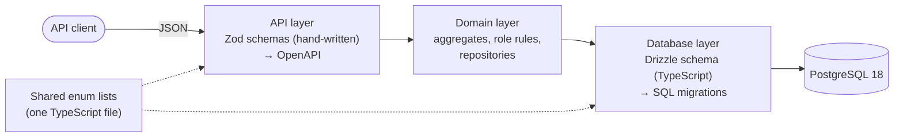

# RoPA Database Design (v0.3, for review)

> The physical Postgres design for the RoPA service: how the logical model in `ropa-data-model.md` (**DM §n**) becomes tables, constraints and migrations, and how the API in `ropa-api.md` (**API §n**) reads and writes them. Stack: Node.js + Express + TypeScript, **Drizzle ORM**, **PostgreSQL 18** on Render.

## 1. Layers and sources of truth



| Layer | Source of truth | Produces | Shape |
|---|---|---|---|
| API | Zod schemas in `src/api/schemas/` | Request validation, response types, the OpenAPI document | API shapes: camelCase, Refs, discriminated union on `role`, write-only `changeNote`, nested `clientScope` (API §3) |
| Domain | TypeScript types + functions in `src/domain/` | Aggregates, role rules (DM §5), save/load logic | One object per aggregate (DM §4) |
| Database | Drizzle tables in `src/db/schema/` | Generated SQL migrations in `drizzle/`, row types | One row per table row, snake_case in Postgres |
| Shared enums | `src/shared/enums.ts` | Both Zod enums and database checks | `as const` arrays |

**Principles**
- **API schemas are never generated from tables.** The API deliberately differs from rows (Refs instead of foreign keys, nested aggregates, write-only fields). Repositories in the domain layer map between the two.
- **Enum values are defined once.** Each list (e.g. `ACTIVITY_ROLES`) lives in `src/shared/enums.ts`. Zod uses it (`z.enum(ACTIVITY_ROLES)`), and so does Drizzle (typed column + check constraint). Adding a value is a code change plus a generated migration.
- **The Drizzle schema is the source of truth for the database.** SQL migrations are generated from it, reviewed, and committed. Anything Drizzle can't express (triggers, functions, reference rows) goes in hand-written migrations (§8).

## 2. Where each rule is enforced

The API has three validation levels (API §1.5). This is how they map onto the layers:

| Rule kind | Example | Enforced by | Why there |
|---|---|---|---|
| Types, `NOT NULL`, foreign keys | `engagement.party_id` must exist | **Postgres** | Always true, whatever the status |
| Uniqueness | codes, slugs, one `self` party, one active scope row per (activity, client) | **Postgres** (unique and partial unique indexes) | Race-proof: two concurrent requests can't both succeed |
| Enum values and formats | `role IN (…)`, slug format, country code format | **Postgres** checks + **Zod** | Zod gives friendly errors; Postgres is the safety net |
| **Forbidden** by role | a processor activity has no `purposes` | **Postgres** checks + **domain** | True for drafts too, so the database can enforce it |
| **Required** by role | an active controller activity needs `lawful_bases` | **Domain** + **Postgres** checks guarded by `status = 'active'` | Drafts may be incomplete (API §1.5). Single-row requirements are also checked in Postgres once a record is active (§4.4); requirements that span tables (at least one retention rule, Art. 9 conditions for special categories) stay in the domain |
| Cross-row and cross-table | engagement data categories ⊆ activity data categories; scope `mode` matches `client_coverage`; offering's default terms are outbound; `supersedes` points to a retired activity | **Domain** (inside the save transaction) | Checks can't reference other tables; triggers for all of these would be hard to maintain |
| Immutability | `code`, `role` never change; revisions never change | **Postgres** triggers + **domain** | Governance-critical history, protected even from application bugs |
| Advisory | missing transfers, region violations, unmapped systems | **`/coverage`** only | Never blocks (DM §7) |

## 3. Conventions

| Topic | Convention |
|---|---|
| Names | Tables and columns in snake_case, singular table names (as in DM §3). TypeScript uses camelCase; Drizzle's snake_case casing option maps between them |
| Primary keys | `id uuid DEFAULT uuidv7()`. UUIDv7 is time-ordered, which keeps indexes compact. It is built into Postgres 18, so no extension is needed |
| Timestamps | `timestamptz`. `created_at DEFAULT now()` on every table; `updated_at` on editable tables, maintained by a trigger |
| Dates | `date` for business dates (`signed_at`, `started_at`, `review_due_at`) |
| Enums | `text` + `CHECK (col IN (…))`, **not** Postgres enum types. Enum types are hard to change (values can't be removed or renamed); a check constraint is replaced in one migration |
| Arrays | `text[] NOT NULL DEFAULT '{}'`: empty means "none", never `NULL`. Used for values without identity (`purposes`, `lawful_bases`, `processing_countries`, `allowed_regions`). Anything that references another record uses a **link table** with foreign keys |
| Foreign keys | `ON DELETE CASCADE` **inside** an aggregate (activity → engagements → transfers). `ON DELETE RESTRICT` **between** aggregates (engagement → party), which is what makes the API's `409 still referenced` work (API §4) |
| Versions | Every aggregate root has `version integer NOT NULL DEFAULT 1`. Nested rows don't; they're versioned through their root |
| Constraint names | `<table>_<meaning>`, e.g. `processing_activity_processor_fields`, so errors can be mapped to API messages |

**Two logical-to-physical changes** (reflected back in DM v0.9):
- `retention_rule.period` → `retention_period` and `retention_rule.trigger` → `trigger_event`. `PERIOD` and `TRIGGER` are SQL keywords; avoiding them saves quoting bugs.
- `review_item.target_type` + `target_id` → three nullable foreign keys (`target_activity_id`, `target_party_id`, `target_system_id`) with a check that exactly one is set. That gives the database real referential integrity instead of an unchecked UUID. The API still returns `targetType` and `target` (API §2).

And one addition: **`revision.change_type`** (`created` \| `updated` \| `activated` \| `retired` \| `deleted`). Events already carry it (API §6), and `asOf` needs it to skip deleted records (§6).

## 4. Schema (DDL)

This is the SQL the generated migrations should produce. It's the reference for reviewing them. Every table also has `created_at timestamptz NOT NULL DEFAULT now()`, and editable ones `updated_at timestamptz NOT NULL DEFAULT now()`. Those columns are left out below for readability.

### 4.1 Shared check patterns

Written once as helper functions in the Drizzle schema, repeated in the SQL below:

| Pattern | Check |
|---|---|
| `slug` | `slug ~ '^[a-z0-9]+(-[a-z0-9]+)*$' AND slug !~ '^[0-9a-f]{8}-[0-9a-f]{4}-'` (lowercase, hyphenated, never UUID-shaped, DM §3.0) |
| country | `~ '^[A-Z]{2}$'` (ISO 3166-1 alpha-2). Array elements are validated by Zod; Postgres checks only that required arrays aren't empty |
| enum array | `col <@ ARRAY['6(1)(a)', …]::text[]` (every element is an allowed value) |

### 4.2 Parties, agreements, offerings, systems

```sql
CREATE TABLE party (
  id                    uuid PRIMARY KEY DEFAULT uuidv7(),
  slug                  text NOT NULL UNIQUE,            -- + slug check
  kind                  text NOT NULL CHECK (kind IN ('self','client','vendor','other')),
  legal_name            text NOT NULL,
  country               text NOT NULL CHECK (country ~ '^[A-Z]{2}$'),
  contact_name          text,
  contact_email         text,
  dpo_name              text,
  dpo_email             text,
  trust_url             text,
  dpa_url               text,
  subprocessor_list_url text,
  version               integer NOT NULL DEFAULT 1,
  CONSTRAINT party_self_dpo CHECK (kind <> 'self' OR (dpo_name IS NOT NULL AND dpo_email IS NOT NULL))
);
CREATE UNIQUE INDEX party_one_self ON party (kind) WHERE kind = 'self';

CREATE TABLE agreement_terms (
  id                 uuid PRIMARY KEY DEFAULT uuidv7(),
  slug               text NOT NULL UNIQUE,
  name               text NOT NULL,
  direction          text NOT NULL CHECK (direction IN ('outbound','inbound')),
  authorization_type text NOT NULL CHECK (authorization_type IN ('general','specific')),
  notice_days        integer NOT NULL CHECK (notice_days >= 0),
  allowed_regions    text[] NOT NULL DEFAULT '{}',
  document_url       text,
  version            integer NOT NULL DEFAULT 1
);

CREATE TABLE offering (
  id               uuid PRIMARY KEY DEFAULT uuidv7(),
  slug             text NOT NULL UNIQUE,
  name             text NOT NULL,
  default_terms_id uuid NOT NULL REFERENCES agreement_terms (id) ON DELETE RESTRICT,
  version          integer NOT NULL DEFAULT 1
);

CREATE TABLE agreement (
  id          uuid PRIMARY KEY DEFAULT uuidv7(),
  party_id    uuid NOT NULL REFERENCES party (id) ON DELETE RESTRICT,
  terms_id    uuid NOT NULL REFERENCES agreement_terms (id) ON DELETE RESTRICT,
  offering_id uuid REFERENCES offering (id) ON DELETE RESTRICT,   -- required for outbound terms (domain)
  signed_at   date NOT NULL,
  ended_at    date,
  version     integer NOT NULL DEFAULT 1,
  CONSTRAINT agreement_dates CHECK (ended_at IS NULL OR ended_at >= signed_at)
);
CREATE INDEX agreement_offering_party ON agreement (offering_id, party_id, ended_at);
CREATE INDEX agreement_party ON agreement (party_id);

CREATE TABLE system (
  id                 uuid PRIMARY KEY DEFAULT uuidv7(),
  slug               text NOT NULL UNIQUE,
  name               text NOT NULL,
  kind               text NOT NULL CHECK (kind IN ('render_web_service','render_private_service','render_worker',
                       'render_cron','render_static_site','render_postgres','render_key_value','external_saas')),
  render_resource_id text UNIQUE,
  region             text,
  hosting_party_id   uuid NOT NULL REFERENCES party (id) ON DELETE RESTRICT,
  version            integer NOT NULL DEFAULT 1,
  CONSTRAINT system_render_region CHECK (kind = 'external_saas' OR region IS NOT NULL)
);
CREATE INDEX system_hosting_party ON system (hosting_party_id);
```

### 4.3 Taxonomies

```sql
CREATE TABLE subject_category (
  id uuid PRIMARY KEY DEFAULT uuidv7(), slug text NOT NULL UNIQUE, name text NOT NULL,
  description text, version integer NOT NULL DEFAULT 1
);
CREATE TABLE data_category (
  id uuid PRIMARY KEY DEFAULT uuidv7(), slug text NOT NULL UNIQUE, name text NOT NULL,
  description text,
  special text NOT NULL DEFAULT 'none' CHECK (special IN ('none','art9','art10')),
  version integer NOT NULL DEFAULT 1
);
CREATE TABLE security_measure (
  id uuid PRIMARY KEY DEFAULT uuidv7(), slug text NOT NULL UNIQUE, name text NOT NULL,
  description text, version integer NOT NULL DEFAULT 1
);
```

### 4.4 The activity aggregate

```sql
CREATE TABLE processing_activity (
  id                    uuid PRIMARY KEY DEFAULT uuidv7(),
  code                  text NOT NULL UNIQUE CHECK (code ~ '^[CPJ][1-9][0-9]*$'),
  name                  text NOT NULL,
  description           text,
  supersedes_id         uuid REFERENCES processing_activity (id) ON DELETE RESTRICT,
  role                  text NOT NULL CHECK (role IN ('controller','processor','joint_controller')),
  role_rationale        text,
  status                text NOT NULL DEFAULT 'draft' CHECK (status IN ('draft','active','retired')),
  owner                 text NOT NULL,
  offering_id           uuid REFERENCES offering (id) ON DELETE RESTRICT,
  client_coverage       text CHECK (client_coverage IN ('all_enrolled','opt_in')),
  purposes              text[] NOT NULL DEFAULT '{}',
  lawful_bases          text[] NOT NULL DEFAULT '{}'
                          CHECK (lawful_bases <@ ARRAY['6(1)(a)','6(1)(b)','6(1)(c)','6(1)(d)','6(1)(e)','6(1)(f)']::text[]),
  special_conditions    text[] NOT NULL DEFAULT '{}',        -- + enum-array check: 9(2)(a)…9(2)(j), art10
  processing_categories text[] NOT NULL DEFAULT '{}',
  dpia_required         boolean,                             -- set (default false) by the domain for controllers
  dpia_ref              text,
  dpia_support_ref      text,
  review_due_at         date,
  started_at            date,
  ended_at              date,
  version               integer NOT NULL DEFAULT 1,

  -- The code's prefix always matches the role (DM §3.0)
  CONSTRAINT processing_activity_code_prefix CHECK (
    left(code, 1) = CASE role WHEN 'controller' THEN 'C' WHEN 'processor' THEN 'P' ELSE 'J' END),
  -- "Forbidden by role" holds for drafts too (DM §5)
  CONSTRAINT processing_activity_controller_fields CHECK (role <> 'controller' OR (
    offering_id IS NULL AND client_coverage IS NULL AND processing_categories = '{}' AND dpia_support_ref IS NULL)),
  CONSTRAINT processing_activity_processor_fields CHECK (role <> 'processor' OR (
    purposes = '{}' AND lawful_bases = '{}' AND special_conditions = '{}'
    AND dpia_required IS NULL AND dpia_ref IS NULL)),
  CONSTRAINT processing_activity_dates CHECK (ended_at IS NULL OR started_at IS NULL OR ended_at >= started_at),
  -- "Required by role" as a second safety net: only applies once the record is live (§2).
  -- Cross-table requirements (≥ 1 retention rule, Art. 9 conditions for special categories) stay in the domain.
  CONSTRAINT processing_activity_active_controller CHECK (status <> 'active' OR role <> 'controller' OR (
    cardinality(purposes) > 0 AND cardinality(lawful_bases) > 0 AND dpia_required IS NOT NULL)),
  CONSTRAINT processing_activity_active_processor CHECK (status <> 'active' OR role <> 'processor' OR (
    offering_id IS NOT NULL AND client_coverage IS NOT NULL AND cardinality(processing_categories) > 0)),
  CONSTRAINT processing_activity_active_started CHECK (status = 'draft' OR started_at IS NOT NULL)
);
CREATE INDEX processing_activity_offering ON processing_activity (offering_id);
CREATE INDEX processing_activity_status ON processing_activity (status);

-- Link tables: composite primary key covers lookups by activity; the second index covers the reverse
CREATE TABLE activity_subject_category (
  activity_id         uuid NOT NULL REFERENCES processing_activity (id) ON DELETE CASCADE,
  subject_category_id uuid NOT NULL REFERENCES subject_category (id) ON DELETE RESTRICT,
  PRIMARY KEY (activity_id, subject_category_id)
);
CREATE INDEX activity_subject_category_rev ON activity_subject_category (subject_category_id);   -- data map
-- activity_data_category, activity_system, activity_security_measure: same pattern
-- (activity_system_rev on system_id serves /coverage and the architecture document)

CREATE TABLE retention_rule (
  id               uuid PRIMARY KEY DEFAULT uuidv7(),
  activity_id      uuid NOT NULL REFERENCES processing_activity (id) ON DELETE CASCADE,
  data_category_id uuid REFERENCES data_category (id) ON DELETE RESTRICT,   -- NULL = default rule
  retention_period text NOT NULL CHECK (retention_period ~ '^P([0-9]+Y)?([0-9]+M)?([0-9]+W)?([0-9]+D)?$'
                                        AND retention_period <> 'P'),
  trigger_event    text NOT NULL,
  legal_ref        text,
  -- One rule per data category AND at most one default rule, in one constraint (Postgres 15+).
  -- If the pinned Drizzle version can't express NULLS NOT DISTINCT, this goes in a custom migration.
  CONSTRAINT retention_rule_one_per_category UNIQUE NULLS NOT DISTINCT (activity_id, data_category_id)
);

CREATE TABLE activity_client_scope (
  id              uuid PRIMARY KEY DEFAULT uuidv7(),
  activity_id     uuid NOT NULL REFERENCES processing_activity (id) ON DELETE CASCADE,
  client_party_id uuid NOT NULL REFERENCES party (id) ON DELETE RESTRICT,
  mode            text NOT NULL CHECK (mode IN ('include','exclude')),
  reason          text,
  agreement_id    uuid REFERENCES agreement (id) ON DELETE RESTRICT,
  started_at      date NOT NULL,
  ended_at        date,
  CONSTRAINT activity_client_scope_dates CHECK (ended_at IS NULL OR ended_at >= started_at)
);
CREATE UNIQUE INDEX activity_client_scope_one_active
  ON activity_client_scope (activity_id, client_party_id) WHERE ended_at IS NULL;
CREATE INDEX activity_client_scope_client ON activity_client_scope (client_party_id);

CREATE TABLE engagement (
  id                   uuid PRIMARY KEY DEFAULT uuidv7(),
  activity_id          uuid NOT NULL REFERENCES processing_activity (id) ON DELETE CASCADE,
  party_id             uuid NOT NULL REFERENCES party (id) ON DELETE RESTRICT,
  role                 text NOT NULL CHECK (role IN ('processor','subprocessor','recipient','joint_controller')),
  service_description  text NOT NULL,
  processing_countries text[] NOT NULL CHECK (cardinality(processing_countries) >= 1),
  started_at           date,
  ended_at             date
);
CREATE INDEX engagement_activity ON engagement (activity_id);
CREATE INDEX engagement_party ON engagement (party_id);            -- vendor impact (API §5.3)

CREATE TABLE engagement_data_category (
  engagement_id    uuid NOT NULL REFERENCES engagement (id) ON DELETE CASCADE,
  data_category_id uuid NOT NULL REFERENCES data_category (id) ON DELETE RESTRICT,
  PRIMARY KEY (engagement_id, data_category_id)
);

CREATE TABLE transfer (
  id                  uuid PRIMARY KEY DEFAULT uuidv7(),
  engagement_id       uuid NOT NULL REFERENCES engagement (id) ON DELETE CASCADE,
  destination_country text NOT NULL CHECK (destination_country ~ '^[A-Z]{2}$'),
  mechanism           text NOT NULL CHECK (mechanism IN ('adequacy','dpf','sccs','bcr','derogation_49')),
  onward_via          text,
  document_ref        text
);
CREATE INDEX transfer_engagement ON transfer (engagement_id);

CREATE TABLE engagement_client_scope (
  id              uuid PRIMARY KEY DEFAULT uuidv7(),
  engagement_id   uuid NOT NULL REFERENCES engagement (id) ON DELETE CASCADE,
  client_party_id uuid NOT NULL REFERENCES party (id) ON DELETE RESTRICT,
  mode            text NOT NULL CHECK (mode IN ('include','exclude')),
  reason          text NOT NULL,
  agreement_id    uuid REFERENCES agreement (id) ON DELETE RESTRICT,
  CONSTRAINT engagement_client_scope_once UNIQUE (engagement_id, client_party_id)
);
CREATE INDEX engagement_client_scope_client ON engagement_client_scope (client_party_id);
```

### 4.5 Workflow, history, events

```sql
CREATE TABLE review_item (
  id                 uuid PRIMARY KEY DEFAULT uuidv7(),
  code               text NOT NULL UNIQUE CHECK (code ~ '^RI-[1-9][0-9]*$'),
  target_activity_id uuid REFERENCES processing_activity (id) ON DELETE RESTRICT,
  target_party_id    uuid REFERENCES party (id) ON DELETE RESTRICT,
  target_system_id   uuid REFERENCES system (id) ON DELETE RESTRICT,
  source             text NOT NULL CHECK (source IN ('monitor','snapshot','manual','schedule')),
  reason             text NOT NULL CHECK (reason IN ('vendor_subprocessor_added','vendor_subprocessor_removed',
                       'unmapped_system','transfer_missing','region_violation','review_overdue')),
  details            jsonb,
  deadlines          jsonb,
  due_at             date,
  status             text NOT NULL DEFAULT 'open' CHECK (status IN ('open','resolved','dismissed')),
  resolution_note    text,
  CONSTRAINT review_item_one_target CHECK (num_nonnulls(target_activity_id, target_party_id, target_system_id) = 1),
  CONSTRAINT review_item_resolution CHECK (status = 'open' OR resolution_note IS NOT NULL)
);
CREATE INDEX review_item_open_due ON review_item (due_at) WHERE status = 'open';
-- plus one index per target column

CREATE TABLE revision (
  id          uuid PRIMARY KEY DEFAULT uuidv7(),
  entity_type text NOT NULL CHECK (entity_type IN ('activity','party','agreement','agreement_terms','offering',
                'system','subject_category','data_category','security_measure')),
  entity_id   uuid NOT NULL,          -- deliberately no foreign key: history outlives deleted drafts
  version     integer NOT NULL CHECK (version >= 1),
  change_type text NOT NULL CHECK (change_type IN ('created','updated','activated','retired','deleted')),
  valid_from  timestamptz NOT NULL DEFAULT now(),
  snapshot    jsonb NOT NULL,
  actor       text NOT NULL,
  change_note text,
  CONSTRAINT revision_version_once UNIQUE (entity_type, entity_id, version)
);
CREATE INDEX revision_as_of ON revision (entity_type, entity_id, valid_from DESC);   -- asOf
CREATE INDEX revision_changes ON revision (valid_from);                             -- /changes

CREATE TABLE event_outbox (
  id              uuid PRIMARY KEY DEFAULT uuidv7(),
  event_id        uuid NOT NULL,
  event_type      text NOT NULL CHECK (event_type IN ('record.changed','subprocessors.changed')),
  destination     text NOT NULL,
  payload         jsonb NOT NULL,
  revision_id     uuid REFERENCES revision (id) ON DELETE RESTRICT,
  attempts        integer NOT NULL DEFAULT 0,
  next_attempt_at timestamptz NOT NULL DEFAULT now(),
  last_error      text,
  delivered_at    timestamptz,
  CONSTRAINT event_outbox_once UNIQUE (event_id, destination)
);
CREATE INDEX event_outbox_pending ON event_outbox (destination, next_attempt_at) WHERE delivered_at IS NULL;

-- Code allocation (§5)
CREATE TABLE code_counter (
  prefix     text PRIMARY KEY CHECK (prefix IN ('C','P','J','RI')),
  last_value integer NOT NULL DEFAULT 0
);
```

`revision.valid_from` is when the version took effect; `created_at` is when the row was actually inserted. They're equal in normal use. The seed script backdates `valid_from` to replay the story's timeline (§9), and `created_at` keeps that visible.

### 4.6 Triggers (hand-written migration)

| Trigger | On | Does |
|---|---|---|
| `set_updated_at` | `BEFORE UPDATE` on every table with `updated_at` | `NEW.updated_at = now()` |
| `forbid_immutable_change` | `BEFORE UPDATE` on `processing_activity` (`code`, `role`) and `review_item` (`code`) | Raises an error if the column changes |
| `revision_append_only` | `BEFORE UPDATE OR DELETE` on `revision` | Raises an error: history can only be appended |

Protecting history in the database means even an application bug, or someone with a SQL console using the app's credentials, can't rewrite what the record said.

### 4.7 Drizzle example

How one table looks in the Drizzle schema, using the shared enums:

```ts
// src/shared/enums.ts
export const PARTY_KINDS = ['self', 'client', 'vendor', 'other'] as const;

// src/db/schema/party.ts
export const party = pgTable('party', {
  id: uuid().primaryKey().default(sql`uuidv7()`),
  slug: text().notNull().unique(),
  kind: text({ enum: PARTY_KINDS }).notNull(),      // typed in TypeScript…
  legalName: text().notNull(),
  country: text().notNull(),
  dpoName: text(),
  dpoEmail: text(),
  // …
  version: integer().notNull().default(1),
  createdAt: timestamp({ withTimezone: true }).notNull().defaultNow(),
  updatedAt: timestamp({ withTimezone: true }).notNull().defaultNow(),
}, (t) => [
  check('party_kind', inList(t.kind, PARTY_KINDS)),  // …and enforced in Postgres (helper builds the IN list)
  check('party_slug', slugCheck(t.slug)),
  check('party_country', sql`${t.country} ~ '^[A-Z]{2}$'`),
  check('party_self_dpo', sql`${t.kind} <> 'self' OR (${t.dpoName} IS NOT NULL AND ${t.dpoEmail} IS NOT NULL)`),
  uniqueIndex('party_one_self').on(t.kind).where(sql`${t.kind} = 'self'`),
]);
```

`inList` and `slugCheck` are small helpers in `src/db/schema/checks.ts`, so every table writes these checks the same way.

## 5. Code allocation

Codes (`C4`, `P3`, `RI-42`) come from `code_counter`, inside the transaction that creates the record:

```sql
UPDATE code_counter SET last_value = last_value + 1 WHERE prefix = 'P' RETURNING last_value;   -- → 4, so 'P4'
```

- The `UPDATE` locks that prefix's row until the transaction ends, so two concurrent creates can't get the same number.
- If the transaction rolls back, the increment rolls back too. Only committed records ever hold a code, so codes are **gapless and never reused** (DM §3.0).
- A Postgres sequence would avoid the lock, but sequences aren't transactional: every failed create would burn a number. For a record that gets a handful of new activities a week, the lock costs nothing.
- The four counter rows are inserted by a hand-written migration, because the application can't work without them.

## 6. Saving and reading aggregates

### 6.1 Save (create, `PUT`, `activate`, `retire`, sub-resource writes)

All in **one transaction** (`READ COMMITTED` is enough, because step 1 locks the root row):

1. **Version check and lock.** `UPDATE <root> SET …, version = version + 1 WHERE id = $id AND version = $expected RETURNING version`. No row → `412` if the record exists, `404` if not (API §1.8). Creates `INSERT` with `version = 1` and allocate a code (§5).
2. **Domain validation** of the new state: structural always, role rules if the result is `active` (API §1.5). Cross-table rules (§2) are checked here, inside the transaction, so they see a consistent state.
3. **Nested rows.** Compare what was sent with what's stored, by `id` (API §1.4): update rows with a known `id`, insert rows without one, delete rows that were left out. Link tables are replaced (delete + insert).
4. **Snapshot.** Load the whole aggregate from within the transaction and write it to `revision` with the new `version`, the `change_type`, `actor` and `change_note`.
5. **Events.** Insert one `event_outbox` row per destination for `record.changed`. If the change alters a derived subprocessor list (API §6), compute the list before and after for the affected offering and clients, and insert `subprocessors.changed` rows too.
6. **Commit.** The record, its history and its events become visible together, or not at all.

In Drizzle this is `db.transaction(async (tx) => { … })`, with every step using `tx`.

### 6.2 Snapshot format

- **Canonical, not the API shape.** Snapshots hold IDs, not Refs (DM §6), so that renaming a party doesn't change old snapshots. Names are resolved from the party's own revision as of the same date.
- **Versioned.** Every snapshot has `"schemaVersion": 1`. Snapshots are append-only and are **never migrated in place**. When the aggregate's shape changes, the code gets an upgrader (`v1 → v2`) that runs when an old snapshot is read.
- **Validated.** The snapshot has its own Zod schema per `schemaVersion`, used when writing and when reading back.

### 6.3 `asOf` reads

The state of every aggregate at time *T* is its latest revision at or before *T*:

```sql
SELECT DISTINCT ON (entity_type, entity_id) *
FROM revision
WHERE valid_from <= $as_of
ORDER BY entity_type, entity_id, valid_from DESC;
-- then drop rows whose change_type = 'deleted'
```

`revision_as_of` serves this. Views (`/report`, `/subprocessors`) then run the same logic over the snapshots instead of the live tables. That's why view logic lives in the domain layer as functions over aggregates, not as SQL-only queries.

### 6.4 Current-state views

Current-state views (`/subprocessors`, `/parties/{ref}/impact`, `/data-map`, `/coverage`) query the live tables. The indexes in §4 exist for them:
- **Impact:** `engagement_party`, then the activity, then its clients via `agreement_offering_party` and the scope indexes.
- **Data map:** `activity_subject_category_rev`.
- **Coverage:** `activity_system_rev`.

## 7. Outbox dispatcher

The dispatcher (API §6) runs in a loop, inside the web service for the demo or as a Render background worker later:

```sql
SELECT o.*
FROM event_outbox o
LEFT JOIN revision r ON r.id = o.revision_id
WHERE o.delivered_at IS NULL
  AND o.next_attempt_at <= now()
  -- per-record ordering: skip if an earlier version of the same record is still pending for this destination
  AND NOT EXISTS (
    SELECT 1 FROM event_outbox o2
    JOIN revision r2 ON r2.id = o2.revision_id
    WHERE o2.destination = o.destination AND o2.delivered_at IS NULL
      AND r2.entity_type = r.entity_type AND r2.entity_id = r.entity_id AND r2.version < r.version)
ORDER BY o.next_attempt_at
LIMIT 50
FOR UPDATE OF o SKIP LOCKED;
```

- `SKIP LOCKED` lets more than one dispatcher run without sending the same event twice at the same time.
- On `2xx`: set `delivered_at`. On failure: `attempts + 1`, `last_error`, and `next_attempt_at` pushed back (1 min, 5 min, 30 min, then hourly).
- A cleanup job deletes delivered rows older than 30 days.
- Drizzle's query builder has row-locking support, but this query can also be written with Drizzle's `sql` template. We'll use whichever the pinned Drizzle version supports cleanly.

## 8. Migration strategy

### 8.1 Producing migrations

| Change | How |
|---|---|
| Tables, columns, indexes, checks | Edit the Drizzle schema → `drizzle-kit generate` → review the SQL → commit |
| Triggers, functions, reference rows (`code_counter`) | `drizzle-kit generate --custom --name=<name>` → write the SQL by hand → commit |

**Rules**
- **Forward-only.** No down migrations. A mistake is fixed by a new migration, which is also how production actually recovers.
- **Never edit an applied migration.** Once a migration has been merged, it's immutable, like a revision.
- **Review generated SQL** in the PR. The generator is usually right, but "rename column" versus "drop and add" is the kind of guess that loses data.
- **CI keeps schema and migrations in sync:** CI runs `drizzle-kit generate` and fails if it produces a new file, because that means someone changed the schema without committing the migration.
- **Backward-compatible migrations (expand, then contract).** On Render, migrations run *before* the new code goes live, while the old code is still serving (§8.2). Every migration must therefore work with the currently running code. A breaking change takes two deploys:
  1. **Expand:** add the new column or table, have the new code write both and read the new one.
  2. **Contract:** in a later deploy, drop what's no longer used.

### 8.2 Running migrations on Render

**Decision:** the workspace is on Render's **Pro** plan, so the service runs on a paid instance and migrations use the **pre-deploy command**.

| Environment | How migrations run |
|---|---|
| **Render (all environments)** | Pre-deploy command `npm run db:migrate`, declared in `render.yaml`. It runs after the build and before the new version goes live, on a separate instance. If it fails, the deploy fails and the previous version keeps serving. Preview environments run the same pre-deploy, then the seed (§9) |
| Local | `npm run db:migrate` against Docker Postgres 18 |
| Tests | Migrations run once per test run against a real Postgres (§10) |

The migrator is also safe to run at startup (it takes a Postgres advisory lock, so two instances starting together can't both migrate), but with the pre-deploy command available there's no reason to: a failed migration should stop the deploy, not take down a running service.

`db:migrate` uses Drizzle's migrator (`migrate()` from `drizzle-orm/node-postgres/migrator`), so the same code path runs everywhere.

**Postgres version:** Render Postgres supports major versions 13–18. We require **18** for the built-in `uuidv7()`. Using `gen_random_uuid()` instead would work on older versions, at the cost of less compact indexes.

### 8.3 Evolving other data

- **Revisions:** never migrated. Snapshot upgraders handle old shapes (§6.2).
- **Enum values:** adding one means updating `src/shared/enums.ts` and generating the migration that replaces the check constraint. Removing one means migrating the data first (expand/contract).
- **Outbox rows:** transient. Payloads of pending rows are sent as written.

## 9. Seed data

- **Separate from migrations.** Migrations create structure plus the rows the app can't run without (`code_counter`). The Hireloop story's data is **demo data**, loaded by `npm run db:seed`.
- **Written through the domain layer**, not with raw inserts, so codes, revisions and validation behave exactly as in real use.
- **Replays the timeline.** The seed creates records in story order (Feb 2026 → Sep 2026) using an internal, seed-only option to backdate `valid_from`. That makes `asOf` and `/changes` show the Chapter 8 history. The option isn't exposed through the API.
- **Idempotent.** It looks records up by slug and code, so running it twice doesn't duplicate anything. A `--reset` flag truncates everything first.
- **Useful on Render:** free Postgres databases expire after 30 days, and preview environments start empty, so a one-command rebuild is worth having.

## 10. Testing against the database

- **Real Postgres, not mocks.** Constraints, triggers and the outbox query are part of the behavior under test. Tests run against Postgres 18 (Docker Compose locally, a service container in CI).
- **Migrations run once** per test run, which also tests the migrations themselves.
- **Isolation:** each test runs in a transaction that's rolled back at the end. Tests that exercise transactions or the dispatcher use a fresh schema instead.
- **Constraint tests:** each named constraint in §4 has a test that proves it rejects bad data, e.g. a second `self` party, or a processor activity with `purposes`.

## 11. Project layout

> Superseded by `ropa-packages.md` §2: the repository is a monorepo. This layout is now the inside of `apps/api`, with `src/api/schemas/` moved out to `packages/schemas`.

```
service-ropa/
├── drizzle.config.ts          # schema path, migrations folder, snake_case casing
├── drizzle/                   # generated + custom SQL migrations (committed)
├── src/
│   ├── shared/enums.ts        # enum lists used by Zod and Drizzle
│   ├── db/
│   │   ├── client.ts          # pg pool + drizzle instance
│   │   ├── migrate.ts         # db:migrate entry (advisory lock for startup use)
│   │   └── schema/            # checks.ts, party.ts, agreement.ts, activity.ts, taxonomy.ts, workflow.ts, history.ts
│   ├── domain/                # aggregates, role rules, repositories (load/save), views, snapshot upgraders
│   ├── api/                   # Express routes, Zod schemas, OpenAPI generation
│   └── dispatcher/            # outbox loop
└── scripts/seed.ts            # Hireloop demo data
```

## 12. Open questions

1. ~~**Migrating on the free tier**~~ **Resolved (2026-09-19):** the workspace is on Render **Pro**, so migrations run through the pre-deploy command on a paid instance (§8.2).
2. ~~**Separate database roles**~~ **Deferred (2026-09-19):** see §13, D1.
3. ~~**Retention of delivered outbox rows**~~ **Resolved (2026-09-19):** 30 days (§7).
4. ~~**Checks vs domain for "required by role"**~~ **Resolved (2026-09-19):** yes, add them. Single-row requirements are checked in Postgres, guarded by `status = 'active'` (§4.4). Cross-table ones stay in the domain.

## 13. Future improvements

| # | Improvement | Why it's deferred | What changes |
|---|---|---|---|
| D1 | **Separate database roles.** A migration role that owns the schema and runs DDL, and an application role with DML rights only, restricted to `SELECT` and `INSERT` on `revision` (no `UPDATE` or `DELETE`). Stronger protection for history than the trigger alone, because it also covers anyone holding the app's credentials | Needs a check that Render's managed Postgres lets us create and manage extra roles on this plan, plus two connection strings in the service's environment | A hand-written migration creating the roles and grants; `DATABASE_URL` for the app and a separate `MIGRATION_DATABASE_URL` used only by the pre-deploy command; default privileges set so new tables keep the same grants |
