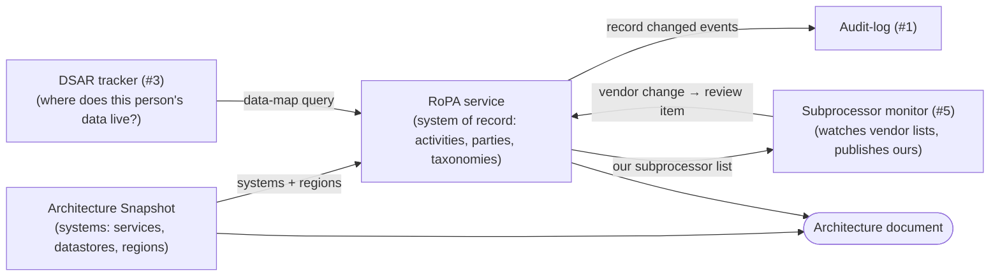
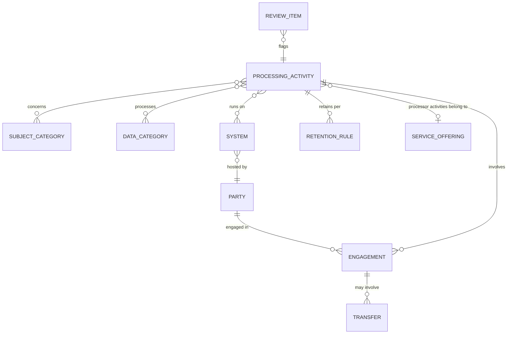

# RoPA Service: Design Strawman (v0.1, for discussion)

> Status: draft to react to, not a decision record. Open questions are in §9.

## 1. Where RoPA sits in the program

The program goal is an always-current architecture document. Architecture Snapshot answers *what runs where*. RoPA adds *what personal data each part handles, why, on whose behalf, how long, and which third parties touch it*. Put together, they give a **data-aware architecture document**: the diagram shows the services, and each one carries its legal context.



## 2. Problems and users

| Problem | Who feels it | What RoPA must provide |
|---|---|---|
| The record lives in a spreadsheet and goes stale as the architecture changes | DPO / privacy counsel | Structured records linked to real systems; coverage gaps flagged |
| A regulator asks for the Art. 30 record (Art. 30(4)) | DPO | Export, ideally "as of" a date |
| A vendor adds a subprocessor. Do we object? Are new countries involved? Does our record change? | Privacy, security/GRC | Impact query: vendor → activities → data categories → countries |
| A customer's DPA questionnaire asks "list your subprocessors" | Sales, procurement, legal | Our subprocessor list derived from processor-role activities |
| Someone asks for their data or its deletion: which systems and vendors hold it? | DSAR operator (service #3) | Data map from subject category to systems and vendors, plus retention |
| Engineers spin up a datastore with no recorded purpose or legal basis | Platform, GRC | Coverage check against the Architecture Snapshot inventory |
| "Can I add vendor X for feature Y?" | Engineers | Vendor registry + what it's already approved for |

Secondary readers: auditors (SOC 2 / ISO 27001 asset + vendor inventories overlap heavily with RoPA).

## 3. Controller vs Processor

**Legal shape**
- **Art. 30(1), controller record:** controller/DPO contact; purposes; categories of data subjects and personal data; categories of recipients; third-country transfers + safeguards; retention/erasure time limits; general description of security measures (TOMs).
- **Art. 30(2), processor record:** processor/DPO contact **and each controller on whose behalf it acts**; categories of processing carried out for each controller; transfers + safeguards; TOMs. No purposes, legal basis or retention (those are the controller's decisions).
- **Art. 28(2):** a processor may use a subprocessor only with the controller's authorization. With *general* authorization, the processor must notify the controller of changes and give the controller the chance to object. **That is the legal reason the subprocessor monitor exists.**

**Why a Render customer needs both.** A typical B2B SaaS on Render is:
- a **controller** for its own data: employees, leads, billing contacts;
- a **processor** for its customers' end-user data inside the product;
- and Render is **its subprocessor**, with Render's own subprocessors (cloud providers etc.) one level further down.

```
Customer (controller) → Our company (processor) → Render (subprocessor) → Render's subprocessors
```

So the demo company's RoPA naturally has both halves, and the chain of processors is what the monitor watches.

**Modeling options**

| Option | Shape | Trade-off |
|---|---|---|
| A. Controller only | One record type | Simplest, but drops the processor view, which is what makes subprocessor lists meaningful |
| **B. One `ProcessingActivity` with `role` discriminator (recommended)** | `role: controller \| processor \| joint_controller`; required fields vary by role | One resource, one report pipeline; maps cleanly to a Zod discriminated union → OpenAPI `oneOf`, which is good to show |
| C. Separate `/controller-activities` and `/processor-activities` | Two resources | Mirrors the law literally, but duplicates shared parts (transfers, TOMs, systems, vendors) |

**Processor-record granularity.** A SaaS might have thousands of customers, and listing each one per activity doesn't scale. Proposal: a processor activity belongs to a **service offering** (e.g. "Core product, standard DPA"), which covers "all customers on the standard DPA" by default, with explicit client parties only for bespoke DPAs.

## 4. What the subprocessor monitor (#5) needs from RoPA

Two directions:

1. **Inbound (we are the customer):** watch each vendor's subprocessor list, DPA and trust page. When one changes:
   - diff the list (added/removed entities, new countries, changed purpose);
   - ask RoPA **"what depends on this vendor?"**, meaning activities, data categories and whether the data is special category, subject categories and current transfer mechanisms;
   - open a **review item** on affected RoPA records with the objection deadline (from the vendor's notice terms, e.g. 30 days).
2. **Outbound (we are the processor):** our own subprocessor list is **derived** from processor-role activities (every party engaged as a subprocessor). When it changes, the monitor publishes the new list and notifies clients, which is our own Art. 28(2) obligation.

**Model implications:**
- Vendors are first-class, stable entities with IDs shared by both services.
- The link between an activity and a vendor carries data: the vendor's **role** (processor/subprocessor/independent recipient), **which data categories** flow to it, **destination countries** and **transfer mechanism**.
- Vendors carry monitoring metadata: subprocessor-list URL, DPA URL, notice period, notification channel.
- A **review item** concept (opened by other services, resolved in RoPA).

## 5. What the DSAR tracker (#3) needs from RoPA

- Given a **subject category** (e.g. "Customer end users"), return activities → systems → vendors, and retention per data category. That's the "where to search / what to erase" map.
- Distinguish controller-role data (we act on the DSAR) from processor-role data (we forward it to the client controller, and only assist).
- **Implication:** subject categories and data categories must be **shared taxonomy IDs**, not free text, or the graph can't be queried.

## 6. Entity model (strawman)



| Entity | Key fields | Notes |
|---|---|---|
| **ProcessingActivity** | name, `role`, owner, status (draft/active/retired), purposes[], lawfulBasis (+ Art. 9 condition), dpiaRequired, securityMeasures, reviewDueAt | Role-specific required fields (§3) |
| **Party** | legalName, kind (`self` / `client` / `vendor` / `other`), country, contacts, DPO; *vendor-only:* dpaUrl, subprocessorListUrl, noticePeriodDays | One table: a company can be both client and vendor |
| **Engagement** | activityId, partyId, `role` (client_controller / processor / subprocessor / joint_controller / recipient), dataCategoryIds[], purpose | The edge the monitor and DSAR both traverse |
| **Transfer** | engagementId, destinationCountry, mechanism (adequacy / SCCs / BCR / DPF / Art. 49), documentRef | Can also be *derived* from system region (e.g. EU data in Oregon) |
| **System** | name, renderResourceId?, region, hostingPartyId | Seeded or synced from Architecture Snapshot |
| **SubjectCategory / DataCategory** | name, `special` flag (Art. 9/10) | Seeded taxonomy, extensible |
| **RetentionRule** | activityId, dataCategoryId?, period, trigger ("after account closure") | Controller-role only |
| **ServiceOffering** | name, defaultDpaRef | Groups processor activities (§3 granularity) |
| **ReviewItem** | targetId, source (monitor/snapshot/manual), reason, dueAt, status | Integration seam for #5 and Snapshot |

Cross-cutting: every record is **versioned** so reports can be produced "as of" a date, and changes emit events to the audit log.

## 7. Service boundaries (proposal)

| Data | Owner | Others |
|---|---|---|
| Activities, parties/vendors, engagements, taxonomies, review items | **RoPA** | Read via API |
| Vendor subprocessor-list snapshots, diffs, fetch schedule | **Monitor** | References vendor `partyId` |
| Systems (Render resources) | **Architecture Snapshot** | RoPA holds a reference + cached name/region |
| DSAR cases and timelines | **DSAR** | Reads RoPA data map |

## 8. API surface (strawman)

**Records (CRUD)**
- `/activities` — filters: `role`, `subjectCategory`, `dataCategory`, `party`, `system`, `country`, `status`
- `/activities/{id}/history`
- `/parties`, `/systems`, `/service-offerings`
- `/taxonomy/subject-categories`, `/taxonomy/data-categories`

**Read models (the reason this service exists)**
- `GET /report?view=controller|processor&asOf=&format=json|markdown|csv`: the Art. 30 record
- `GET /parties/{id}/impact`: what depends on this vendor (for the monitor)
- `GET /data-map?subjectCategory=`: where this category's data lives (for DSAR)
- `GET /subprocessors`: our published subprocessor list (derived)
- `GET /coverage`: systems with no activity, activities with no system (vs. Snapshot)

**Integration**
- `/review-items` (POST from other services, PATCH to resolve)
- Outbound events → audit log: `activity.changed`, `subprocessors.changed`

**Possible MVP cut:** activities (both roles), parties, engagements, taxonomies, `/report`, `/parties/{id}/impact`, `/subprocessors`. Defer: versioning/`asOf`, review items, coverage, markdown/CSV formats.

## 9. Open decisions

1. **Role modeling:** Option B (one activity with a `role` discriminator)?
2. **Processor granularity:** service offering + default client coverage?
3. **Party model:** unified `Party` with `kind`, and a role-bearing `Engagement` edge?
4. **Vendor ownership:** RoPA owns vendors; the monitor owns list snapshots and opens review items?
5. **Versioning:** revisions table in RoPA (enables `asOf`) vs. relying on audit-log events?
6. **Systems:** reference Snapshot's Render resource IDs, or keep standalone Systems until Snapshot exists?
7. **Demo scenario:** a fictional B2B SaaS on Render (controller for staff/leads, processor for customer end users; vendors = Render + fictional email/payments/error-tracking providers)?
