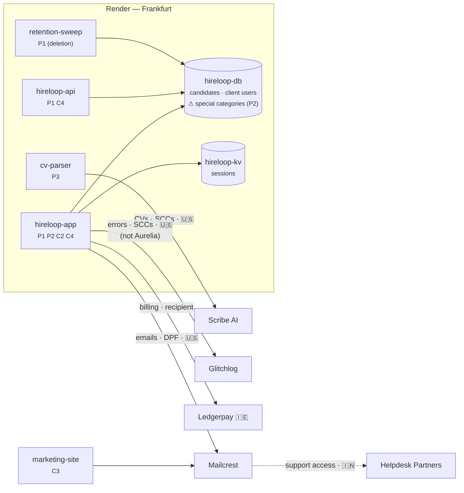

# The Hireloop Story: RoPA in Practice

> A narrative walkthrough of the RoPA service (with the future Subprocessor Monitor and DSAR tracker) used to sanity-check design decisions in `ropa-design.md` and to define our synthetic seed data. All companies and people are fictional, except Render, whose role is generic (hosting provider) and makes no claims about its real subprocessors.

---

## Cast

**Hireloop B.V.** (Amsterdam, 58 employees) sells an applicant tracking system (ATS) to European employers. Recruiters at client companies post jobs, candidates apply through Hireloop-hosted career pages, and recruiters review CVs and interview notes. Everything runs on **Render, Frankfurt region**.

| Person | Role in the story |
|---|---|
| **Priya Raman** | Hireloop's Privacy Lead & DPO. Owns the record. |
| **Tomás Herrera** | Platform engineer. Ships services on Render. |
| **Ines Duarte** | Head of Customer Success. Fields procurement questionnaires. |
| **Jonas Weber** | CTO. Wants AI CV parsing. |
| **Marc Lentz** | Vendor-risk analyst at Aurelia Bank (a client). |
| **Lena Vogel** | A candidate who applied to Northwind via Hireloop. |
| **Kees de Vries** | A former Hireloop employee. |

**Clients (controllers of candidate data)**

| Client | Agreement | Notable terms |
|---|---|---|
| Northwind Logistics B.V. (NL) | Standard DPA v3 | General authorization for subprocessors, 30-day notice |
| Fjord Outdoor AS (NO) | Standard DPA v3 | Same |
| Aurelia Bank S.A. (LU) | Bespoke DPA | **Specific** (prior written) authorization, 60-day notice, EU-only processing, uses the Diversity module |

**Vendors**

| Vendor | Country | Does what | Role |
|---|---|---|---|
| Render | US (hosting in Frankfurt) | Hosting, Postgres, Key Value | Processor (for Hireloop's own data), **subprocessor** (for client data) |
| Mailcrest Inc. | US | Transactional + marketing email | Processor / subprocessor |
| Glitchlog Ltd | US | Error tracking | Processor / subprocessor |
| Peoplehub GmbH | DE | HR system | Processor (employee data only) |
| Ledgerpay Ltd | IE | Payments | **Independent controller** (recipient, *not* a subprocessor) |
| Scribe AI Inc. | US | LLM-based CV parsing | Subprocessor (arrives in Chapter 5) |

**Systems on Render (what Architecture Snapshot would see)**

| System | Render type | Holds personal data? |
|---|---|---|
| `hireloop-app` | Web service | Yes: recruiter UI + candidate portal |
| `hireloop-api` | Web service | Yes: public API for client integrations |
| `hireloop-db` | Postgres | Yes: primary store |
| `hireloop-kv` | Key Value | Yes: sessions |
| `retention-sweep` | Cron job | Processes (deletes) candidate data |
| `marketing-site` | Static site | Lead forms (posted to Mailcrest) |
| `cv-parser` | Background worker | *Added in Chapter 5* |

---

## Chapter 1: The spreadsheet (January 2026)

Aurelia Bank is about to sign. Marc Lentz sends Ines a 140-question vendor-risk questionnaire. Question 37: *"Provide the extract of your Record of Processing Activities relevant to our data, and your current list of subprocessors with locations and transfer mechanisms."*

Ines forwards it to Priya. Priya opens `RoPA_master_v7_FINAL.xlsx`. It was last updated eleven months ago. It lists Heroku (Hireloop left in 2025), doesn't mention Glitchlog, and has one row called "Candidate stuff."

Priya spends four days rebuilding it by interviewing Tomás. Then she asks for a system so it never drifts that far again.

> **Problem exposed:** the record goes stale because it's disconnected from the architecture, and two audiences (regulator, customers) ask for different *views* of the same facts.

---

## Chapter 2: Hireloop as controller (February 2026)

Priya starts with the data Hireloop decides about itself. These are **Art. 30(1)** records: Hireloop chooses the purposes and the means.

```yaml
id: act-c2
name: Customer accounts & billing
role: controller
purposes: [Provide contracted service accounts, Invoice and collect payment]
lawfulBasis: ["6(1)(b) contract", "6(1)(c) legal obligation (tax)"]
subjectCategories: [sc-client-users]
dataCategories: [dc-identity, dc-account, dc-billing]
systems: [hireloop-app, hireloop-db, hireloop-kv]
engagements:
  - party: render      role: processor      data: [dc-identity, dc-account, dc-billing]
  - party: mailcrest   role: processor      data: [dc-identity]         transfer: {to: US, mechanism: DPF}
  - party: ledgerpay   role: recipient      data: [dc-billing]          # independent controller
retention:
  - data: dc-account  period: P90D  trigger: "after contract end"
  - data: dc-billing  period: P7Y   trigger: "after invoice date"   # Dutch tax law
securityMeasures: [encryption-at-rest, sso-for-staff, rbac, audit-logging]
owner: Priya Raman
```

She records four controller activities (full list in the appendix): **C1 Employee administration**, **C2 Customer accounts & billing**, **C3 Sales & marketing**, **C4 Service reliability monitoring**.

Things she notices while writing them:
- **Retention differs per data category** within one activity: billing data 7 years, account data 90 days.
- **C1 includes health data** (sick-leave records): a special category, so it needs an **Art. 9(2)** condition on top of the Art. 6 basis.
- **Ledgerpay is not Hireloop's processor.** It decides its own fraud-screening purposes, which makes it a *recipient*. It appears in the record but will **not** appear on the subprocessor list.
- **C4 is a grey zone.** Glitchlog error reports sometimes include candidate emails in stack traces. Is Hireloop processing candidate data *for its own purpose* (security of the service, so controller) or *on behalf of clients* (so processor)? Priya decides controller, documents why, and puts "scrub PII from error payloads" on Tomás's backlog. That later becomes the Redaction service (#2).

> **Operations:** `POST /activities` (role=controller), `POST /parties`, `GET /taxonomy/*`.

---

## Chapter 3: Hireloop as processor (February 2026)

Candidate data belongs to the clients. Northwind decides why it recruits and whom it keeps; Hireloop only processes on Northwind's instructions. These are **Art. 30(2)** records, which have no purposes, lawful basis or retention of Hireloop's own. Instead they record **which controllers** Hireloop serves and **what categories of processing** it performs for them.

Hireloop has 400 clients. Priya won't list each one per activity. Most sign the **Standard DPA v3**, so she groups processor activities under a **service offering**:

```yaml
id: off-ats
name: Hireloop ATS
defaultAgreement: agr-standard-dpa-v3   # general authorization, 30-day notice
```

```yaml
id: act-p1
name: Candidate application management
role: processor
offering: off-ats
controllers: "all clients on off-ats"        # default coverage
processingCategories: [hosting, storage, workflow, candidate notifications, retention-deletion]
subjectCategories: [sc-candidates]
dataCategories: [dc-identity, dc-cv, dc-assessment]
systems: [hireloop-app, hireloop-api, hireloop-db, retention-sweep]
engagements:
  - party: render     role: subprocessor   data: [dc-identity, dc-cv, dc-assessment]   # hosted in Frankfurt
  - party: mailcrest  role: subprocessor   data: [dc-identity]   transfer: {to: US, mechanism: DPF}
  - party: glitchlog  role: subprocessor   data: [dc-identity]   transfer: {to: US, mechanism: SCCs}
                      excludedFor: [aurelia]      # ← Aurelia requires EU-only processing
securityMeasures: [encryption-at-rest, tenant-isolation, rbac, audit-logging]
```

Then Aurelia complicates things:
- Aurelia's **bespoke DPA** requires *specific* authorization for any new subprocessor, 60 days' notice, and **EU-only processing**. Glitchlog (US) must not receive Aurelia's candidate data, so Tomás adds tenant-based suppression, and the record shows an **exclusion on that engagement for that client**.
- Aurelia enables the optional **Diversity & Accommodations module**, which collects ethnicity and disability-accommodation requests. That's **P2**: special-category data, processed *only* for clients who enable it. The Art. 9 condition is Aurelia's to establish, because Aurelia is the controller. Hireloop's record just notes that special categories are processed.

> **Model pressure:** the terms that matter (authorization type, notice period, location restrictions) live in the **agreement**, not the activity. The strawman had no `Agreement` entity.
>
> **Operations:** `POST /service-offerings`, `POST /activities` (role=processor), engagement exclusions per client.

---

## Chapter 4: Answering Marc (February 2026)

Ines now answers Question 37 with two calls:

- `GET /report?view=processor&client=aurelia`: the Art. 30(2) extract for Aurelia: P1 and P2, with Glitchlog *absent* (excluded).
- `GET /subprocessors?client=aurelia`: Render (Frankfurt, hosting) and Mailcrest (US, email, DPF). Ledgerpay isn't there (it never touches client data). Neither is Peoplehub (employee data only).

Northwind asking the same question gets a list that **includes** Glitchlog. The subprocessor list is a **per-client view** derived from the record, not a static web page.

> **Checks decisions:** #2 (offering + override), #3 (Party + Engagement roles). **Endpoint:** `/subprocessors` needs a `client` parameter.

---

## Chapter 5: Jonas wants AI (April 2026)

Jonas ships AI CV parsing. Tomás adds a background worker, `cv-parser`, on Render. It sends CVs to **Scribe AI (US)**.

**The architecture notices first.** The nightly Architecture Snapshot finds a new service. `GET /coverage` reports: *`cv-parser` is not linked to any processing activity.* A review item opens for Priya.

Priya drafts **P3 CV parsing**: candidates' CVs go to Scribe AI, which is a new subprocessor with a US transfer (SCCs). She also flags `dpiaRequired: true`, since automated evaluation of job candidates is high-risk under Art. 35.

**This is an outbound subprocessor change.** Because Hireloop is a processor, Art. 28(2) applies:
- For the **Standard DPA** clients (general authorization), the monitor publishes the updated list and sends notices: *"Scribe AI will be added on 2026-05-15; you may object until then."*
- For **Aurelia** (specific authorization), a notice isn't enough. Hireloop needs Aurelia's written approval, 60 days ahead.

Marc objects. Result: P3's Scribe engagement gets `excludedFor: [aurelia]`, and CV parsing stays off for Aurelia's tenant.

> **Operations:** Snapshot → `/coverage` → `POST /review-items`; `POST /activities` (P3); `GET /subprocessors` changes → monitor diffs our own list → notifications per agreement terms.
> **Checks decision:** #4 (who owns what). The monitor needs to read **agreements** to know who gets a notice vs. who must approve.

---

## Chapter 6: A vendor changes its list (June 2026)

The Subprocessor Monitor fetches Mailcrest's published subprocessor page weekly. On June 3 the diff shows one addition:

> **+ Helpdesk Partners Pvt Ltd**, India, customer-support access to message content. Effective 2026-07-03 (30 days' notice).

The monitor calls `GET /parties/mailcrest/impact`:

| Activity | Hireloop's role | Data at Mailcrest | Consequence |
|---|---|---|---|
| C2 Customer accounts | Controller | client-user emails | **Hireloop decides**: accept or object. Record new transfer: India, SCCs via Mailcrest DPA |
| C3 Sales & marketing | Controller | lead emails | Same |
| P1 Candidate management | **Processor** | candidate emails | **Hireloop must pass this on to its clients**: it's a new sub-subprocessor in their chain |

The last row is the chain effect. **An inbound change on a processor-role engagement triggers an outbound notification.** And the deadlines collide: Mailcrest gave Hireloop **30 days**, but Hireloop owes Aurelia **60 days** and *prior approval*. Priya can't meet that by accepting. She has to ask Mailcrest to exclude Aurelia's traffic from Helpdesk Partners, or route Aurelia's candidate emails through a different provider.

The monitor opens three review items in RoPA with due dates computed from both agreements.

> **Operations:** monitor snapshot/diff (monitor-owned) → `GET /parties/{id}/impact` → `POST /review-items` ×3 → on resolution, `PUT /activities/*` adds transfers → `GET /subprocessors` changes → outbound notices.
> **Model pressure:** impact must return **role per activity** and **the clients affected** (with their agreement terms), not just activity IDs.

---

## Chapter 7: Two requests, two roles (July 2026)

**Lena Vogel** applied to Northwind last year. She emails *Hireloop* (not Northwind) asking for all her data to be deleted.

The DSAR tracker logs the request and queries `GET /data-map?subjectCategory=sc-candidates&client=northwind`:

| Where | Activity | Holds |
|---|---|---|
| `hireloop-db` | P1 | identity, CV, interview notes |
| Mailcrest | P1 | email delivery logs |
| Scribe AI | P3 | none retained (0-day retention per its DPA) |
| Glitchlog | **C4** | possibly: error payloads (incidental) |

Because P1 and P3 are **processor** activities, Hireloop doesn't decide. It **forwards** the request to Northwind (the controller) and assists when instructed. The Glitchlog row falls under **C4**, where Hireloop is controller, so Hireloop handles that part itself.

**Kees de Vries** left Hireloop in 2024 and asks for erasure. The data map for `sc-employees` points to **C1 → Peoplehub**. Hireloop is controller, so it decides. Retention rules resolve it:
- sick-leave records: 2-year limit passed → **erase**
- payroll data: 7-year tax obligation → **retain**, citing the Art. 17(3)(b) exception

> **Checks decision:** shared taxonomy IDs make the data map queryable; **role** determines whether Hireloop acts or forwards; retention rules per data category determine the answer.

---

## Chapter 8: The regulator (September 2026)

A candidate complains to the Dutch data protection authority (Autoriteit Persoonsgegevens) about AI screening. The authority invokes Art. 30(4) and asks for:
1. Hireloop's record **as it stood on 1 March 2026**, and
2. the current record,
3. plus the DPIA for CV parsing.

Priya runs `GET /report?view=all&asOf=2026-03-01` and `GET /report?view=all`. The diff shows that P3 and the Scribe AI engagement were added on 2026-04-14, with `dpiaRequired: true` and a DPIA reference dated 2026-04-02. The audit-log service shows who changed each record and when.

> **Checks decision #5:** without versioned records, `asOf` is impossible and Priya would be back to reconstructing history from memory, which is the same failure as the spreadsheet.

---

## Chapter 9: The architecture document

At the end of September, Jonas asks for an architecture overview for the board and for the next SOC 2 audit. Architecture Snapshot generates the component diagram, and RoPA annotates it:



Each box now answers *what runs here*, *whose data*, *which activity*, and *where it goes next*. That's the program's goal.

---

## What the story tests

| Scene | Decision tested | Endpoints exercised |
|---|---|---|
| Ch2 controller records | #1 role discriminator; retention per data category | `POST /activities`, taxonomy |
| Ch3 processor records | #2 offering + client override; #3 Party/Engagement | `POST /service-offerings`, exclusions |
| Ch4 questionnaire | #3; per-client views | `GET /report?client=`, `GET /subprocessors?client=` |
| Ch5 new AI vendor | #4 boundaries; #6 Snapshot linkage | `GET /coverage`, `POST /review-items` |
| Ch6 vendor list change | #4; chain effect | `GET /parties/{id}/impact` |
| Ch7 DSARs | taxonomy IDs; role → act vs forward | `GET /data-map` |
| Ch8 regulator | #5 versioning | `GET /report?asOf=` |
| Ch9 architecture doc | #6 Snapshot linkage | report + Snapshot join |

## What the story revealed (changes to the strawman)

1. **Add an `Agreement` entity** (DPA between us and a client, or between us and a vendor): authorization type (general/specific), notice days, location restrictions. Chapters 3, 5 and 6 all depend on it.
2. **Engagements need client-scoped exclusions** (`excludedFor`): Glitchlog and Scribe for Aurelia.
3. **`/subprocessors` and `/report` take a `client` parameter.** These are per-client views, not one global list.
4. **Recipients ≠ subprocessors.** Ledgerpay (an independent controller) belongs in the record but not on the list, which confirms the need for a role on the Engagement.
5. **The chain effect:** an inbound vendor change on a processor-role engagement must create outbound obligations. `impact` should return role plus affected clients and their agreement terms.
6. **Deadline conflicts** between a vendor's notice period and our commitments to clients are a real, computable risk. The review item should surface both dates.
7. **The controller/processor grey zone** (C4) is real. The record needs a free-text `roleRationale`.
8. **DPIA fields** (`dpiaRequired`, `dpiaRef`) belong on the activity.
9. **Versioning is not optional** if the regulator scene matters (decision #5 → yes).

---

## Appendix: Seed data inventory

**Subject categories:** `sc-candidates`, `sc-client-users`, `sc-employees`, `sc-leads`

**Data categories:** `dc-identity`, `dc-cv`, `dc-assessment`, `dc-diversity` ⚠, `dc-health` ⚠, `dc-account`, `dc-billing`, `dc-telemetry`, `dc-payroll`, `dc-marketing` (⚠ = special category, Art. 9)

**Activities**

| ID | Name | Role | Subjects | Data | Parties |
|---|---|---|---|---|---|
| C1 | Employee administration | controller | employees | identity, payroll, health⚠ | Peoplehub (processor) |
| C2 | Customer accounts & billing | controller | client users | identity, account, billing | Render, Mailcrest (processors); Ledgerpay (recipient) |
| C3 | Sales & marketing | controller | leads | identity, marketing | Render, Mailcrest (processors) |
| C4 | Service reliability monitoring | controller | client users, candidates (incidental) | telemetry, identity | Render, Glitchlog (processors) |
| P1 | Candidate application management | processor | candidates | identity, cv, assessment | Render, Mailcrest, Glitchlog* (subprocessors) |
| P2 | Diversity & accommodations module | processor | candidates | diversity⚠, health⚠ | Render (subprocessor); Aurelia only |
| P3 | CV parsing (from 2026-04-14) | processor | candidates | cv, identity | Render, Scribe AI* (subprocessors) |

\* excluded for Aurelia

**Agreements:** `agr-standard-dpa-v3` (general, 30d), `agr-aurelia-dpa` (specific, 60d, EU-only), plus vendor DPAs for Render, Mailcrest, Glitchlog, Scribe AI, Peoplehub.

**Timeline (for versioning):** 2026-02-10 record created → 2026-04-14 P3 + Scribe added → 2026-06-03 Mailcrest change detected → 2026-07-03 Helpdesk Partners effective → 2026-09 regulator request.
