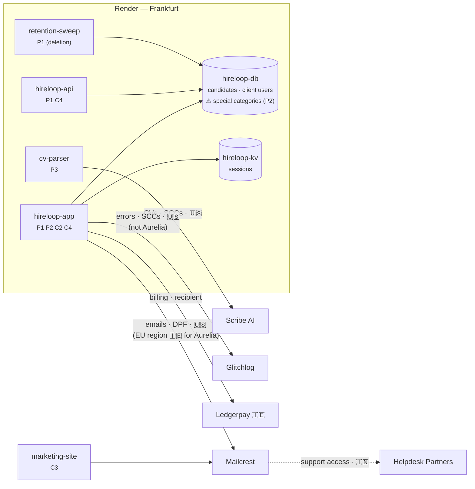

# The Hireloop Story: RoPA in Practice

> A narrative walkthrough of the RoPA service (with the future Subprocessor Monitor and DSAR tracker) used to sanity-check design decisions in `ropa-design.md` and to define our synthetic seed data. All companies and people are fictional, except Render, whose role is generic (hosting provider) and makes no claims about its real subprocessors.

---

## Cast

**Hireloop B.V.** (Amsterdam, 58 employees) sells an **applicant tracking system (ATS)** to European employers. An ATS is hiring software: employers use it to post job openings, collect applications and CVs, move candidates through stages (screening, interviews, offer), share interview notes, and email candidates. Recruiters at client companies post jobs, candidates apply through Hireloop-hosted career pages, and recruiters review CVs and interview notes. Everything runs on **Render, Frankfurt region**.

| Person | Role in the story |
|---|---|
| **Priya Raman** | Hireloop's Privacy Lead & DPO. Owns the record. |
| **Tomás Herrera** | Platform engineer. Ships services on Render. |
| **Ines Duarte** | Head of Customer Success. Fields procurement questionnaires. |
| **Jonas Weber** | CTO. Wants AI CV parsing. |
| **Marc Lentz** | Vendor-risk analyst at Aurelia Bank (a prospect that becomes a client in Chapter 4). |
| **Lena Vogel** | A candidate who applied to Northwind via Hireloop. |
| **Kees de Vries** | A former Hireloop employee. |

**Clients (controllers of candidate data)**

| Client | Agreement | Notable terms |
|---|---|---|
| Northwind Logistics B.V. (NL) | Standard DPA v3 | General authorization for subprocessors, 30-day notice |
| Fjord Outdoor AS (NO) | Standard DPA v3 | Same |
| Aurelia Bank S.A. (LU) | Bespoke DPA, signed 2026-03-16 (Chapter 4) | **Specific** (prior written) authorization, 60-day notice, EU-only processing, uses the Diversity module. A prospect until then. |

**Vendors**

| Vendor | Country | Does what | Role |
|---|---|---|---|
| Render | US (hosting in Frankfurt) | Hosting, Postgres, Key Value | Processor (for Hireloop's own data), **subprocessor** (for client data) |
| Mailcrest Inc. | US (plus an EU data region in Ireland) | Transactional + marketing email | Processor / subprocessor |
| Glitchlog Ltd | US | Error tracking | Processor / subprocessor |
| Peoplehub GmbH | DE | HR system | Processor (employee data only) |
| Ledgerpay Ltd | IE | Payments | **Independent controller** (recipient, *not* a subprocessor) |
| Scribe AI Inc. | US | LLM-based CV parsing | Subprocessor (arrives in Chapter 5) |

**Systems on Render (what Architecture Snapshot would see)**

| System | Render type | Holds personal data? |
|---|---|---|
| `hireloop-app` | Web service | Yes: recruiter UI + candidate portal |
| `hireloop-api` | Web service | Yes: public API for client integrations |
| `hireloop-db` | Postgres | Yes: primary store |
| `hireloop-kv` | Key Value | Yes: sessions |
| `retention-sweep` | Cron job | Processes (deletes) candidate data |
| `marketing-site` | Static site | Lead forms (posted to Mailcrest) |
| `cv-parser` | Background worker | *Added in Chapter 5* |

---

## Chapter 1: The spreadsheet (January 2026)

Aurelia Bank has chosen Hireloop and is weeks away from signing the subscription contract (master services agreement + order form) and its data processing agreement (DPA). First, Aurelia's vendor-risk team runs due diligence. A controller must only use processors that give "sufficient guarantees" (Art. 28(1)), and as a bank Aurelia must also vet technology suppliers before contracting under financial-sector outsourcing rules and DORA. Marc Lentz sends Ines a 140-question vendor-risk questionnaire. Question 37: *"Provide the extract of your Record of Processing Activities relevant to our data, and your current list of subprocessors with locations and transfer mechanisms."*

Ines forwards it to Priya. Priya opens `RoPA_master_v7_FINAL.xlsx`. It was last updated eleven months ago. It lists Heroku (Hireloop left in 2025), doesn't mention Glitchlog, and has one row called "Candidate stuff."

Priya spends four days rebuilding it by interviewing Tomás. Then she asks for a system so it never drifts that far again.

> **Problem exposed:** the record goes stale because it's disconnected from the architecture, and two audiences (regulator, customers) ask for different *views* of the same facts.

---

## Chapter 2: Hireloop as controller (February 2026)

Priya starts with **Hireloop's own operations**: its staff, its customers' accounts, its sales pipeline and the monitoring of its own service. These are **Art. 30(1)** records, because Hireloop decides why and how this data is processed. None of them is about customers' candidate data.

> **Rule of thumb:** *who decided this processing should happen?* If Hireloop decided, it's a controller record. If a customer decided and Hireloop carries it out, it's a processor record.

```yaml
id: act-c2
name: Customer accounts & billing
role: controller
purposes: [Provide contracted service accounts, Invoice and collect payment]
lawfulBasis: ["6(1)(b) contract", "6(1)(c) legal obligation (tax)"]
subjectCategories: [sc-client-users]
dataCategories: [dc-identity, dc-account, dc-billing]
systems: [hireloop-app, hireloop-db, hireloop-kv]
engagements:
  - party: render      role: processor      data: [dc-identity, dc-account, dc-billing]
  - party: mailcrest   role: processor      data: [dc-identity]         transfer: {to: US, mechanism: DPF}
  - party: ledgerpay   role: recipient      data: [dc-billing]          # independent controller
retention:
  - data: dc-account  period: P90D  trigger: "after contract end"
  - data: dc-billing  period: P7Y   trigger: "after invoice date"   # Dutch tax law
securityMeasures: [encryption-at-rest, sso-for-staff, rbac, audit-logging]
owner: Priya Raman
```

She records four controller activities (full list in the appendix):
- **C1 Hireloop staff administration:** Hireloop's own 58 employees (contracts, payroll, sick leave), managed in Peoplehub.
- **C2 Customer accounts & billing:** the recruiter logins and billing contacts of Hireloop's customers.
- **C3 Hireloop sales & marketing (prospective customers):** HR managers at companies that might buy the ATS, from the marketing site, newsletter and demo requests.
- **C4 Service reliability monitoring:** Hireloop's error tracking and telemetry for its own service.

Things she notices while writing them:
- **Retention differs per data category** within one activity: billing data 7 years, account data 90 days.
- **C1 runs entirely outside Render** (in Peoplehub). The record covers everything Hireloop controls, not just what runs on its platform.
- **C1 includes health data** (sick-leave records): a special category, so it needs an **Art. 9(2)** condition on top of the Art. 6 basis.
- **Ledgerpay is not Hireloop's processor.** It decides its own fraud-screening purposes, which makes it a *recipient*. It appears in the record but will **not** appear on the subprocessor list.
- **C4 is a grey zone.** Glitchlog error reports sometimes include candidate emails in stack traces. Is Hireloop processing candidate data *for its own purpose* (security of the service, so controller) or *on behalf of clients* (so processor)? Priya decides controller, documents why, and puts "scrub PII from error payloads" on Tomás's backlog. That later becomes the Redaction service (#2).

> **Operations:** `POST /activities` (role=controller), `POST /parties`, `GET /taxonomy/*`.

---

## Chapter 3: Hireloop as processor (February 2026)

Candidate data belongs to the clients. Northwind decides why it recruits and whom it keeps; Hireloop only processes on Northwind's instructions. These are **Art. 30(2)** records, which have no purposes, lawful basis or retention of Hireloop's own. Instead they record **which controllers** Hireloop serves and **what categories of processing** it performs for them.

Hireloop has 400 clients. Priya won't list each one per activity. Most sign the **Standard DPA v3**, so she groups processor activities under a **service offering**:

```yaml
id: off-ats
name: Hireloop ATS
defaultAgreement: agr-standard-dpa-v3   # general authorization, 30-day notice
```

```yaml
id: act-p1
name: Candidate application management
role: processor
offering: off-ats
controllers: "all clients on off-ats"        # default coverage
processingCategories: [hosting, storage, workflow, candidate notifications, retention-deletion]
subjectCategories: [sc-candidates]
dataCategories: [dc-identity, dc-cv, dc-assessment]
systems: [hireloop-app, hireloop-api, hireloop-db, retention-sweep]
engagements:
  - party: render     role: subprocessor   data: [dc-identity, dc-cv, dc-assessment]   # hosted in Frankfurt
  - party: mailcrest  role: subprocessor   data: [dc-identity]   transfer: {to: US, mechanism: DPF}
  - party: glitchlog  role: subprocessor   data: [dc-identity]   transfer: {to: US, mechanism: SCCs}
securityMeasures: [encryption-at-rest, tenant-isolation, rbac, audit-logging]
```

At this point every client (Northwind, Fjord and the other 398) is on the Standard DPA, so one record covers them all. Priya notices that the terms Hireloop has promised its clients (general authorization for subprocessors, 30 days' notice before a change) aren't properties of the activity. They're written in the **Standard DPA v3**, and every client on that DPA shares them.

> **Model pressure:** the terms that matter (authorization type, notice period, location restrictions) live in the **agreement**, not the activity. The strawman had no `Agreement` entity.
>
> **Operations:** `POST /service-offerings`, `POST /agreements`, `POST /activities` (role=processor).

---

## Chapter 4: Answering Marc, and signing Aurelia (February–March 2026)

**Before signing.** Aurelia is still a prospect: there's no Aurelia agreement and none of its candidates' data is processed yet, so RoPA has nothing to say about Aurelia specifically. (RoPA records processing that actually happens. Deals in progress live in Hireloop's CRM. Marc does appear in RoPA, though: his contact details are a *lead* in C3.)

So Ines answers Question 37 with the **standard offering** view, which is what any new client on the Standard DPA gets:

- `GET /report?view=processor&offering=off-ats`: the Art. 30(2) extract for the ATS: P1, the categories of processing, transfers and security measures.
- `GET /subprocessors?offering=off-ats`: Render (Frankfurt, hosting), Mailcrest (US, email, DPF), Glitchlog (US, error tracking, SCCs). Ledgerpay isn't there (it never touches client data). Neither is Peoplehub (employee data only).

This offering view is the same list Hireloop publishes on its website's subprocessor page. It's also exactly what *other* companies' subprocessor monitors would watch, just as Hireloop's monitor watches Mailcrest's page (Chapter 6).

**The negotiation.** Marc reads the list and pushes back:
- The bank requires **EU-only processing** of candidate data. Two subprocessors process in the US: Glitchlog (error tracking) and Mailcrest (candidate emails).
- Aurelia wants **specific** (prior written) authorization for any new subprocessor, not just a notice, and **60 days** to respond.
- Aurelia wants the optional **Diversity & Accommodations module**, which collects ethnicity and disability-accommodation requests.

Tomás looks at both:
- **Glitchlog** has no EU option, but error reporting can be suppressed for Aurelia's tenant.
- **Mailcrest** offers an **EU data region** (Ireland). Tomás configures Aurelia's tenant to send candidate emails through it. Every other client stays on Mailcrest's US region.

Legal drafts a bespoke DPA. **Aurelia signs on 2026-03-16.**

**After signing**, Priya records what is now real:
- Aurelia as a client party, with agreement `agr-aurelia-dpa` (specific authorization, 60 days, EU-only).
- **Client scoping on P1's engagements.** The same vendor can now appear twice on one activity, once per region, each scoped to different clients:

```yaml
engagements:
  - party: mailcrest  role: subprocessor  service: "Candidate notifications (US region)"
    countries: [US]   transfer: {to: US, mechanism: DPF}
    clientScope: {exclude: [aurelia]}          # everyone except Aurelia
  - party: mailcrest  role: subprocessor  service: "Candidate notifications (EU region)"
    countries: [IE]                            # no third-country transfer
    clientScope: {include: [aurelia]}          # only Aurelia
  - party: glitchlog  role: subprocessor  service: "Error tracking"
    countries: [US]   transfer: {to: US, mechanism: SCCs}
    clientScope: {exclude: [aurelia]}
```
- **P2 Diversity & accommodations module:** special-category data processed *only* for clients who enable it. The Art. 9 condition is Aurelia's to establish, because Aurelia is the controller. Hireloop's record just notes that special categories are processed.

Now the per-client views make sense:
- `GET /subprocessors?client=aurelia`: Render (Germany) and Mailcrest (**Ireland**, EU region). **No Glitchlog**, and no US transfer.
- `GET /subprocessors?client=northwind`: Render, Mailcrest (US, DPF) **and** Glitchlog (standard terms).
- `GET /subprocessors?offering=ats` is unchanged. The EU-region engagement exists only for Aurelia, so it isn't part of the standard terms.

Aurelia's agreement also lists its allowed region (`EEA`). From now on, `/coverage` checks that every engagement used for Aurelia's data processes it, and transfers it, only inside that region.

The subprocessor list is a **view derived from the record**, not a static page. The offering view shows the standard terms before a contract. The client view shows a signed client's actual terms.

> **Checks decisions:** #2 (offering + client override), #3 (Party + Engagement roles). **Endpoints:** `/report` and `/subprocessors` take `offering=` and `client=`.

---

## Chapter 5: Jonas wants AI (April 2026)

Jonas ships AI CV parsing. Tomás adds a background worker, `cv-parser`, on Render. It sends CVs to **Scribe AI (US)**.

**The architecture notices first.** The nightly Architecture Snapshot finds a new service. `GET /coverage` reports: *`cv-parser` is not linked to any processing activity.* A review item opens for Priya.

Coverage runs both ways, and not every gap is a problem. A system with no activity (`cv-parser`) is a gap. An activity with no Render system (C1, which lives in Peoplehub) is legitimate and must not be flagged.

Priya drafts **P3 CV parsing**: candidates' CVs go to Scribe AI, which is a new subprocessor with a US transfer (SCCs). Automated evaluation of job candidates is high-risk, so under Art. 35 a **Data Protection Impact Assessment (DPIA)** is needed before launch. A DPIA is a documented risk assessment covering the processing, why it's necessary, the risks to people, and the safeguards.

But a DPIA is the *controller's* duty, and for P3 the controllers are Hireloop's clients. Hireloop's job is to help them (Art. 28(3)(f)). Priya prepares a **DPIA support pack** (risk analysis, safeguards, how the model's output is used, Scribe AI's zero-retention terms) that each client can reuse in its own DPIA, and records it on P3 as `dpiaSupportRef`. CV screening is also classed as high-risk under the EU AI Act, which brings its own obligations for Hireloop and its clients.

**This is an outbound subprocessor change.** Because Hireloop is a processor, Art. 28(2) applies:
- For the **Standard DPA** clients (general authorization), the monitor publishes the updated list and sends notices: *"Scribe AI will be added on 2026-05-15; you may object until then."*
- For **Aurelia** (specific authorization), a notice isn't enough. Hireloop needs Aurelia's written approval, 60 days ahead.

Marc objects. CV parsing is switched off for Aurelia's tenant altogether, so Priya excludes Aurelia from **P3 as a whole** (`clientScope: {exclude: [aurelia]}` on the activity), not just from the Scribe engagement. P3 stays on for every other client, but Aurelia's processor report no longer lists it, and a data-map request for Aurelia's candidates doesn't point to `cv-parser`, where their CVs never go.

> **Operations:** Snapshot → `/coverage` → `POST /review-items`; `POST /activities` (P3); `GET /subprocessors` changes → monitor diffs our own list → notifications per agreement terms.
> **Checks decision:** #4 (who owns what). The monitor needs to read **agreements** to know who gets a notice vs. who must approve.

---

## Chapter 6: A vendor changes its list (June 2026)

The Subprocessor Monitor fetches Mailcrest's published subprocessor page weekly. On June 3 the diff shows one addition:

> **+ Helpdesk Partners Pvt Ltd**, India, customer-support access to message content **in all regions, including the EU region**. Effective 2026-07-03 (30 days' notice).

The monitor calls `GET /parties/mailcrest/impact`:

| Activity | Hireloop's role | Data at Mailcrest | Consequence |
|---|---|---|---|
| C2 Customer accounts | Controller | client-user emails | **Hireloop decides**: accept or object. Record new transfer: India, SCCs via Mailcrest DPA |
| C3 Hireloop sales & marketing | Controller | lead emails | Same |
| P1 Candidate management, US region | **Processor** | candidate emails (399 clients on the Standard DPA) | **Hireloop must pass this on to its clients**: it's a new sub-subprocessor in their chain |
| P1 Candidate management, EU region | **Processor** | Aurelia's candidate emails, stored in Ireland | Same, and for Aurelia it breaks the EU-only clause |

The P1 rows are the chain effect. **An inbound change on a processor-role engagement triggers an outbound notification.**

The EU-region row adds a lesson: **data residency doesn't rule out transfers.** Aurelia's emails are *stored* in Ireland, but support staff in India who can open them are *accessing* them from a third country, and that counts as a transfer. Once Priya records the onward transfer to India on the EU-region engagement, `/coverage` flags a **region violation** against Aurelia's agreement.

And the deadlines collide: Mailcrest gave Hireloop **30 days**, but Hireloop owes Aurelia **60 days** and *prior approval*. Priya can't meet that by accepting. She has to ask Mailcrest to keep Helpdesk Partners out of the EU region, or move Aurelia's candidate emails to a different EU provider. That would be another engagement with an `include: [aurelia]` scope.

The monitor opens three review items in RoPA with due dates computed from both agreements.

> **Operations:** monitor snapshot/diff (monitor-owned) → `GET /parties/{id}/impact` → `POST /review-items` ×3 → on resolution, `PUT /activities/*` adds transfers → `GET /subprocessors` changes → outbound notices.
> **Model pressure:** impact must return **role per activity** and **the clients affected** (with their agreement terms), not just activity IDs.

---

## Chapter 7: Two requests, two roles (July 2026)

**Lena Vogel** applied to Northwind last year. She emails *Hireloop* (not Northwind) asking for all her data to be deleted.

The DSAR tracker logs the request and queries `GET /data-map?subjectCategory=sc-candidates&client=northwind`:

| Where | Activity | Holds |
|---|---|---|
| `hireloop-db` | P1 | identity, CV, interview notes |
| Mailcrest | P1 | email delivery logs |
| Scribe AI | P3 | none retained (0-day retention per its DPA) |
| Glitchlog | **C4** | possibly: error payloads (incidental) |

Because P1 and P3 are **processor** activities, Hireloop doesn't decide. It **forwards** the request to Northwind (the controller) and assists when instructed. The Glitchlog row falls under **C4**, where Hireloop is controller, so Hireloop handles that part itself.

**Kees de Vries** left Hireloop in 2024 and asks for erasure. The data map for `sc-employees` points to **C1 → Peoplehub**. Hireloop is controller, so it decides. Retention rules resolve it:
- sick-leave records: 2-year limit passed → **erase**
- payroll data: 7-year tax obligation → **retain**, citing the Art. 17(3)(b) exception

> **Checks decision:** shared taxonomy IDs make the data map queryable; **role** determines whether Hireloop acts or forwards; retention rules per data category determine the answer.

---

## Chapter 8: The regulator (September 2026)

A candidate complains to the Dutch data protection authority (Autoriteit Persoonsgegevens) about AI screening. The authority invokes Art. 30(4) and asks for:
1. Hireloop's record **as it stood on 1 March 2026**, and
2. the current record,
3. plus the DPIA support documentation Hireloop gave its clients for CV parsing.

(Processors must keep records too, so the authority can rightly ask Hireloop for its record. The DPIAs themselves belong to Northwind and the other clients, and the authority would request those from them.)

Priya runs `GET /report?view=all&asOf=2026-03-01` and `GET /report?view=all`. The diff shows that P3 and the Scribe AI engagement were added on 2026-04-14, with a DPIA support pack (`dpiaSupportRef`) dated 2026-04-02, two weeks before launch. The audit-log service shows who changed each record and when.

> **Checks decision #5:** without versioned records, `asOf` is impossible and Priya would be back to reconstructing history from memory, which is the same failure as the spreadsheet.

---

## Chapter 9: The architecture document

At the end of September, Jonas asks for an architecture overview for the board and for the next SOC 2 audit. Architecture Snapshot generates the component diagram, and RoPA annotates it:



Each box now answers *what runs here*, *whose data*, *which activity*, and *where it goes next*. That's the program's goal.

---

## What the story tests

| Scene | Decision tested | Endpoints exercised |
|---|---|---|
| Ch2 controller records | #1 role discriminator; retention per data category | `POST /activities`, taxonomy |
| Ch3 processor records | #2 offering; Agreement entity | `POST /service-offerings`, `POST /agreements` |
| Ch4 questionnaire + signing | #2 client override; #3 Party/Engagement; prospects out of scope; per-client regions | `GET /subprocessors?offering=` (pre-contract), client-scoped engagements, `GET /subprocessors?client=` (post-contract) |
| Ch5 new AI vendor | #4 boundaries; #6 Snapshot linkage | `GET /coverage`, `POST /review-items` |
| Ch6 vendor list change | #4; chain effect | `GET /parties/{id}/impact` |
| Ch7 DSARs | taxonomy IDs; role → act vs forward | `GET /data-map` |
| Ch8 regulator | #5 versioning | `GET /report?asOf=` |
| Ch9 architecture doc | #6 Snapshot linkage | report + Snapshot join |

## What the story revealed (changes to the strawman)

1. **Add an `Agreement` entity** (DPA between us and a client, or between us and a vendor): authorization type (general/specific), notice days, location restrictions. Chapters 3, 5 and 6 all depend on it.
2. **Client scoping is needed at two levels.** *Activities:* P2 is opt-in (only Aurelia) and P3 is on for everyone except Aurelia (an opt-out). *Engagements:* exclude Glitchlog for Aurelia. Include: Mailcrest's EU region *only* for Aurelia. One activity can therefore have several engagements with the same vendor, e.g. one per region.
3. **`/subprocessors` and `/report` take `offering=` and `client=`.** The offering view shows the standard terms (pre-contract, and the public subprocessor page). The client view shows a signed client's actual terms.
4. **Recipients ≠ subprocessors.** Ledgerpay (an independent controller) belongs in the record but not on the list, which confirms the need for a role on the Engagement.
5. **The chain effect:** an inbound vendor change on a processor-role engagement must create outbound obligations. `impact` should return role plus affected clients and their agreement terms.
6. **Deadline conflicts** between a vendor's notice period and our commitments to clients are a real, computable risk. The review item should surface both dates.
7. **The controller/processor grey zone** (C4) is real. The record needs a free-text `roleRationale`.
8. **DPIA fields depend on role.** Controller activities carry `dpiaRequired` and `dpiaRef` (Hireloop's own DPIA). Processor activities carry `dpiaSupportRef` (the pack Hireloop gives clients for *their* DPIAs, per Art. 28(3)(f)).
9. **Versioning is not optional** if the regulator scene matters (decision #5 → yes).
10. **Prospects are not in RoPA.** The record covers processing that actually happens. A prospect's contacts are leads (C3), and its terms arrive when the agreement is signed.
11. **Coverage is two-directional.** A system with no activity is a gap. An activity with no Render system (C1 in Peoplehub) is legitimate.
12. **Data residency ≠ no transfers.** Where data is stored and where it is accessed from are both processing locations. Agreements with region restrictions need a check (`region_violation`) over processing countries **and** transfer destinations for every engagement used for that client.

---

## Appendix: Seed data inventory

**Subject categories:** `sc-candidates`, `sc-client-users`, `sc-employees`, `sc-leads`

**Data categories:** `dc-identity`, `dc-cv`, `dc-assessment`, `dc-diversity` ⚠, `dc-health` ⚠, `dc-account`, `dc-billing`, `dc-telemetry`, `dc-payroll`, `dc-marketing` (⚠ = special category, Art. 9)

**Activities**

| ID | Name | Role | Subjects | Data | Parties |
|---|---|---|---|---|---|
| C1 | Hireloop staff administration | controller | Hireloop employees | identity, payroll, health⚠ | Peoplehub (processor) |
| C2 | Customer accounts & billing | controller | client users | identity, account, billing | Render, Mailcrest (processors); Ledgerpay (recipient) |
| C3 | Hireloop sales & marketing (prospective customers) | controller | leads | identity, marketing | Render, Mailcrest (processors) |
| C4 | Service reliability monitoring | controller | client users, candidates (incidental) | telemetry, identity | Render, Glitchlog (processors) |
| P1 | Candidate application management | processor | candidates | identity, cv, assessment | Render, Mailcrest US region*, Mailcrest EU region (Aurelia only), Glitchlog* (subprocessors) |
| P2 | Diversity & accommodations module (from 2026-03-16) | processor | candidates | diversity⚠, health⚠ | Render (subprocessor); Aurelia only |
| P3 | CV parsing (from 2026-04-14) | processor | candidates | cv, identity | Render, Scribe AI (subprocessors); all clients except Aurelia |

\* excluded for Aurelia

**Agreements:** `agr-standard-dpa-v3` (general, 30d), `agr-aurelia-dpa` (specific, 60d, EU-only), plus vendor DPAs for Render, Mailcrest, Glitchlog, Scribe AI, Peoplehub.

**Timeline (for versioning):** 2026-01 Aurelia questionnaire → 2026-02-10 record created → 2026-03-16 Aurelia signs (client, agreement, Mailcrest EU region, Glitchlog exclusion, P2) → 2026-04-14 P3 + Scribe added → 2026-06-03 Mailcrest change detected → 2026-07-03 Helpdesk Partners effective → 2026-09 regulator request.
