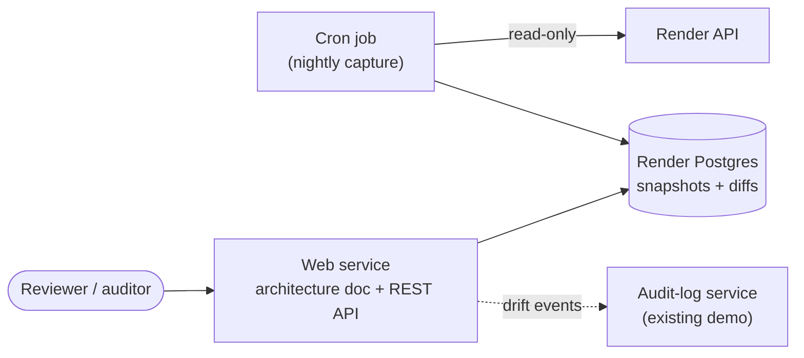

# Architecture Snapshot: Executive Summary

*A self-documenting architecture inventory for workloads running on Render*

## The problem

Teams that run on a PaaS move fast. Services get added in the dashboard, datastores get attached, environment variables get rewired, and the architecture diagram in the wiki falls out of date within weeks. That gap matters most at audit time. SOC 2, ISO 27001, and HIPAA reviews all ask versions of the same questions: *What systems do you run? Where does sensitive data live? Which components are publicly reachable? What changed, and when?* Answering them usually means someone reconstructs the architecture by hand, clicking through the dashboard and writing it up from memory.

Render already exposes everything needed to answer those questions automatically. The platform knows every service, datastore, region, plan, and service-to-service reference in a workspace. What's missing is a lightweight process that turns that knowledge into a current, human-readable architecture document.

## The proposal

**Architecture Snapshot** is a small service, deployed on Render, that inventories the Render resources in a workspace on a schedule and publishes an always-current architecture document: a component diagram, a service catalog, trust boundaries, and a change history.

It works in three steps.

1. **Capture.** A nightly cron job calls the Render API (read-only) and records each service's type, region, plan, visibility (public web service vs. private service), attached datastores, and cross-service references. It stores the names of environment variables but never their values.
2. **Compare.** Each snapshot is diffed against the previous one and, optionally, against the `render.yaml` Blueprint in the repository. Differences are flagged as drift: a service created outside the Blueprint, a plan changed in the dashboard, a new public endpoint.
3. **Publish.** A web service renders the latest snapshot as a readable document with a Mermaid diagram, plus an OpenAPI-documented REST API so other tools can query the inventory.

## Why it matters to a Governance team

**It produces audit evidence as a byproduct.** An asset inventory with timestamps and change history is exactly the kind of evidence compliance reviews request. Instead of a point-in-time document written for the audit, there is a continuous record.

**It makes trust boundaries visible.** Separating public web services from private services, and showing which services hold database credentials, answers the "where can sensitive data flow?" question at a glance. This is the same distinction Render's own HIPAA guidance asks customers to reason about.

**It turns configuration drift into a detectable event.** When the live environment stops matching the Blueprint, that is a governance signal. Routing drift events into the audit-log service creates a single, queryable history of infrastructure changes.

**It demonstrates least-privilege thinking.** The service needs only read access, never reads secret values, and records only operational metadata. Those design constraints are part of the pitch, not an afterthought.

## Scope of the demo

The goal is a working proof of concept, not a product. The minimum viable version includes a nightly capture of services and datastores into Postgres, a rendered architecture page with an auto-generated Mermaid diagram, a diff view between the two most recent snapshots, and a REST API (`GET /snapshots`, `GET /snapshots/latest`, `GET /snapshots/{id}/diff`, `GET /services`) documented with OpenAPI and served through Swagger UI.

Blueprint drift detection and integration with the audit-log service are natural second steps once the core capture is working.

## Render features showcased

The service exercises a meaningful slice of the platform: a **cron job** for scheduled capture, a **web service** for the document and API, **Render Postgres** for snapshot history, **environment groups and secrets** for API key handling, a **Blueprint** defining the whole stack, and the **Render API** itself. Paired with the audit-log and redaction services, it completes a three-service governance suite that communicates over Render's private network.

## Risks and mitigations

**Broad API key scope.** Render API keys grant access to every workspace the account can reach. The demo should run under a dedicated account or workspace, store the key as a secret, and call only read endpoints.

**Accidental exposure of sensitive configuration.** The capture step records environment variable *names* only. Values are never requested, stored, or displayed.

**Cost on the free tier.** Cron jobs are not available on the free tier and carry a small monthly minimum, and free Postgres expires after 30 days. The demo stays inexpensive but is not entirely free.

**Incomplete relationships.** The inventory can only see relationships that Render knows about, such as `fromService` and `fromDatabase` references. Calls that are hardcoded in application code will not appear, which is itself a useful argument for wiring services through Blueprint references.

## Recommendation

Build Architecture Snapshot as the third service in the governance demo, after the audit-log and redaction services. It reuses the same stack and patterns, adds scheduled work and platform API integration to the portfolio, and tells a clear story: on Render, the infrastructure can document and audit itself.
