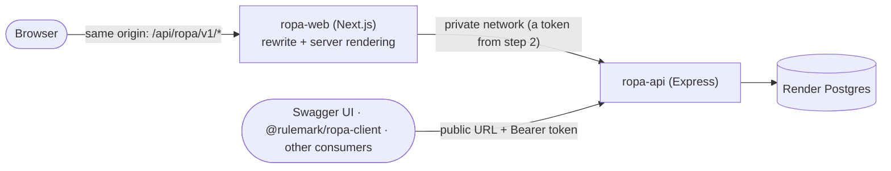

# RoPA Packages & Monorepo (v0.5)

> How the RoPA service, its shared schemas and its API client are organised so a future frontend can reuse the same types, validation and calls. Builds on `ropa-api.md` (**API §n**) and `ropa-database.md` (**DB §n**). Stack: Node.js + TypeScript, Zod 4, npm workspaces.

## 1. Decisions

| # | Decision | Chosen |
|---|---|---|
| 1 | Repository layout | **Monorepo** with npm workspaces |
| 2 | Registry and scope | **Public npm** under **`@rulemark`** (the GitHub organisation name): `@rulemark/ropa-schemas`, `@rulemark/ropa-client`. Packages carry a "demo project" note |
| 3 | When to publish | **Not yet.** Packages are built from day one and consumed as workspace dependencies. Publishing is a later step (§6.4) |
| 4 | Response validation in the client | **On by default**, with an opt-out |
| 5 | Changelogs | Hand-written until the first publish; add Changesets when publishing starts (§6.4) |
| 6 | OpenAPI document | Shipped **inside the client package**, not as a separate package (§5.4) |
| 8 | Browser → API path | The browser calls **the frontend's own origin**; Next.js proxies to the API over Render's private network (§8.1). No CORS. The API is also **public** for Swagger UI, the client package and other consumers |
| 7 | Frontend location | **In this monorepo**, as `apps/ropa-web`: Next.js (App Router), TanStack Query, Tailwind and shadcn/ui components from `packages/ui` (`@rulemark/ui`), since interface step 1. It deploys as its own Render service, `ropa-web` (§8.2). The packages work in both a browser and Node, so server rendering is covered (§9) |

**Why the name carries the service.** The scope is per-organisation, not per-project, and this is the first of several governance services. `@rulemark/ropa-*` leaves room for `@rulemark/monitor-*` and the rest without renaming anything.

## 2. Layout

```
service-ropa/                     # repository root, npm workspaces
├── package.json                  # workspaces: ["apps/*", "packages/*"], shared scripts
├── tsconfig.base.json            # strict base config, extended by every workspace
├── render.yaml                   # Blueprint: one Render service per app (§8)
├── design/                       # these documents
├── packages/
│   ├── ropa-schemas/             # @rulemark/ropa-schemas — wire schemas, types, enums, rule helpers
│   ├── ropa-client/              # @rulemark/ropa-client — typed API client + openapi.json
│   └── ui/                       # @rulemark/ui — the web app's components and theme (not RoPA-specific)
└── apps/
    ├── ropa-api/                 # the service: Express, Drizzle, domain, migrations, seeds (DB §11)
    ├── ropa-web/                 # the frontend (Next.js); consumes both packages and @rulemark/ui
    └── audit-log/                # a stand-in for the audit log: receives RoPA's events (API §6)
```

**Dependency direction.** The apps depend on the packages; the packages depend on nothing in the repository; **`apps/ropa-web` never imports `apps/ropa-api`**. Everything the frontend needs from the service arrives through `@rulemark/ropa-client` and `@rulemark/ropa-schemas`, which is the same path an outside consumer would take. If that rule ever feels restrictive, the missing piece belongs in a package. `apps/audit-log` is the first such consumer from the other direction: it reads the events RoPA pushes with the package's `EventEnvelope`, and imports nothing else.

`apps/ropa-api` keeps the structure from DB §11; `src/api/schemas/` moves out into `packages/ropa-schemas`.

**What lives in the repository root:** the workspace definition, the shared TypeScript base config, lint and formatting configuration, the CI workflow, and `render.yaml`. Each app owns its own build, start and test scripts.

## 3. The boundary

The rule that makes publishing safe: **only wire shapes are shared.**

| Shared (`packages/*`) | Private (`apps/ropa-api`) |
|---|---|
| Zod schemas for requests, responses and views | Drizzle schema, SQL, migrations |
| Inferred TypeScript types | Domain aggregates, repositories, snapshot formats and upgraders |
| Enum value lists (DB §1) | Role rules that need other tables or the current database state |
| Pure rule helpers (§4.3) | Outbox dispatcher, view SQL, seeds |
| The generated `openapi.json` | Configuration and secrets |

A frontend must never be able to import a table definition. Anything that needs a database connection or knows how rows are stored stays in `apps/ropa-api`.

## 4. `@rulemark/ropa-schemas`

### 4.1 Contents

| Module | Exports |
|---|---|
| `enums` | `ACTIVITY_ROLES`, `ENGAGEMENT_ROLES`, `LAWFUL_BASES`, `TRANSFER_MECHANISMS`, `SYSTEM_KINDS`, `REVIEW_REASONS`, … as `as const` arrays (DB §1) |
| `primitives` | `Slug`, `Code`, `CountryCode`, `IsoDuration`, `Ref` (`{id, code?/slug?, name}`), `Cursor`, `AsOf` |
| `resources` | Per record, an **Input** and an **Output** schema: `ActivityInput` / `Activity` (a discriminated union on `role`), `PartyInput` / `Party`, `AgreementTerms`, `Agreement`, `Offering`, `System`, taxonomies, `ReviewItem` |
| `views` | `ReportResponse`, `SubprocessorsResponse`, `ImpactResponse`, `DataMapResponse`, `CoverageResponse`, `ChangesResponse` |
| `events` | `EventEnvelope`: the frame of every event RoPA pushes (API §6). Each event's `data` isn't a schema yet; it comes when the Monitor needs one |
| `errors` | `ProblemDetails` (RFC 9457) with the field-level `errors[]` (API §1.7) |
| `constants` | `API_VERSION = 'v1'` |

Types come from `z.infer`, exported alongside each schema (`export type Activity = z.infer<typeof Activity>`).

### 4.2 Conventions

- **Zod 4** (currently 4.6.x), declared as a **peer dependency** so the app and the frontend share one copy.
- Input and Output are separate schemas, because the API differs on purpose (API §1.2): inputs take identifiers as strings, outputs return `Ref` objects; `changeNote` is input-only; `id`, `code`, `version`, `status` and timestamps are output-only.
- Schemas are annotated for documentation (`.describe()`), so the generated OpenAPI carries the text.
- No side effects, no environment access, no Node-only APIs: the package must work in a browser.

### 4.3 Rule helpers

The parts of DM §5 that need only the record itself are exported as pure functions, so a form can show the same errors the server would return:

```ts
validateActivityShape(input)        // structural + "forbidden by role"  → ProblemDetails["errors"]
canActivate(activity)               // "required by role", the checks that run on activate
describeRoleRules(role)             // field-by-field required/forbidden, for building UI hints
```

The **server stays authoritative**. Rules that need other records (a client's agreement, data-category subsets, `supersedes` pointing at a retired activity) run in the domain layer inside the save transaction (DB §2), not here.

## 5. `@rulemark/ropa-client`

### 5.1 Shape

**Built as the interface needs it** (interface step 1): the core, and only the calls a screen uses. Step 1's home page uses one, `activities.list`; each later screen adds its own. What exists today:

```ts
const ropa = createRopaClient({
  baseUrl: 'https://ropa.example.com', // or '/api/ropa' in the browser (§8.1)
  token: async () => session.token,    // optional: a string or a provider, asked on every call
  validate: true,                      // default: parse responses with the shared schemas
  fetch,                               // injectable, for tests and server rendering
});

const page = await ropa.activities.list({ role: 'processor' }, { signal }); // → { data, nextCursor }
```

There is **no `actor` option**. It predates authentication: the subject written into each revision is the token's (API §1.9), so a client can't claim to be someone else.

The rest of this section is the target the calls grow towards:

```ts
const activity = await ropa.activities.get('P3');            // → Activity, including `version`
await ropa.activities.update('P3', next, {
  ifMatch: activity.version,                                  // API §1.8
  changeNote: 'Added the DPIA support pack reference',
});

for await (const a of ropa.activities.iterate({ role: 'processor' })) { … }   // cursor paging

const list = await ropa.subprocessors.forClient('aurelia', { asOf: '2026-05-01' });
const impact = await ropa.parties.impact('mailcrest');
const report = await ropa.report.markdown({ view: 'processor', client: 'aurelia' });
```

Namespaces mirror the endpoint map (API §2): `activities`, `parties`, `agreementTerms`, `agreements`, `offerings`, `systems`, `taxonomy`, `reviewItems`, `report`, `subprocessors`, `dataMap`, `coverage`, `changes`, `health`.

### 5.2 What it handles for the caller

| Concern | Behaviour | Built |
|---|---|---|
| Identifiers | Any identifier works in path parameters, exactly as the API allows (API §1.2) | With the first single-item call |
| Concurrency | `ifMatch` is sent as `If-Match`; the response `ETag` is surfaced as `version`. Omitting it on a write is a **compile-time** error, so nobody forgets it | With the first single read and the first write (interface steps 3 and 4) |
| Change notes | `changeNote` is an option on writes, placed into the body | With the first write |
| Paging | `list()` returns one page (`data` + `nextCursor`); `iterate()` is an async iterator that follows the cursor | `list()` yes; `iterate()` when a screen needs it |
| Errors | `problem+json` becomes a typed error (§5.3); a body that isn't a problem gets one made from the status | Yes |
| Validation | Responses are parsed with the shared schemas by default; `validate: false` skips it | Yes |
| Retries | **Not in the client.** The web app's TanStack Query retries, in the browser only, and only what might pass on a second try (network errors, `429`, `5xx`); the server's prefetch never retries, so a slow API can't hold the page back. **Never** for writes, which are not idempotent | In the app |
| Cancellation | Every call takes an `AbortSignal` (TanStack Query passes its own). A timeout is the caller's, as `AbortSignal.timeout()` | Yes |
| Auth | `token` (a string or a provider, asked on every call) becomes `Authorization: Bearer` (API §1.9). `ropa.tokens.mint()` and `ropa.me()` are typed like any other call | `token` yes; the calls with sign-in (interface step 2) |

### 5.3 Errors

```ts
RopaError                      // base: status, problem details, raw response
├── RopaValidationError        // 422 — .errors[] is field-level, ready to attach to form inputs
├── RopaConflictError          // 409 — slug taken, still referenced, invalid state transition
├── RopaPreconditionError      // 412 / 428 — stale or missing version (API §1.8)
└── RopaNotFoundError          // 404

RopaResponseError              // the body did not match the schema (only when validate: true)
```

`RopaResponseError` is the early-warning system: it fires the moment the deployed service stops matching the package the caller has. It stands apart from `RopaError` because the API answered successfully; only its shape is wrong, so nothing should retry it or show it as a problem the user caused.

### 5.4 The OpenAPI document

The client package also ships the generated `openapi.json`, so consumers in other languages can generate their own client. It's produced by `apps/ropa-api` from the shared schemas and copied in at build time (§7).

## 6. Versioning and release

### 6.1 Two different versions

| | What it means | Changes when |
|---|---|---|
| **API version** (`/v1`) | The HTTP contract | Only for a breaking change to the contract; a `/v2` would run alongside `/v1` |
| **Package version** (semver) | The published artifacts | Every release |

A compatibility table in each package README says which package versions speak which API version.

### 6.2 What counts as breaking (packages)

| Change | Bump |
|---|---|
| Remove or rename a field, tighten validation, remove an enum value, change a function signature | **major** |
| Add an optional field, add an enum value, add an endpoint or helper | **minor** |
| Documentation, internal refactors, fixes that don't change shapes | **patch** |

Note that **adding an enum value is minor for the server but can break a consumer** that exhaustively switches on it. It gets called out in the changelog.

### 6.3 Keeping the two packages in step

`@rulemark/ropa-client` depends on an exact `@rulemark/ropa-schemas` version and they're released together. Simplest rule: one version number for both.

### 6.4 Release process (when we start publishing)

1. Changesets record intent in the PR.
2. CI builds, type-checks, tests, then verifies the committed `openapi.json` is current.
3. A release PR bumps versions and changelogs; merging it publishes both packages with provenance.
4. Until then, `apps/ropa-api` depends on `"@rulemark/ropa-schemas": "*"` and npm workspaces resolves it locally. Nothing about the code changes when publishing starts.

## 7. Build and tooling

- **Build (packages):** plain `tsc`, emitting ESM and type declarations into `dist/`, with an `exports` map. Subpath exports (`@rulemark/ropa-schemas/enums`) keep imports small. Each entry carries a **`development` condition** pointing at the TypeScript source, so `tsx` and Vitest need no build step, while everything else — the built service included — loads `dist/`. Node refuses to strip types inside `node_modules`, so a package whose entry point is TypeScript cannot be loaded by `node dist/index.js`; the condition is what makes source-only development and a working production build coexist.
- **A bundler is deferred to the first publish** (§6.4), which is when CJS output and a single-file build start to matter. Nothing consumes CJS today: both apps are ESM. The export map does not change when a bundler arrives, so this is a one-line swap in a build script, not a redo. **Pick the tool then rather than now:** this document originally named `tsup`, whose last release was November 2025; the activity has since moved to `tsdown`, from the Rolldown team. Neither is deprecated, and the choice should be made against whatever is current at the time.
- **TypeScript:** one `tsconfig.base.json`, strict, with project references so `apps/ropa-api` type-checks against the packages' sources during development.
- **Root scripts:** `build`, `typecheck`, `lint`, `test`, `db:migrate`, `db:seed`, `openapi:write`, each delegating to workspaces.
- **OpenAPI generation:** `apps/ropa-api` builds the document from the shared schemas (it owns the routes) and `openapi:write` writes it to `packages/ropa-client/openapi.json`. CI fails if that file is stale, which is the same trick as the Drizzle migration check (DB §8.1).
- **Contract tests:** the API integration tests call the service **through `@rulemark/ropa-client`**. The client gets exercised on every run, and any drift between schemas, routes and client shows up as a test failure.

## 8. Deployment topology

### 8.1 How the browser reaches the API


```mermaid
flowchart LR
    B(["Browser"]) -->|"same origin: /api/ropa/v1/*"| W["ropa-web (Next.js)<br/>rewrite + server rendering"]
    W -->|"private network (a token from step 2)"| A["ropa-api (Express)"]
    Ext(["Swagger UI · @rulemark/ropa-client · other consumers"]) -->|"public URL + Bearer token"| A
    A --> DB[("Render Postgres")]
```

The API service is public **and** reachable on Render's internal hostname, so both paths work at once.

- **No CORS.** Browser requests go to the frontend's own origin and are proxied, so no cross-origin request is ever made. The API sets no CORS headers.
- **The token stays server-side (the design; interface step 2 decides).** The browser never holds an API token. The Next server attaches it (API §1.9), which is the standard backend-for-frontend split. Step 1 has no tokens at all: reads are anonymous and writes are refused.
- **The actor can't be forged.** The subject written into every revision comes from a verified token, whether the proxy adds it or the browser carries one the API checks; never from something the browser can simply set.
- **Step 1 is a rewrite** (interface step 1, the user's choice after a Route Handler was built and tested). `/api/ropa/v1/:path*` goes to `ROPA_API_URL/v1/:path*`, declared in `next.config.ts` (`src/lib/rewrites.ts`). With no credentials to attach yet, a static pass-through is enough: `ETag`, `If-None-Match` and 304s, problems, and the API's own 401 for an anonymous write all pass through untouched. Only `/v1` is reachable, not the API's health check or docs. **Next compiles the destination into the build** (`.next/routes-manifest.json`), so `next build` needs `ROPA_API_URL`, and changing the address means a rebuild, not only a restart.
- **The mechanism is revisited with sign-in** (interface step 2). Either the browser's token passes through the rewrite for the API to verify, or a catch-all Route Handler (`/api/ropa/[...path]`) or Next's `proxy.ts` attaches a token the server holds. Whichever it is must pass `If-Match`, `ETag` and `Authorization` straight through.
- **Two client instances in `apps/ropa-web`:** one for the browser with a relative base URL (`/api/ropa`, `src/lib/ropa-browser.ts`) and one for server rendering with the internal address (`ROPA_API_URL`, read at runtime, `src/lib/ropa-server.ts`). `fetch` accepts a relative URL in the browser but not in Node, so the base URL can't be shared. Server Components prefetch a page's queries with the server's instance and hydrate TanStack Query, and the browser refetches the same query keys through the rewrite. From step 2 the token differs too: server-side instances carry one, browser instances don't.

### 8.2 Services on Render

Render supports monorepos through a **root directory** and **build filters**. Root-relative settings (build command, start command) run relative to the root directory, while build filter paths are always relative to the repository root.

**Recommended setup:** leave the service's root directory at the repository root, because npm workspaces need a root-level install, and use **build filters** so unrelated changes don't trigger deploys.

**This is now real: see [`render.yaml`](../../render.yaml) at the repository
root**, which describes the deployed stack and is the source of truth for it.
What follows is the reasoning; the file is the specification.

The Blueprint declares a **project** and its **environments**, and the resources
nest inside an environment rather than sitting at the top level:

```yaml
projects:
  - name: rulemark-governance
    environments:
      - name: Production
        databases: [ropa-db]
        services: [ropa-api, audit-log, coverage-job, ropa-web]
```

Three things learned by deploying, which this sketch originally got wrong:

- **Private networking is scoped to an environment** (`networking.isolation` is
  an environment-level key). The services of the suite must share one to reach
  each other, and a `staging` environment is a complete second copy, its own
  database included.
- **Render matches resources by name when a Blueprint is first synced**, so a
  stack built by hand can be adopted rather than recreated — but the names must
  match exactly, capitalisation included.
- **The build must install devDependencies explicitly.** `NODE_ENV=production`
  makes npm omit them, and the build runs `tsc`, which is one.

The frontend is a second web service in the same Blueprint, `ropa-web` (interface step 1), with its own filter:

```yaml
  - type: web
    name: ropa-web
    runtime: node
    region: frankfurt
    plan: 0.5c-512mb
    buildCommand: npm ci --include=dev && npm run build -w apps/ropa-web
    startCommand: npm run start -w apps/ropa-web
    healthCheckPath: /healthz
    autoDeployTrigger: checksPass
    envVars:
      - key: NODE_ENV
        value: production
      - key: ROPA_API_URL   # private network; compiled into the rewrite at build time (§8.1)
        fromService: { type: web, name: ropa-api, property: hostport }
    buildFilter:
      paths:
        - apps/ropa-web/**
        - packages/**
        - package.json
        - package-lock.json
      ignoredPaths:
        - docs/**
```

Notes:
- A change under `packages/**` rebuilds **both** services, since both depend on them. That's correct: a schema change affects both sides of the contract.
- A change under `apps/ropa-api/**` alone doesn't rebuild the frontend, and vice versa.
- Documentation-only commits redeploy nothing.
- Manual deploys always run, whatever the filters say.
- **`audit-log` is a private service** (`type: pserv`, step 4): reachable only from the environment's private network, with no public URL. `ropa-api` learns its address from the Blueprint (`EVENT_DESTINATION_AUDIT_LOG`, `fromService` with `property: hostport`), the same wiring the frontend sketch uses. Its filter is `apps/audit-log/**` and `packages/ropa-schemas/**`, so a change to the event contract redeploys the consumer as well as the producer.
- **`coverage-job` is a cron job** (`type: cron`, step 4): the same build as `ropa-api` with its own start command (`npm run job:coverage`), nightly at 02:00 UTC. It reaches the API over the private network (`ROPA_API_URL` from `hostport`) and takes the mint secret from `ropa-api` (`envVarKey: TOKEN_MINT_SECRET`), so neither is copied by hand.
- **`ropa-web` reaches the API only over the private network**, both for server rendering and for the browser's reads through the rewrite (§8.1). Render gives a `fromService` value to the build as well as to the running service, which the rewrite needs. Changing `ROPA_API_URL` therefore needs **Save, rebuild, and deploy**; **Save and deploy** reuses the old build, so the browser would keep the old address while the server used the new one.
- **Each service builds its own workspace** (`npm run build -w apps/<service>`), never the root build, which runs every workspace's, the web app's `next build` included. `ropa-api` briefly used the root build and its deploy failed on the missing `ROPA_API_URL`.
- **No token yet.** Step 1's `ropa-web` is anonymous: reads pass through and writes get the API's 401. Sign-in (interface step 2) adds whatever the chosen mechanism needs, perhaps the mint secret from `ropa-api` as the cron job has it.

## 9. How a frontend uses this

A write, as interface step 4 will make one; `activities.update` is part of §5.1's target and not built yet:

```tsx
import { ActivityInput, validateActivityShape, type Activity } from '@rulemark/ropa-schemas';
import { createRopaClient, RopaValidationError } from '@rulemark/ropa-client';

const ropa = createRopaClient({ baseUrl: '/api/ropa' }); // the browser's instance (§8.1)

// Same rules as the server, before anything is sent
const errors = validateActivityShape(form);

try {
  await ropa.activities.update(code, form, { ifMatch: loaded.version, changeNote });
} catch (e) {
  if (e instanceof RopaValidationError) showFieldErrors(e.errors);   // paths line up with form fields
}
```

The frontend gets types, validation, and calls from one place, and a stale deployment shows up as a `RopaResponseError` rather than as a silent mismatch.

## 10. Questions

**Resolved (2026-09-19):** scope `@rulemark` (§1); changelogs hand-written for now (§1); OpenAPI stays in the client (§5.4); the frontend lives in this monorepo as `apps/ropa-web` (§1, §2, §8).

**Resolved (interface step 1, 2026-09-27):** the frontend framework. Next.js 16 with the App Router; Server Components call the API directly over the private network to prefetch, and the browser reads through the same-origin rewrite (§8.1). The reasoning is in interface step 1's findings (`docs/program/`, archived under `plan-archive/` when the step closes).

**Still open**
1. **npm scope availability.** `@rulemark` has to be registered on npm as an organisation or user scope; it may already be taken by someone else. To check when we get to publishing. Fallback: unscoped `rulemark-ropa-schemas` / `rulemark-ropa-client`.
2. ~~**Frontend framework details.**~~ Resolved above.
