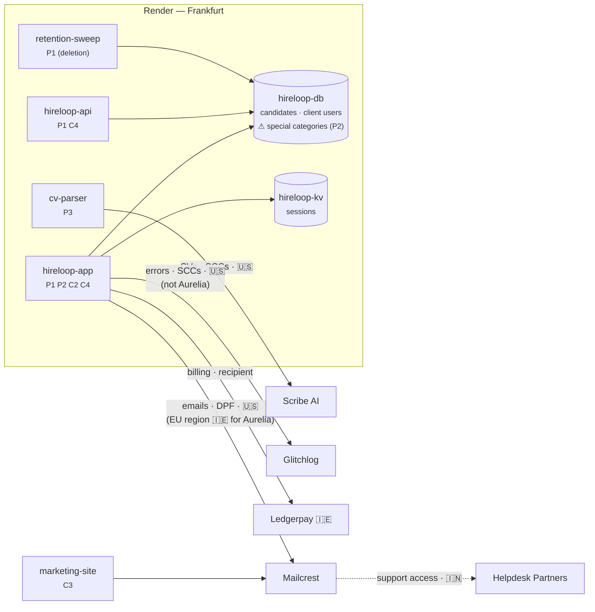

# The Hireloop Story: RoPA in Practice

> A narrative walkthrough of the RoPA service (with the future Subprocessor Monitor and DSAR tracker, and, in Parts II and III, the Architecture Snapshot and what Hireloop's clients see) used to sanity-check design decisions in `ropa-design.md` and to define our synthetic seed data. All companies and people are fictional, except Render, whose role is generic (hosting provider) and makes no claims about its real subprocessors.

---

## Cast

**Hireloop B.V.** (Amsterdam, 58 employees) sells an **applicant tracking system (ATS)** to European employers. An ATS is hiring software: employers use it to post job openings, collect applications and CVs, move candidates through stages (screening, interviews, offer), share interview notes, and email candidates. Recruiters at client companies post jobs, candidates apply through Hireloop-hosted career pages, and recruiters review CVs and interview notes. Everything runs on **Render, Frankfurt region**.

| Person | Role in the story |
|---|---|
| **Priya Raman** | Hireloop's Privacy Lead & DPO. Owns the record. |
| **Tomás Herrera** | Platform engineer. Ships services on Render. |
| **Ines Duarte** | Head of Customer Success. Fields procurement questionnaires. |
| **Jonas Weber** | CTO. Wants AI CV parsing. |
| **Marc Lentz** | Vendor-risk analyst at Aurelia Bank (a prospect that becomes a client in Chapter 4). |
| **Lena Vogel** | A candidate who applied to Northwind via Hireloop. |
| **Kees de Vries** | A former Hireloop employee. |
| **Sanne Okafor** | Hireloop's SOC 2 auditor (Part II, Chapter 15). |
| **Femke Jansen** | Northwind's privacy officer (Part III, Chapter 20). |

**Clients (controllers of candidate data)**

| Client | Agreement | Notable terms |
|---|---|---|
| Northwind Logistics B.V. (NL) | Standard DPA v3 | General authorization for subprocessors, 30-day notice |
| Fjord Outdoor AS (NO) | Standard DPA v3 | Same |
| Aurelia Bank S.A. (LU) | Bespoke DPA, signed 2026-03-16 (Chapter 4) | **Specific** (prior written) authorization, 60-day notice, EU-only processing, uses the Diversity module. A prospect until then. |

**Vendors**

| Vendor | Country | Does what | Role |
|---|---|---|---|
| Render | US (hosting in Frankfurt) | Hosting, Postgres, Key Value | Processor (for Hireloop's own data), **subprocessor** (for client data) |
| Mailcrest Inc. | US (plus an EU data region in Ireland) | Transactional + marketing email | Processor / subprocessor |
| Glitchlog Ltd | US | Error tracking | Processor / subprocessor |
| Peoplehub GmbH | DE | HR system | Processor (employee data only) |
| Ledgerpay Ltd | IE | Payments | **Independent controller** (recipient, *not* a subprocessor) |
| Scribe AI Inc. | US | LLM-based CV parsing | Subprocessor (arrives in Chapter 5) |

**Systems on Render (what Architecture Snapshot would see)**

| System | Render type | Holds personal data? |
|---|---|---|
| `hireloop-app` | Web service | Yes: recruiter UI + candidate portal |
| `hireloop-api` | Web service | Yes: public API for client integrations |
| `hireloop-db` | Postgres | Yes: primary store |
| `hireloop-kv` | Key Value | Yes: sessions |
| `retention-sweep` | Cron job | Processes (deletes) candidate data |
| `marketing-site` | Static site | Lead forms (posted to Mailcrest) |
| `cv-parser` | Background worker | *Added in Chapter 5* |

From Chapter 10, Rulemark Governance runs in the same workspace, in a project of its own: `ropa-api`, `audit-log`, `coverage-job`, `snapshot-web`, `snapshot-capture` and `ropa-db` (Part II).

---

## Chapter 1: The spreadsheet (January 2026)

Aurelia Bank has chosen Hireloop and is weeks away from signing the subscription contract (master services agreement + order form) and its data processing agreement (DPA). First, Aurelia's vendor-risk team runs due diligence. A controller must only use processors that give "sufficient guarantees" (Art. 28(1)), and as a bank Aurelia must also vet technology suppliers before contracting under financial-sector outsourcing rules and DORA. Marc Lentz sends Ines a 140-question vendor-risk questionnaire. Question 37: *"Provide the extract of your Record of Processing Activities relevant to our data, and your current list of subprocessors with locations and transfer mechanisms."*

Ines forwards it to Priya. Priya opens `RoPA_master_v7_FINAL.xlsx`. It was last updated eleven months ago. It lists Heroku (Hireloop left in 2025), doesn't mention Glitchlog, and has one row called "Candidate stuff."

Priya spends four days rebuilding it by interviewing Tomás. Then she asks for a system so it never drifts that far again.

> **Problem exposed:** the record goes stale because it's disconnected from the architecture, and two audiences (regulator, customers) ask for different *views* of the same facts.

---

## Chapter 2: Hireloop as controller (February 2026)

Priya starts with **Hireloop's own operations**: its staff, its customers' accounts, its sales pipeline and the monitoring of its own service. These are **Art. 30(1)** records, because Hireloop decides why and how this data is processed. None of them is about customers' candidate data.

> **Rule of thumb:** *who decided this processing should happen?* If Hireloop decided, it's a controller record. If a customer decided and Hireloop carries it out, it's a processor record.

```yaml
id: act-c2
name: Customer accounts & billing
role: controller
purposes: [Provide contracted service accounts, Invoice and collect payment]
lawfulBasis: ["6(1)(b) contract", "6(1)(c) legal obligation (tax)"]
subjectCategories: [sc-client-users]
dataCategories: [dc-identity, dc-account, dc-billing]
systems: [hireloop-app, hireloop-db, hireloop-kv]
engagements:
  - party: render      role: processor      data: [dc-identity, dc-account, dc-billing]
  - party: mailcrest   role: processor      data: [dc-identity]         transfer: {to: US, mechanism: DPF}
  - party: ledgerpay   role: recipient      data: [dc-billing]          # independent controller
retention:
  - data: dc-account  period: P90D  trigger: "after contract end"
  - data: dc-billing  period: P7Y   trigger: "after invoice date"   # Dutch tax law
securityMeasures: [encryption-at-rest, sso-for-staff, rbac, audit-logging]
owner: Priya Raman
```

She records four controller activities (full list in the appendix):
- **C1 Hireloop staff administration:** Hireloop's own 58 employees (contracts, payroll, sick leave), managed in Peoplehub.
- **C2 Customer accounts & billing:** the recruiter logins and billing contacts of Hireloop's customers.
- **C3 Hireloop sales & marketing (prospective customers):** HR managers at companies that might buy the ATS, from the marketing site, newsletter and demo requests.
- **C4 Service reliability monitoring:** Hireloop's error tracking and telemetry for its own service.

Things she notices while writing them:
- **Retention differs per data category** within one activity: billing data 7 years, account data 90 days.
- **C1 runs entirely outside Render** (in Peoplehub). The record covers everything Hireloop controls, not just what runs on its platform.
- **C1 includes health data** (sick-leave records): a special category, so it needs an **Art. 9(2)** condition on top of the Art. 6 basis.
- **Ledgerpay is not Hireloop's processor.** It decides its own fraud-screening purposes, which makes it a *recipient*. It appears in the record but will **not** appear on the subprocessor list.
- **C4 is a grey zone.** Glitchlog error reports sometimes include candidate emails in stack traces. Is Hireloop processing candidate data *for its own purpose* (security of the service, so controller) or *on behalf of clients* (so processor)? Priya decides controller, documents why, and puts "scrub PII from error payloads" on Tomás's backlog. That later becomes the Redaction service (#2).

> **Operations:** `POST /activities` (role=controller), `POST /parties`, `GET /taxonomy/*`.

---

## Chapter 3: Hireloop as processor (February 2026)

Candidate data belongs to the clients. Northwind decides why it recruits and whom it keeps; Hireloop only processes on Northwind's instructions. These are **Art. 30(2)** records, which have no purposes, lawful basis or retention of Hireloop's own. Instead they record **which controllers** Hireloop serves and **what categories of processing** it performs for them.

Hireloop has 400 clients. Priya won't list each one per activity. Most sign the **Standard DPA v3**, so she groups processor activities under a **service offering**:

```yaml
id: off-ats
name: Hireloop ATS
defaultAgreement: agr-standard-dpa-v3   # general authorization, 30-day notice
```

```yaml
id: act-p1
name: Candidate application management
role: processor
offering: off-ats
controllers: "all clients on off-ats"        # default coverage
processingCategories: [hosting, storage, workflow, candidate notifications, retention-deletion]
subjectCategories: [sc-candidates]
dataCategories: [dc-identity, dc-cv, dc-assessment]
systems: [hireloop-app, hireloop-api, hireloop-db, retention-sweep]
engagements:
  - party: render     role: subprocessor   data: [dc-identity, dc-cv, dc-assessment]   # hosted in Frankfurt
  - party: mailcrest  role: subprocessor   data: [dc-identity]   transfer: {to: US, mechanism: DPF}
  - party: glitchlog  role: subprocessor   data: [dc-identity]   transfer: {to: US, mechanism: SCCs}
securityMeasures: [encryption-at-rest, tenant-isolation, rbac, audit-logging]
```

At this point every client (Northwind, Fjord and the other 398) is on the Standard DPA, so one record covers them all. Priya notices that the terms Hireloop has promised its clients (general authorization for subprocessors, 30 days' notice before a change) aren't properties of the activity. They're written in the **Standard DPA v3**, and every client on that DPA shares them.

> **Model pressure:** the terms that matter (authorization type, notice period, location restrictions) live in the **agreement**, not the activity. The strawman had no `Agreement` entity.
>
> **Operations:** `POST /service-offerings`, `POST /agreements`, `POST /activities` (role=processor).

---

## Chapter 4: Answering Marc, and signing Aurelia (February–March 2026)

**Before signing.** Aurelia is still a prospect: there's no Aurelia agreement and none of its candidates' data is processed yet, so RoPA has nothing to say about Aurelia specifically. (RoPA records processing that actually happens. Deals in progress live in Hireloop's CRM. Marc does appear in RoPA, though: his contact details are a *lead* in C3.)

So Ines answers Question 37 with the **standard offering** view, which is what any new client on the Standard DPA gets:

- `GET /report?view=processor&offering=off-ats`: the Art. 30(2) extract for the ATS: P1, the categories of processing, transfers and security measures.
- `GET /subprocessors?offering=off-ats`: Render (Frankfurt, hosting), Mailcrest (US, email, DPF), Glitchlog (US, error tracking, SCCs). Ledgerpay isn't there (it never touches client data). Neither is Peoplehub (employee data only).

This offering view is the same list Hireloop publishes on its website's subprocessor page. It's also exactly what *other* companies' subprocessor monitors would watch, just as Hireloop's monitor watches Mailcrest's page (Chapter 6).

**The negotiation.** Marc reads the list and pushes back:
- The bank requires **EU-only processing** of candidate data. Two subprocessors process in the US: Glitchlog (error tracking) and Mailcrest (candidate emails).
- Aurelia wants **specific** (prior written) authorization for any new subprocessor, not just a notice, and **60 days** to respond.
- Aurelia wants the optional **Diversity & Accommodations module**, which collects ethnicity and disability-accommodation requests.

Tomás looks at both:
- **Glitchlog** has no EU option, but error reporting can be suppressed for Aurelia's tenant.
- **Mailcrest** offers an **EU data region** (Ireland). Tomás configures Aurelia's tenant to send candidate emails through it. Every other client stays on Mailcrest's US region.

Legal drafts a bespoke DPA. **Aurelia signs on 2026-03-16.**

**After signing**, Priya records what is now real:
- Aurelia as a client party, with agreement `agr-aurelia-dpa` (specific authorization, 60 days, EU-only).
- **Client scoping on P1's engagements.** The same vendor can now appear twice on one activity, once per region, each scoped to different clients:

```yaml
engagements:
  - party: mailcrest  role: subprocessor  service: "Candidate notifications (US region)"
    countries: [US]   transfer: {to: US, mechanism: DPF}
    clientScope: {exclude: [aurelia]}          # everyone except Aurelia
  - party: mailcrest  role: subprocessor  service: "Candidate notifications (EU region)"
    countries: [IE]                            # no third-country transfer
    clientScope: {include: [aurelia]}          # only Aurelia
  - party: glitchlog  role: subprocessor  service: "Error tracking"
    countries: [US]   transfer: {to: US, mechanism: SCCs}
    clientScope: {exclude: [aurelia]}
```
- **P2 Diversity & accommodations module:** special-category data processed *only* for clients who enable it. The Art. 9 condition is Aurelia's to establish, because Aurelia is the controller. Hireloop's record just notes that special categories are processed.

Now the per-client views make sense:
- `GET /subprocessors?client=aurelia`: Render (Germany) and Mailcrest (**Ireland**, EU region). **No Glitchlog**, and no US transfer.
- `GET /subprocessors?client=northwind`: Render, Mailcrest (US, DPF) **and** Glitchlog (standard terms).
- `GET /subprocessors?offering=ats` is unchanged. The EU-region engagement exists only for Aurelia, so it isn't part of the standard terms.

Aurelia's agreement also lists its allowed region (`EEA`). From now on, `/coverage` checks that every engagement used for Aurelia's data processes it, and transfers it, only inside that region.

The subprocessor list is a **view derived from the record**, not a static page. The offering view shows the standard terms before a contract. The client view shows a signed client's actual terms.

> **Checks decisions:** #2 (offering + client override), #3 (Party + Engagement roles). **Endpoints:** `/report` and `/subprocessors` take `offering=` and `client=`.

---

## Chapter 5: Jonas wants AI (April 2026)

Jonas ships AI CV parsing. Tomás adds a background worker, `cv-parser`, on Render. It sends CVs to **Scribe AI (US)**.

**The architecture notices first.** The nightly Architecture Snapshot finds a new service. `GET /coverage` reports: *`cv-parser` is not linked to any processing activity.* A review item opens for Priya.

Coverage runs both ways, and not every gap is a problem. A system with no activity (`cv-parser`) is a gap. An activity with no Render system (C1, which lives in Peoplehub) is legitimate and must not be flagged.

Priya drafts **P3 CV parsing**: candidates' CVs go to Scribe AI, which is a new subprocessor with a US transfer (SCCs). Automated evaluation of job candidates is high-risk, so under Art. 35 a **Data Protection Impact Assessment (DPIA)** is needed before launch. A DPIA is a documented risk assessment covering the processing, why it's necessary, the risks to people, and the safeguards.

But a DPIA is the *controller's* duty, and for P3 the controllers are Hireloop's clients. Hireloop's job is to help them (Art. 28(3)(f)). Priya prepares a **DPIA support pack** (risk analysis, safeguards, how the model's output is used, Scribe AI's zero-retention terms) that each client can reuse in its own DPIA, and records it on P3 as `dpiaSupportRef`. CV screening is also classed as high-risk under the EU AI Act, which brings its own obligations for Hireloop and its clients.

**This is an outbound subprocessor change.** Because Hireloop is a processor, Art. 28(2) applies:
- For the **Standard DPA** clients (general authorization), the monitor publishes the updated list and sends notices: *"Scribe AI will be added on 2026-05-15; you may object until then."*
- For **Aurelia** (specific authorization), a notice isn't enough. Hireloop needs Aurelia's written approval, 60 days ahead.

Marc objects. CV parsing is switched off for Aurelia's tenant altogether, so Priya excludes Aurelia from **P3 as a whole** (`clientScope: {exclude: [aurelia]}` on the activity), not just from the Scribe engagement. P3 stays on for every other client, but Aurelia's processor report no longer lists it, and a data-map request for Aurelia's candidates doesn't point to `cv-parser`, where their CVs never go.

> **Operations:** Snapshot → `/coverage` → `POST /review-items`; `POST /activities` (P3); `GET /subprocessors` changes → monitor diffs our own list → notifications per agreement terms.
> **Checks decision:** #4 (who owns what). The monitor needs to read **agreements** to know who gets a notice vs. who must approve.

---

## Chapter 6: A vendor changes its list (June 2026)

The Subprocessor Monitor fetches Mailcrest's published subprocessor page weekly. On June 3 the diff shows one addition:

> **+ Helpdesk Partners Pvt Ltd**, India, customer-support access to message content **in all regions, including the EU region**. Effective 2026-07-03 (30 days' notice).

The monitor calls `GET /parties/mailcrest/impact`:

| Activity | Hireloop's role | Data at Mailcrest | Consequence |
|---|---|---|---|
| C2 Customer accounts | Controller | client-user emails | **Hireloop decides**: accept or object. Record new transfer: India, SCCs via Mailcrest DPA |
| C3 Hireloop sales & marketing | Controller | lead emails | Same |
| P1 Candidate management, US region | **Processor** | candidate emails (399 clients on the Standard DPA) | **Hireloop must pass this on to its clients**: it's a new sub-subprocessor in their chain |
| P1 Candidate management, EU region | **Processor** | Aurelia's candidate emails, stored in Ireland | Same, and for Aurelia it breaks the EU-only clause |

The P1 rows are the chain effect. **An inbound change on a processor-role engagement triggers an outbound notification.**

The EU-region row adds a lesson: **data residency doesn't rule out transfers.** Aurelia's emails are *stored* in Ireland, but support staff in India who can open them are *accessing* them from a third country, and that counts as a transfer. Once Priya records the onward transfer to India on the EU-region engagement, `/coverage` flags a **region violation** against Aurelia's agreement.

And the deadlines collide: Mailcrest gave Hireloop **30 days**, but Hireloop owes Aurelia **60 days** and *prior approval*. Priya can't meet that by accepting. She has to ask Mailcrest to keep Helpdesk Partners out of the EU region, or move Aurelia's candidate emails to a different EU provider. That would be another engagement with an `include: [aurelia]` scope.

The monitor opens three review items in RoPA with due dates computed from both agreements.

> **Operations:** monitor snapshot/diff (monitor-owned) → `GET /parties/{id}/impact` → `POST /review-items` ×3 → on resolution, `PUT /activities/*` adds transfers → `GET /subprocessors` changes → outbound notices.
> **Model pressure:** impact must return **role per activity** and **the clients affected** (with their agreement terms), not just activity IDs.

---

## Chapter 7: Two requests, two roles (July 2026)

**Lena Vogel** applied to Northwind last year. She emails *Hireloop* (not Northwind) asking for all her data to be deleted.

The DSAR tracker logs the request and queries `GET /data-map?subjectCategory=sc-candidates&client=northwind`:

| Where | Activity | Holds |
|---|---|---|
| `hireloop-db` | P1 | identity, CV, interview notes |
| Mailcrest | P1 | email delivery logs |
| Scribe AI | P3 | none retained (0-day retention per its DPA) |
| Glitchlog | **C4** | possibly: error payloads (incidental) |

Because P1 and P3 are **processor** activities, Hireloop doesn't decide. It **forwards** the request to Northwind (the controller) and assists when instructed. The Glitchlog row falls under **C4**, where Hireloop is controller, so Hireloop handles that part itself.

**Kees de Vries** left Hireloop in 2024 and asks for erasure. The data map for `sc-employees` points to **C1 → Peoplehub**. Hireloop is controller, so it decides. Retention rules resolve it:
- sick-leave records: 2-year limit passed → **erase**
- payroll data: 7-year tax obligation → **retain**, citing the Art. 17(3)(b) exception

> **Checks decision:** shared taxonomy IDs make the data map queryable; **role** determines whether Hireloop acts or forwards; retention rules per data category determine the answer.

---

## Chapter 8: The regulator (September 2026)

A candidate complains to the Dutch data protection authority (Autoriteit Persoonsgegevens) about AI screening. The authority invokes Art. 30(4) and asks for:
1. Hireloop's record **as it stood on 1 March 2026**, and
2. the current record,
3. plus the DPIA support documentation Hireloop gave its clients for CV parsing.

(Processors must keep records too, so the authority can rightly ask Hireloop for its record. The DPIAs themselves belong to Northwind and the other clients, and the authority would request those from them.)

Priya runs `GET /report?view=all&asOf=2026-03-01` and `GET /report?view=all`. The diff shows that P3 and the Scribe AI engagement were added on 2026-04-14, with a DPIA support pack (`dpiaSupportRef`) dated 2026-04-02, two weeks before launch. The audit-log service shows who changed each record and when.

> **Checks decision #5:** without versioned records, `asOf` is impossible and Priya would be back to reconstructing history from memory, which is the same failure as the spreadsheet.

---

## Chapter 9: The architecture document

At the end of September, Jonas asks for an architecture overview for the board and for the next SOC 2 audit. Architecture Snapshot generates the component diagram, and RoPA annotates it:



Each box now answers *what runs here*, *whose data*, *which activity*, and *where it goes next*. That's the program's goal.

---

# Part II: The Architecture Snapshot

> Part I follows the record. Part II follows the infrastructure, from the day Hireloop installs Rulemark Governance to the auditor's visit. Its chapters run **alongside** Part I, dated to fit its timeline. It is told at a high level on purpose: its job is to find what we don't know yet. Each chapter ends with the **gaps** it exposed, gathered at the end of Part II by where they land. Design decisions it refers to are in `docs/snapshot/snapshot-design.md`.

## Chapter 10: Install day (3 February 2026)

After the spreadsheet (Chapter 1), Priya wants the record tied to the architecture so it can't drift that far again. Hireloop chooses **Rulemark Governance**, self-hosted: it runs in Hireloop's own Render workspace, so Hireloop's record and its Render key never leave Hireloop (decision 2).

Tomás clicks **Deploy to Render** on Rulemark's public repository. The Blueprint creates a project of its own, `rulemark-governance`, in Frankfurt: `ropa-api`, `audit-log`, the `coverage-job` cron job, the Snapshot's `snapshot-web` and `snapshot-capture` cron job, and `ropa-db`. Render asks for the values the Blueprint leaves to him:

- **The users** (`PRINCIPALS`): Priya (editor and approver), Tomás (editor), Ines and Jonas (viewers).
- **A Render API key** for the Snapshot. Render keys are personal, so it's *Tomás's* key, with everything Tomás can do in every workspace he belongs to.
- **A read-only Git token** for `hireloop-platform`, the private repository holding Hireloop's own `render.yaml`, so the Snapshot can see how Hireloop's services are wired (decision 5).
- The workspaces to document: Hireloop's only one.

The record starts empty. Priya's first act is to record Hireloop itself: the `self` party, with her as DPO.

> **Gaps:**
> - **How does Priya use it?** There's no user interface yet (`ropa-web` is a placeholder), and signing in means minting a token with a shared secret in Swagger UI. The whole story assumes Priya "records" things. *Product.*
> - **Whose key is it?** A personal key dies with its owner's account: if Tomás leaves, the Snapshot stops seeing anything. Does Render offer a member role that can read but not change, for a dedicated key? Unknown. *Snapshot, Render.*
> - **Adding a user** means editing `PRINCIPALS` in the dashboard and redeploying (the roadmap's F5). *RoPA API.*
> - **First run.** The demo seed must never run on a customer's install, the `self` party has to exist before much else works, and the Snapshot needs a `Render` party to be the hosting party of every system it creates (decision 7). Nothing guides this order. *Product.*
> - **Upgrades.** Render advises `autoDeployTrigger: off` for button deploys, so how does Hireloop get Rulemark's next release, with its migrations? *Distribution.*
> - **Cost.** Four paid services, a cron job and a database for a 58-person company: is that acceptable, and can it shrink? *Distribution.*

---

## Chapter 11: The first night (4 February 2026)

At 01:30 the Snapshot captures for the first time. It finds two Blueprints and **twelve resources**:

- Hireloop's, from `hireloop-platform`: `hireloop-app`, `hireloop-api`, `hireloop-db`, `hireloop-kv` and `retention-sweep`.
- `marketing-site`, a static site **in no Blueprint**: someone made it by hand. The Snapshot's first drift finding.
- Rulemark's own six, from `rulemark-governance`.

It creates a RoPA system for each (decision 7): kind, region, hosting party Render, the Render resource id. At 02:00 the coverage job asks `/coverage`. The record has no activities yet, so **every system is `unmapped_system`**, and the job opens **twelve review items**. Priya's first morning with Rulemark starts with twelve tasks, one for each thing Rulemark just found, its own services included.

> **Gaps:**
> - **Day-one flood.** Is a review item per system right before the record exists, or does onboarding need a baseline: capture first, raise items only once Priya says the record is in place? *Snapshot, coverage job.*
> - **Where Hireloop's vendors show.** Mailcrest, Glitchlog, Scribe AI and Peoplehub are called from code, not declared in `render.yaml`, so the Snapshot sees none of them. Arrows to vendors can only come from RoPA. *Snapshot document.*
> - **The Git token expires** (fine-grained tokens last a year at most), and the key's owner can change. A capture that silently loses a source still produces a document, just a thinner one. Who notices? *Snapshot.*

---

## Chapter 12: The record meets the architecture (10–16 February 2026)

While Priya writes C1–C4 and P1 (Chapters 2 and 3), every activity lists the systems it runs on, now picked from what the Snapshot found rather than typed from memory. The morning after, coverage has **no findings left for those systems**. But the review items are still open: the coverage job opens and never decides, so Priya closes eleven items by hand, writing the same resolution note each time.

One system group is left: **Rulemark's own**. Priya stops. The record of processing is itself processing: it holds staff names (activity owners, the actor on every revision), her own contact details as DPO, and vendors' contacts, and the audit log keeps who changed what. She records **C5 Privacy compliance record-keeping**: controller, Art. 6(1)(c) (Art. 30 is a legal obligation), Render as processor, systems `ropa-api`, `ropa-db`, `audit-log`, `coverage-job`, `snapshot-web` and `snapshot-capture`. The tool that keeps the record is in the record.

> **Gaps:**
> - **Closing what resolved itself.** A finding that disappears because the record was fixed leaves its item open. Should an item say "the finding is gone" so a person can close it in one step, or should that be the coverage job's one decision? *Coverage job, RoPA API.*
> - **C5 isn't in the seed or the story's appendix.** Adding it changes the demo record, and its systems exist only in Part II. *Story, seed.*
> - **Stand-ins collide with "documents itself."** In our demo, the real `ropa-api` is meant to play `hireloop-api` (decision 1), yet as Rulemark's own service it belongs in C5 (decision 5). One resource can't be both. *Snapshot design.*

---

## Chapter 13: A worker nobody mentioned (30 March – 14 April 2026)

Chapter 5, seen from the infrastructure. On 30 March Tomás merges a pull request adding a background worker, `cv-parser`, to `hireloop-platform`'s `render.yaml`, and Render deploys it. AI parsing sits behind a feature flag, off for everyone.

That night the Snapshot sees a new resource, a new edge from the Blueprint (`cv-parser` → `hireloop-db`) and no edge to Scribe AI, which is called from code. It creates the system, and sends `architecture.changed` to the audit log. At 02:00 coverage reports `cv-parser` as unmapped, and the job opens the review item Priya reads the next morning. She drafts P3 and the DPIA support pack (2 April); P3 goes live on 14 April.

> **Gaps:**
> - **Found after the fact.** The Snapshot sees what is deployed, not what is planned: Priya hears about `cv-parser` after it runs, and nothing tells her whether CVs already reached Scribe AI. The flag was what kept this lawful, and no one can see a flag. Could Rulemark look at a pull request's `render.yaml` before it merges (Render's Blueprint validation endpoint takes a file), so the question reaches Priya before the worker exists? *Snapshot, new capability.*
> - **The story's own dates.** Part I has the Snapshot find `cv-parser` and Priya prepare the DPIA support pack before P3 goes live; it never says when the worker was deployed. Part II needs it deployed before the pack, which only works with the flag. *Story.*

---

## Chapter 14: A Friday shortcut (19 June 2026)

Jonas wants hiring-funnel dashboards for a board meeting on Monday. On Friday afternoon an analyst deploys `hireloop-insights`, an open-source BI tool, **by hand**, as a public web service in Render's **Oregon** region, where the free instance was quickest to try. To reach the database from outside Frankfurt, Tomás adds Oregon's outbound IPs to `hireloop-db`'s **IP allow list**.

The Snapshot sees it at 01:30 on Saturday: a resource in no Blueprint, public, in the US, and `hireloop-db` newly reachable from outside Render's private network. It records the drift and sends it to the audit log. It creates the system `hireloop-insights`, and on Monday Priya finds the review item. Then she understands what it means: Hireloop is running **its own analytics on its clients' candidate data**. That's a purpose of Hireloop's, not of Northwind's. As a processor, Hireloop may only act on its clients' instructions (Art. 28(10)), and the data now sits in the US, Aurelia's included, with no transfer recorded.

The dashboards come down. The allow list is restored.

> **Gaps:**
> - **Drift has no owner.** The opened allow list reached the audit log and nobody else: decision 11 keeps drift out of review items, so no person was asked to act. Changes to the exposure of a system holding special categories may need to become someone's task. *Snapshot design (revisit decision 11).*
> - **Regions of systems aren't checked.** `/coverage`'s `region_violation` checks where engagements process data, not where Hireloop's own systems run. A US system used for Aurelia's candidates breaks her EEA-only clause, and today only the `unmapped_system` item hints at it, once someone maps the system to P1. *RoPA API (coverage).*
> - **Nine hours of exposure.** A nightly capture means a Friday change is seen on Saturday. Render webhooks (Pro and up) could trigger a capture on a deploy or a configuration change. *Snapshot (webhooks were left for later).*
> - **A capture sees a public database, not who connected.** The Snapshot can't tell whether data actually left; that's for Render's logs and Hireloop's investigation. The document should say what it can't know. *Snapshot document.*

---

## Chapter 15: The auditor, and the regulator again (September 2026)

Hireloop's SOC 2 auditor, **Sanne Okafor**, asks for the architecture: every system, where it runs, which are reachable from the internet, what changed during the audit period, and evidence that changes were reviewed. The same week, the Dutch authority's request arrives (Chapter 8).

Jonas opens `snapshot-web`: the diagram grouped by trust boundary, each system carrying its activities (linking to the report's `#p3`), the catalog, June's drift and its resolution in the history. For Sanne, Priya exports the Markdown.

The authority wants the record as it stood on 1 March. Priya has it (`/report?asOf=2026-03-01`). She'd like to show the architecture on that day too, before `cv-parser` existed.

> **Gaps:**
> - **The architecture as of a date.** The Snapshot keeps its history (decision 10), but nothing lets the document be read as of a date, the way `/report?asOf=` does. *Snapshot.*
> - **Sharing with outsiders.** Sanne needs read access: a principal in `PRINCIPALS`, a redeploy, and a token that expires in eight hours. Or a Markdown file, which proves nothing about when it was generated or whether it was edited. *Snapshot, RoPA API.*
> - **Chapter 9's diagram can't be drawn from the model.** Its arrows say which *system* sends data to which vendor (`cv-parser` → Scribe AI, `hireloop-app` → Mailcrest). The data model links activities to systems and activities to engagements, never an engagement to a system. The arrows to vendors have nowhere to come from. *RoPA data model.*
> - **"Evidence that changes were reviewed."** The history shows June's drift, and a review item shows `hireloop-insights` was looked at, but nothing ties the two together. *Snapshot, RoPA API.*

---

## What Part II revealed

| # | Gap | Chapter | Lands in |
|---|---|---|---|
| 1 | No user interface: Priya can't use the product without Swagger UI and a shared secret | 10 | Product (`ropa-web`) |
| 2 | The Snapshot runs on a person's Render key; a read-only member role is unverified | 10 | Snapshot, Render |
| 3 | Adding a user means an environment variable and a redeploy | 10, 15 | RoPA API (F5) |
| 4 | First run: no guided order for the `self` party, the `Render` party and the absent seed | 10 | Product |
| 5 | Upgrades for button deploys, and the cost of the suite for a small company | 10 | Distribution |
| 6 | A review item per system on day one, before the record exists | 11 | Snapshot, coverage job |
| 7 | Vendors called from code never appear in a capture; their arrows must come from RoPA | 11 | Snapshot document |
| 8 | A source that stops working (expired token, departed key owner) thins the document silently | 11 | Snapshot |
| 9 | Items whose finding has gone stay open until closed one by one | 12 | Coverage job, RoPA API |
| 10 | Rulemark's own processing needs an activity (C5) the seed doesn't have | 12 | Story, seed |
| 11 | In the demo, one real resource can't both stand in for Hireloop's and be Rulemark's own | 12 | Snapshot design |
| 12 | A new service is found after it deploys; a pull-request check could find it before | 13 | Snapshot, new capability |
| 13 | Part I never dates `cv-parser`'s deploy | 13 | Story |
| 14 | Drift reaches the audit log but no person | 14 | Snapshot design (decision 11) |
| 15 | Coverage doesn't check the regions of Hireloop's own systems against clients' allowed regions | 14 | RoPA API (coverage) |
| 16 | A nightly capture leaves a day's gap; webhooks could close it | 14 | Snapshot |
| 17 | The document should say what a capture can't know | 14 | Snapshot document |
| 18 | The architecture can't be read as of a date | 15 | Snapshot |
| 19 | No way to share with an outside auditor, or to prove an export is genuine | 15 | Snapshot, RoPA API |
| 20 | No link between an engagement and the systems that send it data, so the vendor arrows can't be drawn | 15 | RoPA data model |
| 21 | Drift and the review that followed it aren't linked | 15 | Snapshot, RoPA API |

---

# Part III: What Hireloop's clients see

> Parts I and II follow the record and the infrastructure. Part III follows what leaves Hireloop: the subprocessor page, questionnaire answers, notices of change and the approvals they ask for, and what a client can look up for itself. These outputs are where the record pays off for the people outside Hireloop who depend on it. Like Part II, it runs **alongside** Part I, stays high-level, and ends each chapter with the **gaps** it exposed.

## Chapter 16: The subprocessor page (February 2026)

Every B2B SaaS company publishes its subprocessors, and Hireloop's page on `hireloop.com` is a hand-edited table last touched when Glitchlog arrived. Ines wants it to come from the record: the ATS's standard terms, exactly what `GET /subprocessors?offering=ats` answers, with the Diversity module listed separately. Beneath the table, a box: *"Get notified when this list changes."*

Marc subscribes from Aurelia's side of the fence (Chapter 4), and so do people at Northwind, Fjord and two prospects.

> **Gaps:**
> - **Everything is public, not just the page.** RoPA's reads are open to anonymous callers by default, a demo convenience. On a real install that publishes C1 (Hireloop's staff administration), every agreement and every client's name. The subprocessor list for an offering should be public; the record should not. *RoPA API (access).*
> - **A page, not JSON.** The list needs a presentation Hireloop can put on its own domain or embed in its marketing site, with the date it was generated and the changes of the last year. *UI.*
> - **Subscribers are personal data.** Their emails need consent (double opt-in), an unsubscribe link, retention, and an activity in the record (C3's newsletter is the nearest). *Product, record.*
> - **A subscriber isn't a client.** A subscription is a courtesy. The Standard DPA's 30 days' notice is owed to each *client*, at the address its contract names, whether or not anyone there subscribed. Two audiences, two obligations. *Model.*

---

## Chapter 17: Question 37, and the other 139 (February–March 2026)

Chapter 4, from Ines's desk. Marc's questionnaire has 140 questions. Question 37 wants the extract and the subprocessor list, and Rulemark answers it with the offering's report and list. Ines looks further and finds a dozen more the record already knows: the DPO's contact, transfer mechanisms per vendor, the categories of personal data (special categories marked), retention, security measures, how subprocessor changes are notified (the Standard DPA's terms), where data is stored. Others it doesn't know: incident response, certifications, penetration tests.

Then Marc asks the question that decides the deal: *"With EU-only processing, what would our list be?"* Tomás's answer, Mailcrest's EU region and no Glitchlog, exists only in an email thread until Aurelia signs.

> **Gaps:**
> - **What a vendor-risk analyst accepts.** A dated PDF on Hireloop's letterhead, or an answer in the bank's own portal, not Markdown or CSV. *UI, exports.*
> - **Internal fields in external documents.** The extract carries `owner: Priya Raman`, and Priya's `roleRationale` notes are candid. Which fields may leave Hireloop needs deciding, per output. *RoPA API, UI.*
> - **No "what if" for a prospect.** Prospects aren't in the record (Part I, lesson 10), so RoPA can't show Aurelia's list under proposed terms before signing. That preview is exactly what the negotiation needs. Draft terms, or a scope previewed without saving? *Model.*
> - **The same questions every time.** Most questionnaires repeat each other. Mapping recurring questions to the record's fields, so answers are regenerated rather than retyped, is where much of Ines's time goes. *Product, new capability.*

---

## Chapter 18: Notice, approval, and one objection (April–May 2026)

Chapter 5, from the clients' side. Art. 28(2) wants notice *before* Scribe AI starts, so Priya records P3 on 14 April with the Scribe AI engagement starting on **15 May**. The save produces `subprocessors.changed` for the offering and every client whose list changes, each entry saying when it lands (`effectiveFrom`).

- **398 clients on the Standard DPA** get a notice: *Scribe AI (US, SCCs) joins on 15 May; you may object until then.*
- **Aurelia** has specific authorization and 60 days, so she gets a **request for approval**, and the earliest date Scribe AI could reach her data is mid-June. Marc says no. Priya excludes Aurelia from P3 as a whole (Chapter 5).
- **Fjord objects.** Its works council in Norway won't accept automated CV screening. Under general authorization Hireloop must address an objection, so parsing is switched off for Fjord too, and P3 gets a second exclusion.
- The other 397 stay silent, which under their DPA means they accept.

> **Gaps:**
> - **The seed contradicts this chapter.** It starts the Scribe AI engagement on 14 April, the day P3 went live, so the record says CVs reached Scribe AI a month before the notice period ended. *Story, seed.*
> - **Who receives a notice?** An agreement records no notice contact. Parties carry a contact and a DPO email, but a DPA usually names its own address, and 400 of them must be current. *Model.*
> - **Nothing sends it.** `subprocessors.changed` is routed to the Monitor, which doesn't exist: the events wait in the outbox. And the Monitor was designed to *watch vendors*; sending Hireloop's own notices may be a job of its own. *Architecture decision.*
> - **Responses have nowhere to live.** A notice sent, its deadline, an approval (Aurelia), an objection (Fjord), silence taken as acceptance: none of it is in the model, and it's exactly what a client or a regulator would ask Hireloop to prove. *Model.*
> - **One date doesn't fit every client.** Aurelia's 60 days put her start later than everyone else's, but an engagement has one start date, and its client-scope entries have no dates at all (an activity's do). *Model.*
> - **Proof of delivery.** If Fjord had said it was never told, what would show the notice reached it? *Notices, audit log.*

---

## Chapter 19: Thirty days minus one (June 2026)

Chapter 6, from the clients' side. On 3 June Mailcrest announces Helpdesk Partners, effective 3 July: 30 days' notice to Hireloop. Hireloop owes its Standard DPA clients the same 30 days, so their notices must leave **today**. But Priya hasn't decided anything yet. She's asking Mailcrest to keep the EU region out, and the record changes only when she records the onward transfer, days later. A notice that waits for the record arrives too late.

For Aurelia it's impossible either way: 60 days and prior approval can't fit inside 30. `GET /parties/mailcrest/impact` already says so (`noticeConflict`). Priya writes to Marc the same day: a change is proposed, it's under review, and here's what Hireloop is doing about it.

> **Gaps:**
> - **Notices about changes not yet decided.** The record holds what is decided; notices are about what's coming, sometimes before Hireloop has decided anything. Events fire on saves, so they come too late. Does the record need *proposed* changes, a draft revision that notifies without taking effect? *Model, the biggest open question in Part III.*
> - **Each client's last day to be told.** The effective date minus each client's notice days, per client, with the conflicts first. The impact view computes the conflict; nothing turns it into a notice schedule. *Notices.*
> - **399 notices at once.** Bulk sending, bounces, a client whose contact left: who follows up, and where is that tracked? *Notices, UI.*

---

## Chapter 20: Northwind looks for itself (August 2026)

**Femke Jansen**, Northwind's privacy officer, is updating Northwind's own record, where Hireloop is one of Northwind's processors. Northwind's record must say what Hireloop does with its candidates' data and who else touches it. She wants to look it up herself, any day: Northwind's current subprocessor list, the notices Northwind received and when, the Standard DPA's terms, P3's DPIA support pack for her own DPIA, and an export she can load into Northwind's record-keeping tool.

In July, Hireloop forwarded Lena Vogel's erasure request to Northwind (Chapter 7) by email. Femke would rather have seen it here too.

> **Gaps:**
> - **A client's own view, and who may see it.** A per-client page needs external sign-in for client staff and access limited to that client's views. Today's roles are global: nothing says "this person sees Northwind only." *RoPA API (auth), UI.*
> - **Documents aren't records.** `dpiaSupportRef` is a text reference, not a file a client can download. *Model.*
> - **A shape to exchange.** No standard format exists for a processor's extract; a published JSON schema for what we already return would let Femke's tool import it. *RoPA API.*
> - **Requests between controller and processor.** Forwarded DSARs, instructions, confirmations: a channel with history, part of the DSAR tracker's future. *DSAR tracker.*

---

## What Part III revealed

| # | Gap | Chapter | Lands in |
|---|---|---|---|
| 1 | Anonymous reads expose the whole record; only an offering's list should be public | 16 | RoPA API (access) |
| 2 | The subprocessor list needs a page Hireloop can publish on its own domain | 16 | UI |
| 3 | Subscribers' emails need consent, unsubscribe, retention and an activity | 16 | Product, record |
| 4 | Subscribers and clients are different audiences with different obligations | 16 | Model |
| 5 | Exports in the form reviewers accept (dated PDF, portal answers) | 17 | UI, exports |
| 6 | No per-output rule for which fields may leave Hireloop | 17 | RoPA API, UI |
| 7 | No "what if" preview of a prospect's list under proposed terms | 17 | Model |
| 8 | Recurring questionnaire questions aren't mapped to the record | 17 | New capability |
| 9 | The seed starts Scribe AI before its notice period ends | 18 | Story, seed |
| 10 | No notice contact on an agreement | 18 | Model |
| 11 | Nothing sends notices; the Monitor doesn't exist and may be the wrong home | 18 | Architecture decision |
| 12 | Notices, deadlines, approvals, objections and silent acceptance aren't recorded | 18 | Model |
| 13 | One start date per engagement; engagement scope entries have no dates | 18 | Model |
| 14 | No proof that a notice was delivered | 18 | Notices, audit log |
| 15 | Notices must go out before a change is decided; the record only holds decided changes | 19 | Model |
| 16 | No per-client notice schedule from the effective date and each client's notice days | 19 | Notices |
| 17 | Sending and following up hundreds of notices | 19 | Notices, UI |
| 18 | No external sign-in or per-client access for client staff | 20 | RoPA API (auth), UI |
| 19 | Supporting documents (the DPIA support pack) are references, not files | 20 | Model |
| 20 | No published format for a processor's extract | 20 | RoPA API |
| 21 | No channel for requests between controller and processor | 20 | DSAR tracker |

---

## What the story tests

| Scene | Decision tested | Endpoints exercised |
|---|---|---|
| Ch2 controller records | #1 role discriminator; retention per data category | `POST /activities`, taxonomy |
| Ch3 processor records | #2 offering; Agreement entity | `POST /service-offerings`, `POST /agreements` |
| Ch4 questionnaire + signing | #2 client override; #3 Party/Engagement; prospects out of scope; per-client regions | `GET /subprocessors?offering=` (pre-contract), client-scoped engagements, `GET /subprocessors?client=` (post-contract) |
| Ch5 new AI vendor | #4 boundaries; #6 Snapshot linkage | `GET /coverage`, `POST /review-items` |
| Ch6 vendor list change | #4; chain effect | `GET /parties/{id}/impact` |
| Ch7 DSARs | taxonomy IDs; role → act vs forward | `GET /data-map` |
| Ch8 regulator | #5 versioning | `GET /report?asOf=` |
| Ch9 architecture doc | #6 Snapshot linkage | report + Snapshot join |

## What the story revealed (changes to the strawman)

1. **Add an `Agreement` entity** (DPA between us and a client, or between us and a vendor): authorization type (general/specific), notice days, location restrictions. Chapters 3, 5 and 6 all depend on it.
2. **Client scoping is needed at two levels.** *Activities:* P2 is opt-in (only Aurelia) and P3 is on for everyone except Aurelia (an opt-out). *Engagements:* exclude Glitchlog for Aurelia. Include: Mailcrest's EU region *only* for Aurelia. One activity can therefore have several engagements with the same vendor, e.g. one per region.
3. **`/subprocessors` and `/report` take `offering=` and `client=`.** The offering view shows the standard terms (pre-contract, and the public subprocessor page). The client view shows a signed client's actual terms.
4. **Recipients ≠ subprocessors.** Ledgerpay (an independent controller) belongs in the record but not on the list, which confirms the need for a role on the Engagement.
5. **The chain effect:** an inbound vendor change on a processor-role engagement must create outbound obligations. `impact` should return role plus affected clients and their agreement terms.
6. **Deadline conflicts** between a vendor's notice period and our commitments to clients are a real, computable risk. The review item should surface both dates.
7. **The controller/processor grey zone** (C4) is real. The record needs a free-text `roleRationale`.
8. **DPIA fields depend on role.** Controller activities carry `dpiaRequired` and `dpiaRef` (Hireloop's own DPIA). Processor activities carry `dpiaSupportRef` (the pack Hireloop gives clients for *their* DPIAs, per Art. 28(3)(f)).
9. **Versioning is not optional** if the regulator scene matters (decision #5 → yes).
10. **Prospects are not in RoPA.** The record covers processing that actually happens. A prospect's contacts are leads (C3), and its terms arrive when the agreement is signed.
11. **Coverage is two-directional.** A system with no activity is a gap. An activity with no Render system (C1 in Peoplehub) is legitimate.
12. **Data residency ≠ no transfers.** Where data is stored and where it is accessed from are both processing locations. Agreements with region restrictions need a check (`region_violation`) over processing countries **and** transfer destinations for every engagement used for that client.

---

## Appendix: Seed data inventory

**Subject categories:** `sc-candidates`, `sc-client-users`, `sc-employees`, `sc-leads`

**Data categories:** `dc-identity`, `dc-cv`, `dc-assessment`, `dc-diversity` ⚠, `dc-health` ⚠, `dc-account`, `dc-billing`, `dc-telemetry`, `dc-payroll`, `dc-marketing` (⚠ = special category, Art. 9)

**Activities**

| ID | Name | Role | Subjects | Data | Parties |
|---|---|---|---|---|---|
| C1 | Hireloop staff administration | controller | Hireloop employees | identity, payroll, health⚠ | Peoplehub (processor) |
| C2 | Customer accounts & billing | controller | client users | identity, account, billing | Render, Mailcrest (processors); Ledgerpay (recipient) |
| C3 | Hireloop sales & marketing (prospective customers) | controller | leads | identity, marketing | Render, Mailcrest (processors) |
| C4 | Service reliability monitoring | controller | client users, candidates (incidental) | telemetry, identity | Render, Glitchlog (processors) |
| P1 | Candidate application management | processor | candidates | identity, cv, assessment | Render, Mailcrest US region*, Mailcrest EU region (Aurelia only), Glitchlog* (subprocessors) |
| P2 | Diversity & accommodations module (from 2026-03-16) | processor | candidates | diversity⚠, health⚠ | Render (subprocessor); Aurelia only |
| P3 | CV parsing (from 2026-04-14) | processor | candidates | cv, identity | Render, Scribe AI (subprocessors); all clients except Aurelia |

\* excluded for Aurelia

**Agreements:** `agr-standard-dpa-v3` (general, 30d), `agr-aurelia-dpa` (specific, 60d, EU-only), plus vendor DPAs for Render, Mailcrest, Glitchlog, Scribe AI, Peoplehub.

**Timeline (for versioning):** 2026-01 Aurelia questionnaire → 2026-02-10 record created → 2026-03-16 Aurelia signs (client, agreement, Mailcrest EU region, Glitchlog exclusion, P2) → 2026-04-14 P3 + Scribe added → 2026-06-03 Mailcrest change detected → 2026-07-03 Helpdesk Partners effective → 2026-09 regulator request.

**Part II timeline:** 2026-02-03 Rulemark Governance installed → 2026-02-04 first capture (12 systems, 12 review items) → 2026-02-10–16 systems linked, C5 recorded → 2026-03-30 `cv-parser` deployed behind a flag → 2026-06-19 `hireloop-insights` made by hand → 2026-09 SOC 2 audit.

**Part III timeline:** 2026-02 subprocessor page published from the record → 2026-02–03 Marc's questionnaire answered → 2026-04-14 P3 recorded, Scribe AI to start 2026-05-15; notices to 398 clients, approval requested from Aurelia (refused), Fjord objects → 2026-06-03 Mailcrest's change: notices due the same day → 2026-08 Northwind's privacy officer looks for herself.
